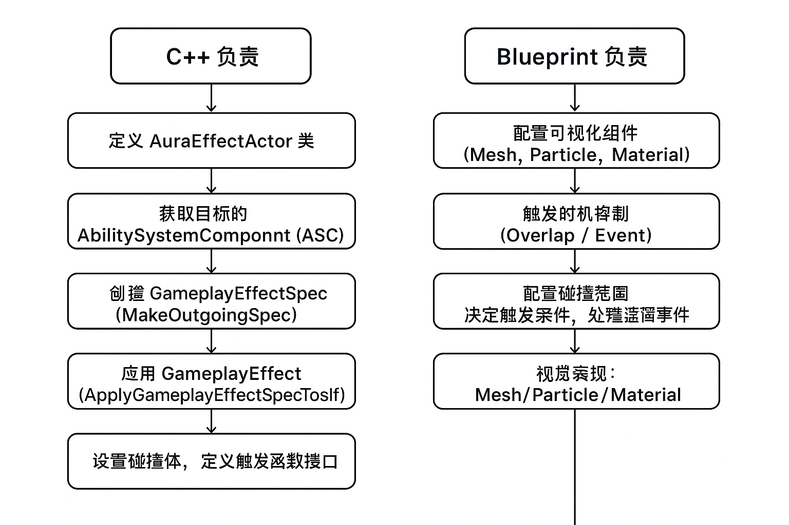

### EffectActor改良

#### 一、问题与现状

- AuraEffectActor 过于固定：强制 Sphere 组件、硬编码数值修改属性
- 缺乏灵活性：只能 +25 HP / -25 Mana
- 设计师端无自由度：视觉表现和碰撞体积被锁死在 C++

#### 二、目标与改进方向

- 移除 Sphere / Mesh / 回调函数，简化 C++ 层逻辑
- 使用 `USceneComponent` 作为 Root，留给蓝图决定视觉表现与碰撞形状
- 提升可扩展性与可配置性

#### 三、蓝图层的自由度

- 在蓝图中添加 Mesh（药水瓶模型）、碰撞体（Sphere/Box/Capsule）
- 配置碰撞：Mesh → 无碰撞，Sphere → OverlapAllDynamic
- 在事件图中通过 OnComponentBeginOverlap 来触发逻辑

#### 四、引入 Gameplay Effect

- 新增 `InstantGameplayEffectClass` 变量（UProperty，EditAnywhere，Category=AppliedEffects）
- 编写 `ApplyEffectToTarget(AActor* Target, TSubclassOf<UGameplayEffect>)` 函数
- BlueprintCallable，便于蓝图调用

#### 五、获取 AbilitySystemComponent 的方式

1. **接口方式**：
   - 检查 Target 是否实现 IAbilitySystemInterface
   - 调用 `GetAbilitySystemComponent()`
2. **蓝图库方式**：
   - `UAbilitySystemBlueprintLibrary::GetAbilitySystemComponent(Target)`
   - 更健壮，支持未实现接口但有 ASC 组件的情况

#### 六、应用 Gameplay Effect

- 使用 `TargetASC->ApplyGameplayEffectSpecToSelf(...)`
- 需要先创建 GameplayEffectSpec：
  - `TargetASC->MakeOutgoingSpec(InstantGameplayEffectClass, Level, Context)`

#### 七、优势与意义

- C++ 保留底层逻辑（效果应用）
- 蓝图侧灵活配置（视觉表现、碰撞体、触发条件）
- 提供更好的模块化、复用性和可扩展性
- 平衡 C++ 与 Blueprint 的职责分配，提高团队协作效率

明白，我帮你整理一份 **C++ vs Blueprint 职责对照表**，覆盖你说的 **00:29:47,900 前的 AuraEffectActor 重构内容**。

| 功能/环节                  | C++ 负责                                                     | Blueprint 负责                             |
| -------------------------- | ------------------------------------------------------------ | ------------------------------------------ |
| **AuraEffectActor 初始化** | 定义 Actor 类、属性（Sphere/StaticMesh 可选）                | 在场景中放置 Actor、可视化组件             |
| **GameplayEffect 应用**    | - 获取目标的 AbilitySystemComponent (ASC)  - 创建 GameplayEffectSpec (`MakeOutgoingSpec`)  - 应用 GameplayEffect (`ApplyGameplayEffectSpecToSelf`) | 触发时机（Overlap/事件）                   |
| **碰撞/触发检测**          | 定义碰撞体、触发函数接口                                     | 自由配置 Sphere 或 Box，决定触发范围和事件 |
| **视觉表现**               | -                                                            | 蓝图控制 Mesh/Particle/Material 等         |
| **参数配置**               | 提供属性接口（如 HP 改变量、Mana 改变量）                    | 在蓝图里直接设置具体数值                   |
| **接口/委托绑定**          | 提供接口给蓝图获取 ASC 或 Actor 状态                         | 绑定 UI 更新，响应事件广播（Delegate）     |
| **复用与扩展**             | 核心逻辑可复用（C++）                                        | 自定义表现和特殊效果（蓝图）               |

💡 **总结规律**：

- **C++**：核心逻辑、数据驱动、ASC 与 GameplayEffect 相关操作
- **Blueprint**：视觉、触发条件、参数具体数值、事件绑定

