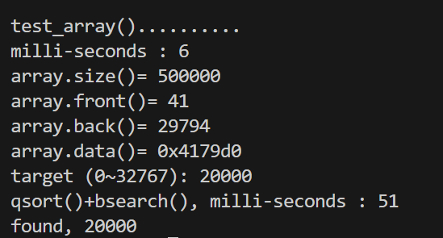

# STL标准库

引言
STL（Standard Template Library，标准模板库）是 C++ 语言的重要组成部分，它极大地提升了 C++ 编程的效率和可维护性。STL 主要由 容器（Containers）、算法（Algorithms） 和 迭代器（Iterators） 组成，依赖于 泛型编程（Generic Programming） 思想，使得代码能够独立于具体的数据类型进行复用。

侯捷老师的 C++ 课程深入剖析了 STL 的实现原理，包括 容器的底层结构、迭代器适配器、STL 的内存管理策略 以及 泛型编程的最佳实践。本文将结合课程内容，深入探索 STL 标准库的内部实现，并提供实际应用案例。

## 1.STL体系结构基础介绍

STL 作为 C++ 标准库的重要组成部分，是基于 泛型编程 和 模板技术 设计的高效数据结构和算法框架。STL 的核心架构主要由六大组件构成，它们相互协作，为 C++ 开发者提供灵活、高效的数据结构和算法支持。

| 组件                 | 作用                                                         |
| -------------------- | ------------------------------------------------------------ |
| 容器（Containers）   | 提供数据存储结构，如 vector、map、set，支持不同的数据组织方式 |
| 算法（Algorithms）   | 提供通用的排序、搜索、变换算法，如 sort()、find()，实现与数据结构解耦 |
| 迭代器（Iterators）  | 充当容器与算法之间的桥梁，提供遍历容器的方式，使算法能适用于不同容器 |
| 适配器（Adapters）   | 改变容器、迭代器或仿函式的行为，如 queue、stack，封装底层容器以提供特定接口 |
| 分配器（Allocators） | 负责内存管理，提高动态内存分配的效率                         |
| 仿函式（Functors）   | 允许算法接受不同的可调用对象，提升代码灵活性                 |


STL 通过 模板编程 实现 通用数据结构和算法，并且高度解耦。其核心思想是 算法与数据结构的分离，使得同一个算法可以作用于不同类型的容器，而无需重新实现。

### 容器的前闭后开特性


### C++11的范围for循环和auto关键字


## 补充：OOP和GP的介绍

1. **OOP：对象为中心的垂直抽象**（面向对象编程）

   - 

     核心思想：将现实实体抽象为**对象（Object）**，对象包含**数据（属性）和行为（方法）**，通过**类（Class）**定义模板，强调四大特性：

     - **封装**：隐藏内部实现，暴露接口（如`private`数据+`public`方法）
     - **继承**：子类复用父类属性和方法（如`class Dog : public Animal`）
     - **多态**：同一接口在不同对象上有不同行为（如虚函数重写）

   - **设计目标**：模拟现实世界，提升代码可维护性和扩展性

2. **GP：类型参数化的水平抽象**（泛型编程）

   - 

     核心思想：编写与数据类型无关的通用算法和数据结构，通过**模板（Template）**实现类型参数化

     - 关键原则：
       - 算法独立于容器（如`std::sort`可作用于`vector`或`deque`）
       - 通过**迭代器（Iterator）**连接算法与容器

   - **设计目标**：实现**零开销抽象**（Zero-Overhead Abstraction），提升代码复用性和性能

------

**技术实现对比**

| **维度**     | **OOP**                                  | **GP**                                        |
| ------------ | ---------------------------------------- | --------------------------------------------- |
| **代码组织** | 数据与方法绑定在类中（如`list::sort()`） | 数据（容器）与算法分离（如`::sort(iter)`）    |
| **多态机制** | 运行时多态（虚函数表，动态绑定）         | 编译时多态（模板实例化，静态绑定）            |
| **类型关系** | 垂直继承（`is-a`关系）                   | 水平约束（`concept-model`关系，如迭代器类别） |
| **性能开销** | 虚函数调用、类层级间接寻址               | 无运行时开销（编译期生成特化代码）            |
| **类型安全** | 编译时类型检查（强类型）                 | 编译时模板类型推导（需约束`concept`）         |

> **经典案例**：
>
> - **OOP**：`std::list`内置`sort()`，因链表迭代器不支持随机访问（无法用`::sort()`）
> - **GP**：`std::vector` + `::sort()`，通过随机访问迭代器实现高效排序

**应用场景与优劣分析**

1. **OOP适用场景**

   - 

     优势：

     - 复杂业务逻辑建模（如GUI事件处理、游戏角色交互）
     - 需动态扩展的系统（插件机制、多态调用）

   - 

     劣势：

     - 性能开销较大（虚函数跳转）
     - 过度继承导致代码僵化（“钻石继承”问题）

2. **GP适用场景**

   - 

     优势：

     - 高性能基础库（如STL容器、数值计算）
     - 类型无关的通用算法（排序、查找、变换）

   - 

     劣势：

     - 编译时间较长（模板实例化膨胀）
     - 错误信息晦涩（模板元编程调试难）

------


## 2.容器结构与分类

STL 提供了多种 **顺序容器** 和 **关联容器**，适用于不同的应用场景。了解这些容器的底层实现和适用场景，有助于编写高效的 C++ 代码。

除此之外还有特殊的**无序容器**本质应该也属于关联容器的一类。


### 2.1顺序容器分类

所有顺序容器都提供了快速顺序访问元素的能力。但是这些容器在以下方面都有不同的性能折中：

* 向容器添加或从容器中删除元素的代价
* 非顺序访问容器元素的代价

| 容器         | 底层结构     | 特性                                                         |
| ------------ | ------------ | ------------------------------------------------------------ |
| vector       | 动态数组     | 支持快速随机访问。在尾部之外的位置插入或删除元素可能很慢     |
| deque        | 双端队列     | 支持快速随机访问。在头尾位置插入/删除速度很快                |
| list         | 双向链表     | 只支持双向顺序访问。在list中任何位置进行插入/删除操作速度都很快 |
| forward_list | 单向链表     | 只支持单向顺序访问。在链表中任何位置进行插入/删除操作速度都很快 |
| array        | 固定数组     | 支持快速随机访问。不能添加或删除元素                         |
| string       | 与vector相似 | 专门用于保存字符。随机访问快。在尾部插入/删除速度快          |

### 2.2关联容器分类

关联容器支持高效关键字查找和访问。

| 容器                 | 特性                             |
| -------------------- | -------------------------------- |
| 按关键字有序保存元素 |                                  |
| map                  | 关联数组；保存关键字-值对        |
| set                  | 关键字即值，即只保存关键字的容器 |
| multimap             | 关键字可重复出现的map            |
| multiset             | 关键字可重复出现的set            |
| 无序集合             |                                  |
| unordered_map        | 用哈希函数组织的map              |
| unordered_set        | 用哈希函数组织的set              |
| unordered_multimap   | 哈希组织的map;关键字可以重复出现 |
| unordered_multiset   | 哈希组织的set;关键字可以重复出现 |

### 2.3顺序容器

#### 容器arrary

C++ 标准模板库（STL）中的 `std::array` 是一个用于管理定长数组的容器。与传统的C风格数组相比，`std::array` 提供了更多的功能和更好的安全性，同时仍保持了数组的高效性。下面详细介绍 `std::array` 的特点、使用方法及其常用成员函数。

##### **std::array 的特点**

1. 定长数组：std::array 是一种定长容器，一旦创建，大小不可更改。因此在编译时必须确定其大小。
2. 在栈上分配内存：与 std::vector 不同，std::array 在栈上分配内存，这使得它的性能与 C 风格数组相似，但提供了更多的功能。
3. 类型安全：std::array 提供类型安全，可以防止数组越界等常见错误。
4. 与STL兼容：std::array 支持 STL 提供的算法和迭代器，因此可以与其他 STL 容器无缝协作。

##### **`std::array` 的定义**

`std::array` 的定义如下：

```c++
std::array<Type, N> arr;
```

* `Type` 是数组中元素的类型。
* `N` 是数组的大小。

示例代码

```c++
#include <iostream>
#include <array>

int main() {
    // 创建一个包含5个整数的 std::array
    std::array<int, 5> arr = {1, 2, 3, 4, 5};
    
    // 访问元素
    std::cout << "First element: " << arr[0] << std::endl;
    
    // 修改元素
    arr[0] = 10;
    
    // 使用范围for循环遍历元素
    for (int elem : arr) {
        std::cout << elem << " ";
    }
    std::cout << std::endl;
    
    return 0;
}

```


##### **常用成员函数**

`std::array` 提供了一些常用的成员函数，用于操作和访问数组元素：

1. **`at(size_t index)`**：返回给定索引处的元素，并执行边界检查。

```c++
int val = arr.at(2); // 如果index超出范围，将抛出std::out_of_range异常
```

2. **`operator[]`**：返回给定索引处的元素，不进行边界检查。

```c++
int val = arr[2];
```

3. **`size()`**：返回数组的大小。

```c++
size_t size = arr.size();
```

4. **`front()` 和 `back()`**：分别返回数组中的第一个和最后一个元素。

```c++
int first = arr.front();
int last = arr.back();
```

5. **`data()`**：返回指向底层数组的

##### 测试代码

```c++
//以下为测试程序的辅助函数
using std::string;
// 获取一个long类型的随机数
long get_a_target_long()
{
	// 定义一个long类型的变量target，并初始化为0
long target=0;

	// 输出提示信息，要求用户输入一个0~RAND_MAX之间的随机数
	std::cout << "target (0~" << RAND_MAX << "): ";
	// 从标准输入流中读取用户输入的值，并赋给target
	std::cin >> target;
	// 返回target的值
	return target;
}

// 获取一个目标字符串
string get_a_target_string()
{
	// 定义一个长整型变量target，用于存储目标值
long target=0;
	// 定义一个字符数组buf，用于存储目标值的字符串形式
char buf[10];

	// 输出提示信息，要求用户输入目标值
	std::cout << "target (0~" << RAND_MAX << "): ";
	// 从标准输入读取用户输入的目标值
	std::cin >> target;
	// 使用snprintf函数将目标值转换为字符串形式，并存储在buf数组中
	snprintf(buf, 10, "%d", target);
	// 将buf数组转换为string类型并返回
	return string(buf);
}

// 比较两个long类型数据的函数
int compareLongs(const void* a, const void* b)
{
  // 将指针a和b转换为long类型指针，并返回它们的差值
  return ( *(long*)a - *(long*)b );
}

// 比较两个字符串
int compareStrings(const void* a, const void* b)
{
  // 如果字符串a大于字符串b，返回1
  if ( *(string*)a > *(string*)b )
     	return 1;
  // 如果字符串a小于字符串b，返回-1
  else if ( *(string*)a < *(string*)b )
     	return -1;  
  // 如果字符串a等于字符串b，返回0
  else      	
        return 0;  
}
```

```C++
#include <array>
#include <iostream>
#include <ctime> //引入时间库
#include <cstdlib> //qsort, bsearch, NULL
#include "test.h"
using namespace std;
const long ASIZE  =   500000L;
void test_array()
{
	cout << "\ntest_array().......... \n";
     
array<long,ASIZE> c;  	  	// 定义一个大小为ASIZE的数组c
			
clock_t timeStart = clock();									
    // 记录开始时间
    for(long i=0; i< ASIZE; ++i) {
        c[i] = rand(); 
    }
	// 随机生成ASIZE个随机数，存入数组c中
	cout << "milli-seconds : " << (clock()-timeStart) << endl;	//
	// 输出生成随机数所用的时间
	cout << "array.size()= " << c.size() << endl;		
	// 输出数组c的大小
	cout << "array.front()= " << c.front() << endl;	
	// 输出数组c的第一个元素
	cout << "array.back()= " << c.back() << endl;	
	// 输出数组c的最后一个元素
	cout << "array.data()= " << c.data() << endl;	
	
	// 输出数组c的数据指针
long target = get_a_target_long();

	timeStart = clock();
    ::qsort(c.data(), ASIZE, sizeof(long), compareLongs);
long* pItem = (long*)::bsearch(&target, (c.data()), ASIZE, sizeof(long), compareLongs); 
	// 使用qsort()函数对数组c进行排序，然后使用bsearch()函数在排序后的数组c中查找目标值target
	cout << "qsort()+bsearch(), milli-seconds : " << (clock()-timeStart) << endl;	//    
  	if (pItem != NULL)
    	cout << "found, " << *pItem << endl;
  	else
    	cout << "not found! " << endl;	
}

int main()
{
	// 调用test_array函数
	test_array();
	// 等待用户输入
	cin.get();
	// 返回0，表示程序正常结束
	return 0;
}
```

**输出结果**



#### 容器vector

C++ 标准模板库（STL）中的 std::vector 是一个动态数组容器，它可以根据需要自动调整其大小。std::vector 是一种常用的数据结构，因为它结合了数组的高效性和动态管理内存的能力。下面详细介绍 std::vector 的特点、使用方法、常用成员函数及其背后的机制。

##### **`std::vector` 的特点**

1. **动态大小**：`std::vector` 可以根据需求动态调整其大小，这意味着你可以在运行时添加或删除元素，而不需要关心内存管理细节。
2. **随机访问**：与普通数组一样，`std::vector` 支持常量时间的随机访问，可以通过索引直接访问任意位置的元素。
3. **连续内存**：`std::vector` 在内存中存储元素是连续的，因此它与 C 风格数组兼容，可以通过指针操作向量中的元素。
4. **自动内存管理**：`std::vector` 会自动处理内存的分配和释放，用户不需要手动管理内存，这降低了内存泄漏和其他内存管理错误的风险。
5. **支持STL算法**：`std::vector` 支持 STL 中的各种算法，如排序、查找、复制等，并提供了与其他 [STL 容器](https://so.csdn.net/so/search?q=STL 容器&spm=1001.2101.3001.7020)无缝协作的能力。

##### `std::vector` 的定义

`std::vector` 的使用非常简单。可以通过以下方式定义一个 `std::vector`：

```c++
std::vector<int> vec;             // 创建一个存储 int 类型的空向量
std::vector<int> vec(10);         // 创建一个存储10个元素的 int 类型向量，每个元素默认初始化为 0
std::vector<int> vec(10, 5);      // 创建一个存储10个元素的 int 类型向量，每个元素初始化为 5
std::vector<int> vec = {1, 2, 3}; // 使用初始化列表创建并初始化一个向量

```

##### 常用成员函数

**1.元素访问**

* `at(size_type pos)`：返回指定位置的元素，并进行范围检查。
* `operator[](size_type pos)`：返回指定位置的元素，不进行范围检查。
* `front()`：返回第一个元素。
* `back()`：返回最后一个元素。
* `data()`：返回指向第一个元素的指针（用于与 C 风格数组兼容）。

**2. 容量相关**

* `size()`：返回当前向量中的元素个数。
* `capacity()`：返回当前分配的能够容纳的元素个数。
* `empty()`：判断向量是否为空。
* `reserve(size_type new_cap)`：预留至少能够容纳 `new_cap` 个元素的空间，避免频繁重新分配内存。
* `shrink_to_fit()`：请求减少容量以适应当前大小，可能会减少内存占用。

**3. 修改元素**

* `push_back(const T& value)`：在向量末尾添加一个元素。
* `emplace_back(Args&&... args)`：在向量末尾原地构造一个元素（更高效）。
* `pop_back()`：移除向量末尾的元素。
* `insert(iterator pos, const T& value)`：在指定位置插入一个元素。
* `erase(iterator pos)`：移除指定位置的元素。
* `clear()`：清空向量中的所有元素。
* `resize(size_type count)`：调整向量的大小，如果新大小大于当前大小，使用默认值填充新的元素。

**4. 迭代器**

* `begin()`：返回指向第一个元素的迭代器。
* `end()`：返回指向末尾的迭代器（不指向任何元素）。
* `rbegin()` 和 `rend()`：返回反向迭代器，分别指向末尾和起始位置。

##### `std::vector` 的底层机制

* **自动增长**：`std::vector` 的关键特点是其动态增长机制。当 `vector` 需要更多空间时，它会分配一个比当前容量更大的新内存块，通常是当前容量的两倍，然后将旧数据复制到新内存中。这种增长策略在性能和内存使用之间取得了平衡。
* **内存管理**：为了减少内存分配的开销，`std::vector` 通常会分配比当前所需更大的内存空间，这就是 `capacity()` 通常大于 `size()` 的原因。`shrink_to_fit()` 可以用来释放多余的内存。
* **效率**：由于 `std::vector` 存储元素是连续的，其访问时间是 O(1)，与普通数组相同。然而，由于动态调整大小和元素插入/删除的开销，某些操作的性能可能不如静态数组。

##### 使用 `std::vector` 的注意事项

1. **内存增长**：频繁的内存重新分配可能会影响性能，因此如果你能预估需要的元素数量，使用 `reserve()` 预分配空间可以提高性能。
2. **内存碎片**：在插入、删除或扩展向量时，可能会导致内存碎片化，特别是在大型应用

##### 测试代码

```c++
#include <vector>
#include <stdexcept>
#include <string>
#include <cstdlib> //abort()
#include <cstdio>  //snprintf()
#include <iostream>
#include <ctime> 
#include <algorithm> 	//sort()
namespace jj02
{
	void test_vector(long& value)
	{
		cout << "\ntest_vector().......... \n";

		// 定义一个string类型的vector
		vector<string> c;
		// 定义一个字符数组，用于存储随机生成的字符串
		char buf[10];

		// 记录开始时间
		clock_t timeStart = clock();
		// 循环value次，向vector中添加随机生成的字符串
		for (long i = 0; i < value; ++i)
		{
			try {
				// 将随机生成的字符串存储到buf中
				snprintf(buf, 10, "%d", rand());
				// 将buf中的字符串添加到vector中
				c.push_back(string(buf));
			}
			catch (exception& p) {
				// 如果发生异常，输出异常信息，并终止程序
				cout << "i=" << i << " " << p.what() << endl;
				//曾經最高 i=58389486 then std::bad_alloc
				abort();
			}
		}
		// 输出程序运行时间
		cout << "milli-seconds : " << (clock() - timeStart) << endl;
		// 输出vector的最大容量
		cout << "vector.max_size()= " << c.max_size() << endl;	//1073747823
		// 输出vector的大小
		cout << "vector.size()= " << c.size() << endl;
		// 输出vector的第一个元素
		cout << "vector.front()= " << c.front() << endl;
		// 输出vector的最后一个元素
		cout << "vector.back()= " << c.back() << endl;
		// 输出vector的数据指针
		cout << "vector.data()= " << c.data() << endl;
		// 输出vector的容量
		cout << "vector.capacity()= " << c.capacity() << endl << endl;


		// 获取目标字符串
		string target = get_a_target_string();
		{
			// 记录开始时间
			timeStart = clock();
			// 在vector中查找目标字符串
			auto pItem = find(c.begin(), c.end(), target);
			// 输出程序运行时间
			cout << "std::find(), milli-seconds : " << (clock() - timeStart) << endl;

			// 如果找到目标字符串，输出找到的信息
			if (pItem != c.end())
				cout << "found, " << *pItem << endl << endl;
			// 如果没有找到目标字符串，输出未找到的信息
			else
				cout << "not found! " << endl << endl;
		}

		{
			// 记录开始时间
			timeStart = clock();
			// 对vector进行排序
			sort(c.begin(), c.end());
			// 输出程序运行时间
			cout << "sort(), milli-seconds : " << (clock() - timeStart) << endl;

			// 记录开始时间
			timeStart = clock();
			// 在排序后的vector中查找目标字符串
			string* pItem = (string*)::bsearch(&target, (c.data()),
											   c.size(), sizeof(string), compareStrings);
			// 输出程序运行时间
			cout << "bsearch(), milli-seconds : " << (clock() - timeStart) << endl;

			// 如果找到目标字符串，输出找到的信息
			if (pItem != NULL)
				cout << "found, " << *pItem << endl << endl;
			// 如果没有找到目标字符串，输出未找到的信息
			else
				cout << "not found! " << endl << endl;
		}

		// 清空vector
		c.clear();
		// 测试可移动的vector
		test_moveable(vector<MyString>(), vector<MyStrNoMove>(), value);
	}
}
```

输出结果


#### 容器list

C++ 标准模板库（STL）中的 std::list 是一种双向链表容器，专为需要频繁插入和删除操作的场景设计。std::list 与 std::vector 不同，它不支持随机访问，但在插入和删除元素时具有更高的效率。下面详细介绍 std::list 的特点、使用方法、常用成员函数以及底层机制。

##### `std::list` 的特点

1. **双向链表**：`std::list` 是一种双向链表（Doubly Linked List），这意味着每个元素都有指向前一个和后一个元素的指针。你可以从任一方向遍历链表。
2. **高效插入和删除**：由于链表的结构，`std::list` 可以在常量时间内进行插入和删除操作，特别是在已知位置的情况下，这使得它在频繁修改数据的场景中非常高效。
3. **不连续的内存存储**：`std::list` 的元素并不需要在内存中连续存放，这与 `std::vector` 不同。每个元素都独立存在，并通过指针连接到前后元素。
4. **不支持随机访问**：由于 `std::list` 的链表结构，不能通过索引直接访问元素，因此随机访问的时间复杂度为 O(n)。
5. **双向迭代器**：`std::list` 提供双向迭代器，可以向前或向后遍历，但不支持随机访问迭代。

##### `std::list` 的定义

```c++
std::list<int> lst;              // 创建一个存储 int 类型元素的空链表
std::list<int> lst(5);           // 创建一个包含 5 个元素的 int 类型链表，每个元素默认初始化为 0
std::list<int> lst(5, 100);      // 创建一个包含 5 个元素的 int 类型链表，每个元素初始化为 100
std::list<int> lst = {1, 2, 3};  // 使用初始化列表创建并初始化一个链表

```

##### 常用成员函数

**1.元素访问**

* `front()`：返回链表中的第一个元素。
* `back()`：返回链表中的最后一个元素。

**2.容量相关**

* `empty()`：判断链表是否为空。
* `size()`：返回链表中元素的数量。
* `max_size()`：返回链表可以容纳的最大元素数量。

**3.修改元素**

* `push_front(const T& value)`：在链表的前端插入一个元素。
* `push_back(const T& value)`：在链表的末尾插入一个元素。
* `pop_front()`：移除链表前端的元素。
* `pop_back()`：移除链表末尾的元素。
* `insert(iterator pos, const T& value)`：在指定位置前插入一个元素，返回新元素的迭代器。
* `erase(iterator pos)`：移除指定位置的元素，返回下一个元素的迭代器。
* `clear()`：移除链表中的所有元素。
* `resize(size_type count)`：调整链表的大小。如果新大小大于当前大小，使用默认值填充新的元素。
* `emplace_front(Args&&... args)`：在链表的前端原地构造一个元素。
* `emplace_back(Args&&... args)`：在链表的末尾原地构造一个元素。

**4.操作链表**

* `splice(iterator pos, list& other)`：将 `other` 链表的内容插入到当前链表中的 `pos` 位置处。
* `remove(const T& value)`：移除所有与 `value` 相等的元素。
* `remove_if(Predicate pred)`：移除所有满足谓词 `pred` 的元素。
* `reverse()`：反转链表中的元素顺序。
* `unique()`：移除链表中连续重复的元素，只保留一个。
* `sort()`：对链表中的元素进行排序。

**5.迭代器**

* `begin()`：返回指向链表中第一个元素的迭代器。
* `end()`：返回指向链表末尾（不指向任何元素）的迭代器。
* `rbegin()` 和 `rend()`：返回反向迭代器，分别指向末尾和起始位置。

##### `std::list` 的底层机制

1. **链表节点**：每个元素存储在一个节点中，节点包含数据和指向前后元素的指针。插入或删除元素只需要更新相邻节点的指针，因此操作非常高效。
2. **内存管理**：由于 `std::list` 是动态分配的链表，每个元素都是独立分配的，这意味着插入和删除操作不会导致大量的内存重新分配，也不会像 `std::vector` 那样需要移动大量元素。
3. **效率与局限性**：
   * **插入和删除**：在链表的任意位置插入或删除元素的时间复杂度为 O(1)。
   * **随机访问**：由于需要从头遍历链表以找到指定位置，随机访问的时间复杂度为 O(n)，这也是 `std::list` 的主要局限性。

##### 使用 `std::list` 的注意事项

1. **适用场景**：`std::list` 非常适合需要频繁插入或删除操作的场景，尤其是在操作涉及到非末尾位置时。如果主要需求是随机访问，则应考虑使用 `std::vector` 或 `std::deque`。
2. **内存开销**：由于链表需要存储指向前后节点的指针，因此 `std::list` 的内存开销比 `std::vector` 要大。此外，每个元素的动态分配也会带来一些额外的性能开销。
3. **操作效率**：虽然插入和删除效率高，但频繁的指针操作可能导致性能问题，特别是在硬件缓存利用率较低的情况下。

总之，`std::list` 是一种在特定情况下非常有用的容器，适用于需要高效插入和删除的场景，但在需要快速随机访问的场合应谨慎使用。

##### 测试代码

```c++
#include <list>
#include <stdexcept>
#include <string>
#include <cstdlib> //abort()
#include <cstdio>  //snprintf()
#include <algorithm> //find()
#include <iostream>
#include <ctime> 
namespace jj03
{
	void test_list(long& value)
	{
		// 打印函数名
		cout << "\ntest_list().......... \n";

		// 定义一个string类型的list
		list<string> c;
		// 定义一个字符数组，用于存储随机数
		char buf[10];

		// 记录开始时间
		clock_t timeStart = clock();
		// 循环value次
		for (long i = 0; i < value; ++i)
		{
			// 将随机数转换为字符串，并添加到list中
			try {
				snprintf(buf, 10, "%d", rand());
				c.push_back(string(buf));
			}
			// 捕获异常
			catch (exception& p) {
				cout << "i=" << i << " " << p.what() << endl;
				abort();
			}
		}
		// 打印运行时间
		cout << "milli-seconds : " << (clock() - timeStart) << endl;
		// 打印list的大小
		cout << "list.size()= " << c.size() << endl;
		// 打印list的最大大小
		cout << "list.max_size()= " << c.max_size() << endl;    //357913941
		// 打印list的第一个元素
		cout << "list.front()= " << c.front() << endl;
		// 打印list的最后一个元素
		cout << "list.back()= " << c.back() << endl;

		// 获取目标字符串
		string target = get_a_target_string();
		// 记录开始时间
		timeStart = clock();
		// 在list中查找目标字符串
		auto pItem = find(c.begin(), c.end(), target);
		// 打印运行时间
		cout << "std::find(), milli-seconds : " << (clock() - timeStart) << endl;

		// 如果找到了目标字符串
		if (pItem != c.end())
			cout << "found, " << *pItem << endl;
		// 否则打印未找到
		else
			cout << "not found! " << endl;

		// 记录开始时间
		timeStart = clock();
		// 对list进行排序
		c.sort();
		// 打印运行时间
		cout << "c.sort(), milli-seconds : " << (clock() - timeStart) << endl;

		// 清空list
		c.clear();
		// 测试可移动的list
		test_moveable(list<MyString>(), list<MyStrNoMove>(), value);
	}
}
```

测试结果

输出结果


#### 容器forward_list

C++ 标准模板库（STL）中的 std::forward_list 是一种单向链表容器。与 std::list 不同，std::forward_list 仅支持单向遍历，因此它的内存占用更小，适用于需要简单链表结构且内存效率至关重要的场景。下面详细介绍 std::forward_list 的特点、使用方法、常用成员函数及其底层机制。

##### `std::forward_list` 的特点

1. **单向链表**：`std::forward_list` 是单向链表（Singly Linked List），每个元素只包含一个指向下一个元素的指针，无法向前遍历。
2. **低内存开销**：由于每个节点只存储一个指向下一个节点的指针，相比 `std::list`，`std::forward_list` 的内存开销更低。
3. **不支持逆向遍历**：因为是单向链表，`std::forward_list` 不支持逆向遍历和双向迭代器。
4. **高效插入和删除**：与 `std::list` 类似，`std::forward_list` 在已知位置进行插入和删除操作非常高效，时间复杂度为 O(1)。
5. **不支持随机访问**：与 `std::list` 一样，`std::forward_list` 不支持通过索引随机访问元素，访问特定元素需要从头遍历，时间复杂度为 O(n)。

##### `std::forward_list` 的定义

```c++
std::forward_list<int> flist;              // 创建一个存储 int 类型元素的空链表
std::forward_list<int> flist(5);           // 创建一个包含 5 个元素的 int 类型链表，每个元素默认初始化为 0
std::forward_list<int> flist(5, 100);      // 创建一个包含 5 个元素的 int 类型链表，每个元素初始化为 100
std::forward_list<int> flist = {1, 2, 3};  // 使用初始化列表创建并初始化一个链表

```

##### 常用成员函数

1. **元素访问**
   * `front()`：返回链表中的第一个元素。
2. **容量相关**
   * `empty()`：判断链表是否为空。
   * `max_size()`：返回链表可以容纳的最大元素数量。
3. **修改元素**
   * `push_front(const T& value)`：在链表的前端插入一个元素。
   * `pop_front()`：移除链表前端的元素。
   * `insert_after(iterator pos, const T& value)`：在指定位置之后插入一个元素，返回新插入元素的迭代器。
   * `erase_after(iterator pos)`：移除指定位置之后的元素，返回下一个元素的迭代器。
   * `emplace_after(iterator pos, Args&&... args)`：在指定位置之后原地构造一个元素。
   * `splice_after(iterator pos, forward_list& other)`：将 `other` 链表的内容插入到当前链表中的 `pos` 位置之后。
   * `remove(const T& value)`：移除所有与 `value` 相等的元素。
   * `remove_if(Predicate pred)`：移除所有满足谓词 `pred` 的元素。
   * `reverse()`：反转链表中的元素顺序。
   * `unique()`：移除链表中连续重复的元素，只保留一个。
   * `sort()`：对链表中的元素进行排序。
4. **迭代器**
   * `begin()`：返回指向链表中第一个元素的迭代器。
   * `end()`：返回指向链表末尾（不指向任何元素）的迭代器。
   * `before_begin()`：返回指向第一个元素前的迭代器（仅适用于插入操作）。
   * `cbegin()` 和 `cend()`：返回常量迭代器，分别指向起始和末尾。
   * `cbefore_begin()`：返回常量迭代器，指向第一个元素前的迭代器。

##### `std::forward_list` 的底层机制

1. **链表节点**：`std::forward_list` 的每个节点只包含数据和指向下一个节点的指针，因此插入和删除操作只需更新相邻节点的指针，操作时间复杂度为 O(1)。
2. **内存管理**：由于 `std::forward_list` 只维护一个指针的开销，内存使用更为紧凑。这使得它在某些需要严格控制内存的场景中比 `std::list` 更具优势。
3. **效率**：
   * **插入和删除**：在链表的任意位置插入或删除元素的时间复杂度为 O(1)。
   * **随机访问**：由于 `std::forward_list` 只能单向遍历，访问特定元素需要线性时间，时间复杂度为 O(n)。

##### 使用 `std::forward_list` 的注意事项

1. **适用场景**：`std::forward_list` 适用于内存资源有限或不需要双向遍历的场景。如果需要频繁插入或删除元素，且这些操作大多集中在链表的头部，那么 `std::forward_list` 是一个很好的选择。
2. **不适合的场景**：当你需要双向遍历或快速随机访问时，不应选择 `std::forward_list`。在这些场景下，`std::vector` 或 `std::list` 更为合适。
3. **操作细节**：由于 `std::forward_list` 是单向链表，许多 `std::list` 中的操作在 `std::forward_list` 中需要使用不同的方法，例如使用 `before_begin()` 迭代器来处理插入和删除操作。

总之，`std::forward_list` 是一种轻量级的链表容器，适合需要高效、低内存开销的单向链表操作的场景。它在某些特定应用中提供了比 `std::list` 更优的性能和内存效率。

##### 测试代码

```c++
#include <forward_list>
#include <stdexcept>
#include <string>
#include <cstdlib> //abort()
#include <cstdio>  //snprintf()
#include <iostream>
#include <ctime> 
namespace jj04
{
	void test_forward_list(long& value)
	{
		// 测试forward_list容器
		cout << "\ntest_forward_list().......... \n";

		// 定义一个forward_list容器
		forward_list<string> c;
		// 定义一个字符数组，用于存储随机数
		char buf[10];

		// 记录开始时间
		clock_t timeStart = clock();
		// 循环插入随机数
		for (long i = 0; i < value; ++i)
		{
			try {
				// 将随机数转换为字符串
				snprintf(buf, 10, "%d", rand());
				// 将字符串插入到forward_list容器的头部
				c.push_front(string(buf));
			}
			catch (exception& p) {
				// 如果发生异常，输出异常信息并终止程序
				cout << "i=" << i << " " << p.what() << endl;
				abort();
			}
		}
		// 输出执行时间
		cout << "milli-seconds : " << (clock() - timeStart) << endl;
		// 输出forward_list容器的最大容量
		cout << "forward_list.max_size()= " << c.max_size() << endl;  //536870911
		// 输出forward_list容器的第一个元素
		cout << "forward_list.front()= " << c.front() << endl;


		// 获取目标字符串
		string target = get_a_target_string();
		// 记录开始时间
		timeStart = clock();
		// 在forward_list容器中查找目标字符串
		auto pItem = find(c.begin(), c.end(), target);
		// 输出执行时间
		cout << "std::find(), milli-seconds : " << (clock() - timeStart) << endl;

		// 如果找到目标字符串，输出找到的信息
		if (pItem != c.end())
			cout << "found, " << *pItem << endl;
		else
			// 如果没有找到目标字符串，输出未找到的信息
			cout << "not found! " << endl;

		// 记录开始时间
		timeStart = clock();
		// 对forward_list容器进行排序
		c.sort();
		// 输出执行时间
		cout << "c.sort(), milli-seconds : " << (clock() - timeStart) << endl;

		// 清空forward_list容器
		c.clear();
	}
}
```

测试结果


#### 容器deque

C++ 标准模板库（STL）中的 std::deque（双端队列）是一种通用的、动态的序列容器，支持在序列的两端进行快速的插入和删除操作。std::deque 是 “double-ended queue” 的缩写，它提供了类似 std::vector 的功能，同时增加了对两端的高效操作能力。下面详细介绍 std::deque 的特点、使用方法、常用成员函数及其底层机制。

##### `std::deque` 的特点

1. **双端操作**：`std::deque` 支持在容器的前端和后端进行 O(1) 时间复杂度的插入和删除操作，这使得它非常适合需要频繁在两端进行操作的场景。
2. **随机访问**：`std::deque` 像 `std::vector` 一样支持常量时间的随机访问，可以通过索引直接访问任意位置的元素。
3. **动态大小**：`std::deque` 能根据需要动态调整大小，插入和删除操作会自动处理内存的分配和释放。
4. **连续内存块**：`std::deque` 的实现通常由多个连续的内存块组成，因此虽然支持随机访问，但其内存布局与 `std::vector` 不同。`std::vector` 是一个单一的连续内存块，而 `std::deque` 是多个块的组合。
5. **两端均衡**：与 `std::vector` 不同，`std::deque` 在两端的插入和删除操作都非常高效，这使得它在处理需要在两端进行操作的数据时比 `std::vector` 更具优势。

##### `std::deque` 的定义

```C++
std::deque<int> deq;                // 创建一个存储 int 类型元素的空双端队列
std::deque<int> deq(5);             // 创建一个包含 5 个元素的 int 类型双端队列，每个元素默认初始化为 0
std::deque<int> deq(5, 100);        // 创建一个包含 5 个元素的 int 类型双端队列，每个元素初始化为 100
std::deque<int> deq = {1, 2, 3};    // 使用初始化列表创建并初始化一个双端队列

```

##### 常用成员函数

1. **元素访问**
   * `at(size_type pos)`：返回指定位置的元素，并进行范围检查。
   * `operator[](size_type pos)`：返回指定位置的元素，不进行范围检查。
   * `front()`：返回双端队列中的第一个元素。
   * `back()`：返回双端队列中的最后一个元素。
2. **容量相关**
   * `empty()`：判断双端队列是否为空。
   * `size()`：返回双端队列中的元素数量。
   * `max_size()`：返回双端队列可以容纳的最大元素数量。
   * `shrink_to_fit()`：请求减少容量以适应当前大小，可能会减少内存占用。
3. **修改元素**
   * `push_front(const T& value)`：在双端队列的前端插入一个元素。
   * `push_back(const T& value)`：在双端队列的末尾插入一个元素。
   * `pop_front()`：移除双端队列前端的元素。
   * `pop_back()`：移除双端队列末尾的元素。
   * `insert(iterator pos, const T& value)`：在指定位置前插入一个元素。
   * `erase(iterator pos)`：移除指定位置的元素。
   * `clear()`：移除双端队列中的所有元素。
   * `resize(size_type count)`：调整双端队列的大小。如果新大小大于当前大小，使用默认值填充新的元素。
   * `emplace_front(Args&&... args)`：在双端队列的前端原地构造一个元素。
   * `emplace_back(Args&&... args)`：在双端队列的末尾原地构造一个元素。
4. **迭代器**
   * `begin()`：返回指向双端队列中第一个元素的迭代器。
   * `end()`：返回指向双端队列末尾（不指向任何元素）的迭代器。
   * `rbegin()` 和 `rend()`：返回反向迭代器，分别指向末尾和起始位置。

##### `std::deque` 的底层机制

1. **分段内存布局**：`std::deque` 的实现通常由多个内存块（segments）组成，这些块被组织成一个数组。这样可以在两端进行高效的插入和删除操作，而不需要像 `std::vector` 那样频繁地重新分配和移动内存。
2. **两端操作的高效性**：`std::deque` 在内存布局上预留了前后两端的空间，插入和删除操作可以直接在这些预留空间中进行，不需要移动其他元素，因此非常高效。
3. **效率与局限性**：
   * **插入和删除**：`std::deque` 在两端的插入和删除操作都为 O(1) 时间复杂度，而在中间位置插入和删除的时间复杂度为 O(n)。
   * **随机访问**：由于 `std::deque` 的分段内存布局，虽然支持常量时间的随机访问，但访问操作可能比 `std::vector` 略慢，特别是在处理大数据集时。

##### 使用 `std::deque` 的注意事项

1. **适用场景**：`std::deque` 非常适合需要在两端进行频繁插入和删除的场景，例如实现队列或双端队列（deque）结构。它在同时需要快速的插入/删除操作和随机访问的场景中也表现优异。
2. **不适合的场景**：如果你的应用程序主要依赖中间位置的插入和删除操作，或者你只需要在一端进行操作，`std::deque` 可能不是最佳选择。此时，`std::vector` 或 `std::list` 可能更适合。
3. **内存管理**：由于 `std::deque` 使用分段内存布局，其内存使用效率通常比 `std::vector` 更好，特别是在处理大量数据时。此外，`std::deque` 不会像 `std::vector` 那样频繁地重新分配整个数组，因此在某些情况下内存碎片可能更少。

##### 总结

std::deque 是一个功能强大的容器，提供了在两端进行高效插入和删除的能力，同时保留了随机访问的特性。它在某些特定应用场景中表现非常出色，例如需要实现队列或双端队列的场景。如果你的应用程序需要在两端频繁操作数据，同时还需要支持快速的随机访问，那么 std::deque 是一个非常合适的选择。

* 类似vector，两边都能扩充，逻辑上是连续的，但是物理上是分段连续的。有一个map来存放这些段。当一个buffer使用完的之后，会有一个新的buffer，这个buffer的地址放在map中。这个buffer一次分配多大呢？这会影响到这个容器的效率～
* deque还需要指定buffer size，也就是每一个buffer容纳的元素个数，默认是0，就会做相应的操作来存放默认数量的元素，但是肯定不会是让一个buffer存放0个元素的。迭代器类型用的是随机存取（也就是连续的）是deque类做的伪装。迭代器做了模拟连续空间的操作！

##### 测试代码


类似vector，两边都能扩充，实际上是分段连续的

其是通过 *map*（是一个vector，但在扩充时会 copy 到中间）里的指针指向各个 *buffer*，*buffer* 里再存数据，每个 *buffer* 的大小一致，每次扩充都是扩充一个指针指向一个新的 *buffer*

```c++
#include <deque>
#include <stdexcept>
#include <string>
#include <cstdlib> //abort()
#include <cstdio>  //snprintf()
#include <iostream>
#include <ctime> 
namespace jj05
{
	void test_deque(long& value)
	{
		// 测试deque容器
		cout << "\ntest_deque().......... \n";

		// 定义一个deque容器，用于存储string类型的数据
		deque<string> c;
		// 定义一个字符数组，用于存储随机数
		char buf[10];

		// 记录开始时间
		clock_t timeStart = clock();
		// 循环value次，向deque容器中添加随机数
		for (long i = 0; i < value; ++i)
		{
			try {
				// 将随机数转换为字符串，并添加到deque容器中
				snprintf(buf, 10, "%d", rand());
				c.push_back(string(buf));
			}
			catch (exception& p) {
				// 如果发生异常，输出异常信息，并终止程序
				cout << "i=" << i << " " << p.what() << endl;
				abort();
			}
		}
		// 输出程序运行时间
		cout << "milli-seconds : " << (clock() - timeStart) << endl;
		// 输出deque容器的大小
		cout << "deque.size()= " << c.size() << endl;
		// 输出deque容器的第一个元素
		cout << "deque.front()= " << c.front() << endl;
		// 输出deque容器的最后一个元素
		cout << "deque.back()= " << c.back() << endl;
		// 输出deque容器的最大容量
		cout << "deque.max_size()= " << c.max_size() << endl;	//1073741821	

		// 获取一个目标字符串
		string target = get_a_target_string();
		// 记录开始时间
		timeStart = clock();
		// 在deque容器中查找目标字符串
		auto pItem = find(c.begin(), c.end(), target);
		// 输出查找时间
		cout << "std::find(), milli-seconds : " << (clock() - timeStart) << endl;

		// 如果找到了目标字符串，输出找到的信息，否则输出未找到的信息
		if (pItem != c.end())
			cout << "found, " << *pItem << endl;
		else
			cout << "not found! " << endl;

		// 记录开始时间
		timeStart = clock();
		// 对deque容器进行排序
		sort(c.begin(), c.end());
		// 输出排序时间
		cout << "sort(), milli-seconds : " << (clock() - timeStart) << endl;

		// 清空deque容器
		c.clear();
		// 测试可移动的容器
		test_moveable(deque<MyString>(), deque<MyStrNoMove>(), value);
	}
}
```

**测试结果**


#### 容器stack queue

##### **1.stack**

C++ 标准模板库（STL）中的 std::stack 是一个容器适配器，用于实现后进先出（LIFO）的数据结构。std::stack 使得你可以使用一个底层容器（如 std::deque、std::vector 或 std::list）来实现栈的功能，提供了栈的基本操作接口，如推入、弹出、访问栈顶元素等。

##### `std::stack` 的特点

1. **后进先出（LIFO）**：`std::stack` 遵循后进先出的原则，即最后插入的元素最先被访问或移除。
2. **底层容器**：`std::stack` 是一个容器适配器，它内部使用一个底层容器（通常是 `std::deque`，但也可以是 `std::vector` 或 `std::list`）来存储数据。默认情况下，`std::deque` 被用作底层容器。
3. **接口简单**：`std::stack` 提供了一些基本的栈操作，如推入元素、弹出元素和访问栈顶元素，但不提供随机访问或迭代器。
4. **不支持迭代器**：由于栈的特性，`std::stack` 不支持迭代器，因此无法遍历栈中的元素。

##### `std::stack` 的使用

```c++
#include <iostream>
#include <stack>
#include <deque> // 可以指定底层容器

int main() {
    // 使用 std::deque 作为底层容器（默认）
    std::stack<int> s;

    // 推入元素
    s.push(1);
    s.push(2);
    s.push(3);

    // 访问栈顶元素
    std::cout << "Top element: " << s.top() << std::endl; // 输出 3

    // 弹出元素
    s.pop();
    std::cout << "New top element after pop: " << s.top() << std::endl; // 输出 2

    // 判断栈是否为空
    if (s.empty()) {
        std::cout << "Stack is empty." << std::endl;
    } else {
        std::cout << "Stack size: " << s.size() << std::endl; // 输出 2
    }

    return 0;
}

```

##### 常用成员函数

1. **元素操作**
   * `push(const T& value)`：将元素 `value` 压入栈顶。
   * `pop()`：移除栈顶的元素。注意，`pop()` 不会返回被移除的元素，只有栈顶元素被删除。
   * `top()`：返回栈顶的元素，但不移除它。
2. **容量相关**
   * `empty()`：检查栈是否为空。返回 `true` 如果栈为空，`false` 否则。
   * `size()`：返回栈中元素的数量。
3. **底层容器操作**
   *  `c`：底层容器的访问接口（一般情况下不建议直接使用）。`c` 是一个 public 成员，表示底层容器。

##### `std::stack` 的底层机制

1. **底层容器**：`std::stack` 的底层容器可以是 `std::deque`（默认）、`std::vector` 或 `std::list`。可以通过模板参数指定底层容器，例如：

```c++
std::stack<int, std::vector<int>> s;//这使用 std::vector 作为底层容器。
```

2. **操作效率**：
   * **推入和弹出**：这些操作的时间复杂度是 O(1)，因为它们仅涉及到底层容器的前端操作。
   * **访问栈顶**：`top()` 操作的时间复杂度也是 O(1)，因为它只需访问底层容器的最后一个元素。
3. **不支持迭代器**：由于栈的特性，它不支持迭代器。因此，无法直接遍历栈中的元素。只能通过 `top()` 和 `pop()` 操作来访问和修改栈中的元素。

##### 使用 `std::stack` 的注意事项

1. **适用场景**：`std::stack` 适用于需要后进先出行为的场景，如处理函数调用、递归操作、表达式求值等。它提供了简单而直观的栈操作。
2. **底层容器选择**：选择合适的底层容器可以影响栈的性能。例如，`std::deque` 适合于频繁的插入和删除操作，而 `std::vector` 可能在底层实现上更高效，但在栈的两端插入和删除的性能较差。
3. **没有迭代器**：由于栈的设计原则，它不支持迭代器。如果你需要遍历元素，考虑使用其他 STL 容器，如 `std::vector` 或 `std::list`。
4. **内存管理**：`std::stack` 使用的底层容器会自动管理内存，因此你无需担心内存分配和释放问题。

##### 总结

std::stack 是一个简单而强大的容器适配器，提供了后进先出的数据结构。它基于底层容器实现，支持高效的栈操作，如推入、弹出和访问栈顶元素。尽管它不支持迭代器和随机访问，但在处理需要后进先出特性的应用场景时，它是一个非常有用的工具。选择合适的底层容器和理解其操作特性可以帮助你更好地利用 std::stack。

##### **2.queue**

C++ 标准模板库（STL）中的 std::queue 是一个容器适配器，提供了先进先出（FIFO）的数据结构。std::queue 是 “queue” 的缩写，它实现了基本的队列操作，允许在队列的一端插入元素，在另一端删除元素。这个适配器通常使用 std::deque 作为底层容器，但也可以使用其他容器（如 std::list）来实现队列。

##### `std::queue` 的特点

1. **先进先出（FIFO）**：`std::queue` 遵循先进先出的原则，即最先插入的元素最早被访问或移除。
2. **底层容器**：`std::queue` 是一个容器适配器，默认使用 `std::deque` 作为底层容器，也可以指定其他容器（如 `std::list`）来实现队列。
3. **简单接口**：`std::queue` 提供了基本的队列操作，如入队、出队和访问队列的前端和后端元素，但不提供随机访问或迭代器功能。
4. **不支持迭代器**：由于队列的特性，`std::queue` 不支持迭代器，因此无法遍历队列中的元素。

##### `std::queue` 的定义

```c++
#include <iostream>
#include <queue>
#include <deque> // 可以指定底层容器

int main() {
    // 使用 std::deque 作为底层容器（默认）
    std::queue<int> q;

    // 入队操作
    q.push(1);
    q.push(2);
    q.push(3);

    // 访问队列前端元素
    std::cout << "Front element: " << q.front() << std::endl; // 输出 1

    // 出队操作
    q.pop();
    std::cout << "New front element after pop: " << q.front() << std::endl; // 输出 2

    // 判断队列是否为空
    if (q.empty()) {
        std::cout << "Queue is empty." << std::endl;
    } else {
        std::cout << "Queue size: " << q.size() << std::endl; // 输出 2
    }

    return 0;
}

```

##### 常用成员函数

1. **元素操作**
   * `push(const T& value)`：将元素 `value` 添加到队列的末尾。
   * `pop()`：移除队列前端的元素。注意，`pop()` 不会返回被移除的元素。
   * `front()`：返回队列前端的元素，但不移除它。
   * `back()`：返回队列末尾的元素，但不移除它。
2. **容量相关**
   * `empty()`：检查队列是否为空。返回 `true` 如果队列为空，`false` 否则。
   * `size()`：返回队列中元素的数量。
3. **底层容器操作**
   * `c`：底层容器的访问接口（一般情况下不建议直接使用）。`c` 是一个 public 成员，表示底层容器。

##### `std::queue` 的底层机制

1. **底层容器**：`std::queue` 默认使用 `std::deque` 作为底层容器，但也可以使用 `std::list` 或其他容器。底层容器的选择会影响队列的性能和特性。例如：

   ```c++
   std::queue<int, std::list<int>> q; // 使用 std::list 作为底层容器
   ```

2. **操作效率**：

   * **入队和出队**：这些操作的时间复杂度是 O(1)，因为它们仅涉及到底层容器的前端和末尾操作。
   * **访问队列前端和末尾**：`front()` 和 `back()` 操作的时间复杂度也是 O(1)。

3. **不支持迭代器**：由于队列的特性，它不支持迭代器。因此，无法直接遍历队列中的元素。只能通过 `front()` 和 `pop()` 操作来访问和修改队列中的元素。

##### 使用 `std::queue` 的注意事项

1. **适用场景**：`std::queue` 适用于需要先进先出（FIFO）行为的场景，如任务调度、缓冲区管理、广度优先搜索等。它提供了简单而直观的队列操作。
2. **底层容器选择**：选择合适的底层容器可以影响队列的性能。例如，`std::deque` 适合于频繁的插入和删除操作，而 `std::list` 也适合于频繁的插入和删除，但可能会增加一些内存开销。
3. **没有迭代器**：由于队列的设计原则，它不支持迭代器。如果你需要遍历元素，考虑使用其他 STL 容器，如 `std::vector` 或 `std::list`。
4. **内存管理**：`std::queue` 使用的底层容器会自动管理内存，因此你无需担心内存分配和释放问题。

##### 总结

std::queue 是一个简单而强大的容器适配器，提供了先进先出的数据结构。它基于底层容器实现，支持高效的入队、出队和访问队列前端及末尾元素。虽然不支持迭代器和随机访问，但在需要先进先出特性的应用场景中，它是一个非常有用的工具。选择合适的底层容器和理解其操作特性可以帮助你更好地利用 std::queue。

##### 测试代码

**1.stack:**


**2.queue**


*stack*，*queue* 是通过 `push()` 和 `pop()` 来放取元素的，且无_iterator_ 的操作。

### 2.4关联容器

##### set / multiset

C++ 标准模板库（STL）中的 `std::set` 和 `std::multiset` 都是基于红黑树实现的容器，提供了有序集合的功能。虽然它们有许多相似之处，但也有一些重要的区别。下面详细介绍这两个容器的特点、操作、使用方法以及它们之间的主要区别。
