# 4.角色战斗部分

## 前言

这部分内容主要围绕**造成伤害(Deal Damage)**和**战斗反馈(Combat Feedback)**展开。

**造成伤害(Deal Damage)**分为以下几个内容。

* **敌人角色（Enemy Character）**
* **属性（Attribute）**
* **击中检测（Hit Detection）**
* **自定义计算（Custom Calculation）**
* **UI**

**战斗反馈(Combat Feedback)**分为以下几个内容。

* **击中反应（Hit React）**
* **击中/声音特效（Hit/SoundFx）**
* **相机抖动（Camera Shake）**
* **死亡效果（Death）**

## 设置敌人角色

设置敌人角色分为以下几点

- 角色类别（Enemy Character Class）
- 启动数据（Enemy Start Up Data）
- 游戏能力类别（Enemy Gameplay Ability）
- 战斗组件（Enemy Combat Component）

创建WarriorEnemyCharacter,DataAsset_EnemyStartUpData,WarriorEnemyGameplayAbility,EnemyCombatComponent类并初始化。

**WarriorEnemyCharacter类**

```c++
//WarriorEnemyCharacter.h 

#pragma once

#include "CoreMinimal.h"
#include "Characters/WarriorBaseCharacter.h"
#include "WarriorEnemyCharacter.generated.h"

class UEnemyCombatComponent;


UCLASS()
class MYWARRIOR_API AWarriorEnemyCharacter : public AWarriorBaseCharacter
{
    GENERATED_BODY()

public:
    AWarriorEnemyCharacter();// 构造函数声明
protected:    
    UPROPERTY(VisibleAnywhere, Category = "Combat")
    TObjectPtr<UEnemyCombatComponent> EnemyCombatComponent;    // → 核心成员：敌人专属的战斗逻辑组件

public:
    FORCEINLINE UEnemyCombatComponent* GetEnemyCombatComponent() const { return EnemyCombatComponent; }
     // → 内联函数：提供组件访问接口
    // → FORCEINLINE强制编译器内联优化
    // → const确保不修改对象状态
};


//WarriorEnemyCharacter.cpp
#include "Characters/WarriorEnemyCharacter.h"
#include "GameFramework/CharacterMovementComponent.h"
#include "Components/Combat/EnemyCombatComponent.h"
AWarriorEnemyCharacter::AWarriorEnemyCharacter()
{
    AutoPossessAI = EAutoPossessAI::PlacedInWorldOrSpawned;//角色在场景中放置或程序生成时，自动绑定 AI 控制器
    //禁止角色跟随控制器的旋转方向
    bUseControllerRotationPitch = false;
    bUseControllerRotationYaw = false;
    bUseControllerRotationRoll = false;
    //移动组件配置
    GetCharacterMovement()->bUseControllerDesiredRotation = false;//禁用控制器期望的旋转方向（避免与移动方向冲突）
    GetCharacterMovement()->bOrientRotationToMovement = true;//启用角色朝向移动方向（关键！使角色移动时自动转向）
    GetCharacterMovement()->RotationRate = FRotator(0.f, 180.f, 0.f);//旋转速率（Yaw=180 表示每秒转向 180 度，保证快速转身响应）
    GetCharacterMovement()->MaxWalkSpeed = 300.f; //最大行走速度（单位：厘米/秒），控制敌人移动节奏
    GetCharacterMovement()->BrakingDecelerationWalking = 1000.f;//行走时减速值（单位：厘米/秒²），影响停止时的急缓程度

    EnemyCombatComponent = CreateDefaultSubobject<UEnemyCombatComponent>(TEXT("CombatComponent"));//创建并挂载 UEnemyCombatComponent 组件到角色
}
```

WarriorEnemyGameplayAbility类

```c++
//WarriorEnemyGameplayAbility.h

#pragma once

#include "CoreMinimal.h"
#include "AbilitySystem/Abilities/WarriorGameplayAbility.h"
#include "WarriorEnemyGameplayAbility.generated.h"

class AWarriorEnemyCharacter;
class UEnemyCombatComponent;

UCLASS()
class MYWARRIOR_API UWarriorEnemyGameplayAbility : public UWarriorGameplayAbility
{
	GENERATED_BODY()
	
	public:
    UFUNCTION(BlueprintPure, Category = "Warrior|Ability")
    AWarriorEnemyCharacter* GetEnemyCharacterFromActorInfo();//从技能绑定的Actor信息中获取敌人角色实例

    UFUNCTION(BlueprintPure, Category = "Warrior|Ability")
    UEnemyCombatComponent* GetEnemyCombatComponentFromActorInfo();//获取敌人的战斗组件（UEnemyCombatComponent）

    private:
        TWeakObjectPtr<AWarriorEnemyCharacter> CachedWarriorEnemyCharacter;
    /*TWeakObjectPtr：弱指针类型，避免循环引用导致内存泄漏。
       优势：自动处理对象销毁后的空引用，安全性高于裸指针。
      缓存目的：减少频繁查询Actor信息的性能开销。
        场景：在技能持续激活期间（如连击动画），多次访问同一角色时提升效率
    */
};
//WarriorEnemyGameplayAbility.cpp
#include "AbilitySystem/Abilities/WarriorEnemyGameplayAbility.h"
#include "Characters/WarriorEnemyCharacter.h"
AWarriorEnemyCharacter* UWarriorEnemyGameplayAbility::GetEnemyCharacterFromActorInfo()
{
    // 检查缓存是否有效（避免重复类型转换）
    if (!CachedWarriorEnemyCharacter.IsValid())
    {
        // 从当前技能绑定的AvatarActor获取敌人角色实例
        CachedWarriorEnemyCharacter = Cast<AWarriorEnemyCharacter>(CurrentActorInfo->AvatarActor);
    }
    // 返回缓存的角色指针（若无效则返回nullptr）
    return CachedWarriorEnemyCharacter.IsValid() ? CachedWarriorEnemyCharacter.Get() : nullptr;
}

UEnemyCombatComponent* UWarriorEnemyGameplayAbility::GetEnemyCombatComponentFromActorInfo()
{
    // 通过角色实例获取战斗组件
    return GetEnemyCharacterFromActorInfo()->GetEnemyCombatComponent();
}

```


### 异步加载敌人数据

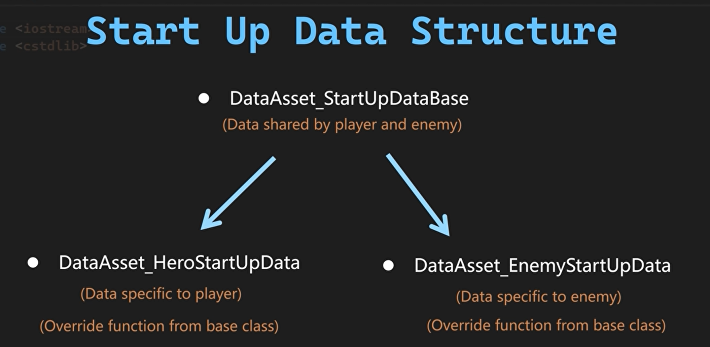

DataAsset_EnemyStartUpData类 

```c++
//DataAsset_EnemyStartUpData.h

#pragma once

#include "CoreMinimal.h"
#include "DataAssets/StartUpData/DataAsset_StartUpDataBase.h"
#include "DataAsset_EnemyStartUpData.generated.h"

class UWarriorEnemyGameplayAbility;

UCLASS()
class MYWARRIOR_API UDataAsset_EnemyStartUpData : public UDataAsset_StartUpDataBase
{
    GENERATED_BODY()
public:
    virtual void GiveToAbilitySystemComponent(UWarriorAbilitySystemComponent* InASCToGive, int32 ApplyLevel = 1) override;//将预设的敌人技能（EnemyCombatAbilities）动态赋予敌人的能力系统组件（ASC）

private:
    UPROPERTY(EditDefaultsOnly, Category = "StartUpData")
    TArray<TSubclassOf<UWarriorEnemyGameplayAbility>> EnemyCombatAbilities; //敌人战斗能力
};
//DataAsset_EnemyStartUpData.cpp
#include "DataAssets/StartUpData/DataAsset_EnemyStartUpData.h"
#include "AbilitySystem/WarriorAbilitySystemComponent.h"
#include "AbilitySystem/Abilities/WarriorEnemyGameplayAbility.h"
// 将数据资产中配置的敌人技能赋予目标能力系统组件（ASC）
void UDataAsset_EnemyStartUpData::GiveToAbilitySystemComponent(
    UWarriorAbilitySystemComponent* InASCToGive, // 目标ASC组件
    int32 ApplyLevel // 技能初始等级（默认=1）
) 
{
    // 1. 调用基类初始化逻辑（如通用技能/属性赋予）
    Super::GiveToAbilitySystemComponent(InASCToGive, ApplyLevel);
    
    // 2. 检查敌人专属技能数组是否非空
    if (!EnemyCombatAbilities.IsEmpty()) 
    {
        // 3. 遍历所有预设的敌人技能类
        for (const TSubclassOf<UWarriorEnemyGameplayAbility>& AbilityClass : EnemyCombatAbilities)
        {
            // 4. 跳过无效技能类（防止崩溃）
            if (!AbilityClass) continue;

            // 5. 创建技能规格（FGameplayAbilitySpec）
            FGameplayAbilitySpec AbilitySpec(AbilityClass);
            
            // 6. 设置技能来源对象（通常为敌人角色实例）
            AbilitySpec.SourceObject = InASCToGive->GetAvatarActor();
            
            // 7. 设置技能初始等级（支持动态难度/成长）
            AbilitySpec.Level = ApplyLevel;
            
            // 8. 将技能赋予ASC组件（注册到GAS系统）
            InASCToGive->GiveAbility(AbilitySpec);
        }
    }
}
```

**WarriorEnemyCharacter类**

```c++
//WarriorEnemyCharacter.h 

#pragma once

#include "CoreMinimal.h"
#include "Characters/WarriorBaseCharacter.h"
#include "WarriorEnemyCharacter.generated.h"

UCLASS()
class MYWARRIOR_API AWarriorEnemyCharacter : public AWarriorBaseCharacter
{
    GENERATED_BODY()
    protected:
    //~ Begin APawn Interface
    virtual void PossessedBy(AController* NewController) override;
    //~ End APawn Interface
    private:
    void InitEnemyStartUpData();
};
//WarriorEnemyCharacter.cpp
#include "Engine/AssetManager.h"
#include "DataAssets/StartUpData/DataAsset_EnemyStartUpData.h"
/**
 * @brief 当控制器接管此敌人角色时触发初始化逻辑
 * @param NewController 新接管角色的控制器（通常为AIController）
 * @note 此函数在角色被AI控制器或玩家控制器接管时调用，用于初始化敌人专属数据
 */
void AWarriorEnemyCharacter::PossessedBy(AController* NewController)
{
    // 1. 调用父类基础逻辑（处理控制器绑定等核心操作）
    Super::PossessedBy(NewController);
    
    // 2. 初始化敌人启动数据（如技能、属性等）
    InitEnemyStartUpData(); // [1,3](@ref)
}

/**
 * @brief 异步加载并应用敌人专属的启动数据资产
 * @note 使用UE的异步加载系统避免同步加载导致的卡顿，适用于可能大量生成的敌人实例
 * @warning 若CharacterStartUpData未配置，函数将静默退出
 */
void AWarriorEnemyCharacter::InitEnemyStartUpData()
{
    // 检查数据资产路径有效性（TSoftObjectPtr判空）
    if (CharacterStartUpData.IsNull()) // 避免无效加载请求
    {
        return; // 未配置数据时安全退出
    }
    
    // 3. 发起异步加载请求（通过UE的流式资源管理器）
    UAssetManager::GetStreamableManager().RequestAsyncLoad(
        CharacterStartUpData.ToSoftObjectPath(), // 转换软引用为可加载路径
        FStreamableDelegate::CreateLambda(        // 定义加载完成回调
            [this]() // Lambda捕获当前角色实例
            {
                // 4. 验证加载结果有效性
                if (UDataAsset_StartUpDataBase* LoadedData = CharacterStartUpData.Get())
                {
                    // 5. 将数据赋予角色的能力系统组件（ASC）
                    LoadedData->GiveToAbilitySystemComponent(WarriorAbilitySystemComponent); // [1](@ref)
                    // 调试输出示例（正式环境建议移除）
                    // Debug::Print(TEXT("Enemy StartUpData Loaded"), FColor::Green); // [1](@ref)
                }
            }
        )
    );
}
```

**关键设计解析**

1. **异步资源加载优化**
   - **`RequestAsyncLoad`**：通过UE的流式资源管理器异步加载数据资产，避免同步加载卡顿主线程。
   - **适用场景**：敌人角色可能大量生成，同步加载会导致性能瓶颈。
   - **`TSoftObjectPtr`安全机制**：  
     使用`IsNull()`检查软引用有效性，`Get()`自动处理加载后的强引用转换。

2. **GAS数据初始化流程**
   - **`GiveToAbilitySystemComponent`**：  
     数据资产中配置的技能（如`EnemyCombatAbilities`）通过此方法注入ASC，完成技能注册。
   - **动态技能赋予**：  
     数据资产`UDataAsset_EnemyStartUpData`可包含敌人专属技能，如近战连击、格挡等。

3. **生命周期与事件驱动**
   - **`PossessedBy`时机**：  
     控制器接管时触发初始化，确保AI行为树与技能系统协同工作。
   - **Lambda回调作用域**：  
     通过`[this]`捕获当前角色实例，确保回调中能访问正确的`WarriorAbilitySystemComponent`。

4. **调试与错误处理**
   - **静默失败设计**：  
     数据未配置时直接退出，避免运行时崩溃。
   - **调试输出**：  
     注释的`Debug::Print`可用于开发阶段验证加载状态。

### 生成敌人武器

继承SpawnWeaponBase的蓝图类和生成角色武器流程差不多

## 属性设置


```c++
//WarriorAttributeSet.h 
#pragma once

#include "CoreMinimal.h"
#include "AttributeSet.h"
#include "AbilitySystem/WarriorAbilitySystemComponent.h"
#include "WarriorAttributeSet.generated.h"


// 属性访问器宏定义（简化属性声明）
#define ATTRIBUTE_ACCESSORS(ClassName, PropertyName) \
    GAMEPLAYATTRIBUTE_PROPERTY_GETTER(ClassName, PropertyName) \ // 生成属性元数据获取器
    GAMEPLAYATTRIBUTE_VALUE_GETTER(PropertyName) \               // 生成属性值Getter
    GAMEPLAYATTRIBUTE_VALUE_SETTER(PropertyName) \               // 生成属性值Setter
    GAMEPLAYATTRIBUTE_VALUE_INITTER(PropertyName)               // 生成属性值初始化器

// 自定义属性集类（继承GAS标准属性集）
UCLASS()
class MYWARRIOR_API UWarriorAttributeSet : public UAttributeSet
{
    GENERATED_BODY() // UE反射代码生成

public:
    // 构造函数声明
    UWarriorAttributeSet();

    //--- 属性定义（使用宏简化访问器生成）---
    
    // 当前生命值（蓝图只读）
    UPROPERTY(BlueprintReadOnly, Category = "Health")
    FGameplayAttributeData CurrentHealth;
    ATTRIBUTE_ACCESSORS(UWarriorAttributeSet, CurrentHealth) // 生成Get/Set函数

    // 最大生命值（蓝图只读）
    UPROPERTY(BlueprintReadOnly, Category = "Health")
    FGameplayAttributeData MaxHealth;
    ATTRIBUTE_ACCESSORS(UWarriorAttributeSet, MaxHealth)

    // 当前怒气值（用于技能释放资源）
    UPROPERTY(BlueprintReadOnly, Category = "Rage")
    FGameplayAttributeData CurrentRage;
    ATTRIBUTE_ACCESSORS(UWarriorAttributeSet, CurrentRage)

    // 最大怒气值
    UPROPERTY(BlueprintReadOnly, Category = "Rage")
    FGameplayAttributeData MaxRage;
    ATTRIBUTE_ACCESSORS(UWarriorAttributeSet, MaxRage)

    // 攻击力（影响伤害输出）
    UPROPERTY(BlueprintReadOnly, Category = "Damage")
    FGameplayAttributeData AttackPower;
    ATTRIBUTE_ACCESSORS(UWarriorAttributeSet, AttackPower)

    // 防御力（减少受到的伤害）
    UPROPERTY(BlueprintReadOnly, Category = "Damage")
    FGameplayAttributeData DefensePower;
    ATTRIBUTE_ACCESSORS(UWarriorAttributeSet, DefensePower)

    // 当前承受的伤害（用于计算实际生命扣除）
    UPROPERTY(BlueprintReadOnly, Category = "Damage")
    FGameplayAttributeData DamageTaken;
    ATTRIBUTE_ACCESSORS(UWarriorAttributeSet, DamageTaken)

};
//WarriorAttributeSet.cpp
// 版权声明
// Tcohneyn All Rights Reserved

#include "AbilitySystem/WarriorAttributeSet.h"

// 构造函数：初始化属性默认值
UWarriorAttributeSet::UWarriorAttributeSet() 
{
    // 初始化所有属性为1.0（实际项目通常从数据表读取初始值）
    InitCurrentHealth(1.f);    // 当前生命值
    InitMaxHealth(1.f);         // 最大生命值
    InitCurrentRage(1.f);       // 当前怒气值
    InitMaxRage(1.f);           // 最大怒气值
    InitAttackPower(1.f);       // 攻击力
    InitDefensePower(1.f);      // 防御力
}

```

* 使用showdebug abilitysystem控制台命令查看属性


### Gameplay Effect

* 建立曲线表格用来作为属性数据

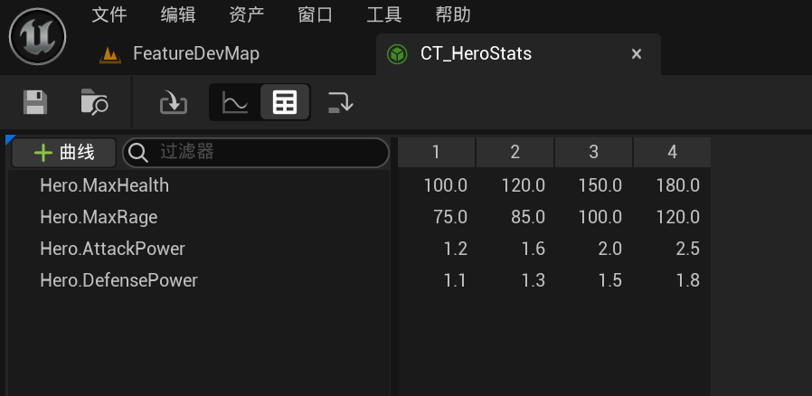


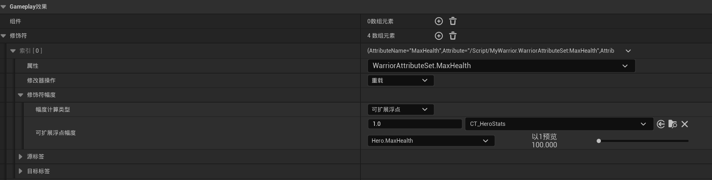

* 这种方法可以直接开始时，让最大血量赋值给当前血量

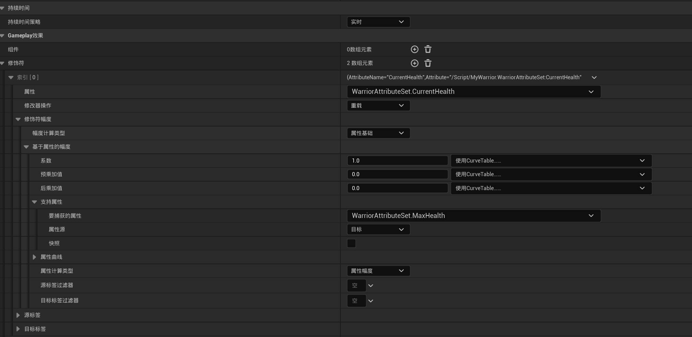

### 应用GameplayEffect

* 将游戏效果应用到目标，在UDataAsset_StartUpDataBase类中，创建一个游戏效果类型的数组，并处理该函数内部的初始化，赋予能力系统组件

**UDataAsset_StartUpDataBase类**

```c++
//UDataAsset_StartUpDataBase.h

#pragma once

#include "CoreMinimal.h"
#include "Engine/DataAsset.h"
#include "DataAsset_StartUpDataBase.generated.h"

class UGameplayEffect;
UCLASS()
class MYWARRIOR_API UDataAsset_StartUpDataBase : public UDataAsset
{
    GENERATED_BODY()
public:
    virtual void GiveToAbilitySystemComponent(UWarriorAbilitySystemComponent* InASCToGive, int32 ApplyLevel = 1);

protected:

    UPROPERTY(EditDefaultsOnly, Category = "StartUpData")
    TArray<TSubclassOf<UGameplayEffect>> StartUpGameplayEffects;//存储GE的数组
};
//UDataAsset_StartUpDataBase.cpp

#include "DataAssets/StartUpData/DataAsset_StartUpDataBase.h"
#include "AbilitySystem/WarriorAbilitySystemComponent.h" // 自定义ASC组件
#include "AbilitySystem/Abilities/WarriorGameplayAbility.h" // 自定义GameplayAbility

/**
 * @brief 向目标能力系统组件（ASC）赋予初始能力和效果
 * @param InASCToGive 目标ASC组件（必须有效）
 * @param ApplyLevel 能力/效果的初始等级
 * @note 此函数是角色初始化的核心逻辑，集成了GAS的两种关键资源：能力（Abilities）和效果（Effects）
 */
void UDataAsset_StartUpDataBase::GiveToAbilitySystemComponent(UWarriorAbilitySystemComponent* InASCToGive, int32 ApplyLevel)
{
    // 1. 验证ASC有效性（开发阶段触发断言，运行时安全退出）
    check(InASCToGive); // 开发阶段强制检查
    if (!InASCToGive) return; // 运行时安全防护

    // 2. 授予主动能力（立即激活）[1,3](@ref)
    GrantAbilities(ActivateOnGivenAbilities, InASCToGive, ApplyLevel);    
    // 3. 授予被动/反应能力（如格挡、反击）[4](@ref)
    GrantAbilities(ReactiveAbilities, InASCToGive, ApplyLevel);

    // 4. 应用初始Gameplay Effects（如角色基础属性）[2,3](@ref)
    if (!StartUpGameplayEffects.IsEmpty())
    {
        for (const TSubclassOf<UGameplayEffect>& EffectClass : StartUpGameplayEffects)
        {
            if (!EffectClass) continue; // 跳过无效效果类

            // 4.1 获取GameplayEffect的默认对象（CDO）
            UGameplayEffect* EffectCDO = EffectClass->GetDefaultObject<UGameplayEffect>();
            
            // 4.2 向自身应用效果
            InASCToGive->ApplyGameplayEffectToSelf(
                EffectCDO,           // 效果实例
                ApplyLevel,           // 效果等级（影响数值计算）
                InASCToGive->MakeEffectContext() // 创建效果上下文（包含来源/目标信息）
            );
        }
    }
}
```

### 初始化敌人的属性

基本与角色的一致有一个地方需要注意。

在 `DefaultGame.ini` 中添加以下配置以启用：

```c++
[/Script/GameplayAbilities.AbilitySystemGlobals]
bUseDebugTargetFromHud=true
```

`bUseDebugTargetFromHud=true` 是GAS调试流程的“快捷开关”🎯，通过绑定HUD焦点对象，大幅减少手动切换目标的繁琐操作。尤其在多角色或网络环境下，能显著提升开发效率。如需深入调试属性同步或底层逻辑，可结合 `AbilitySystem.Debug` 系列命令进一步分析

## 命中检测

为了造成伤害，我们需要正确的设置命中检测,命中检测，我们需要处理四个问题。

* 武器碰撞(Toggle Weapon Collision)
* 命中检查(Hit Check)
* 处理命中(Process Hit)
* 通知结果(Notify Result)

### 武器碰撞

* 我们使用动画状态通知来开启武器碰撞与关闭武器碰撞
* 要启用武器碰撞，显然需要先**获取武器实例**——这可以通过我们的PawnCombatComponent访问，在Pong战斗组件内部，创建一个名为`ToggleCollision`的函数，然后在NMNotifyState中直接调用此函数，就能**随时开关碰撞**
* 当前的问题是：如何从通知状态中**获取PawnCombatComponent**？
* 为了，处理这个问题，一种方法是虽然可以用`FindComponentByClass`动态搜索组件，但高频调用时**性能损耗较大**。

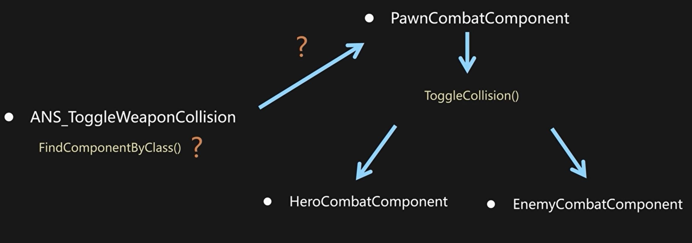

* 因此选择通过**接口抽象**实现：创建一个`IPawnCombat`接口。在`BaseCharacter`中实现该接口，声明纯虚函数`GetPongCombatComponent()`。英雄/敌人子类重写此函数，返回各自的战斗组件。在`ToggleWeaponCollision`通知状态中，只需检查骨骼网格所有者是否实现此接口，即可**直接获取组件**。

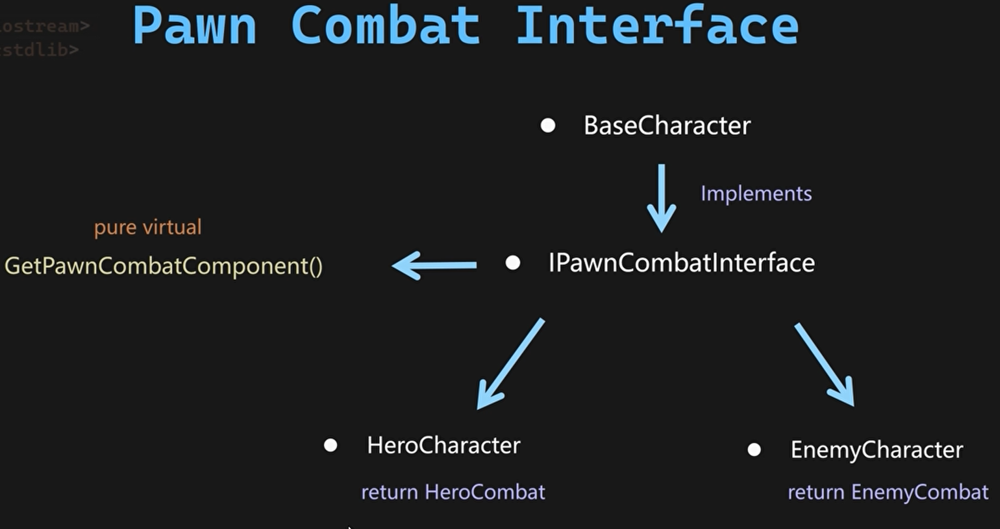

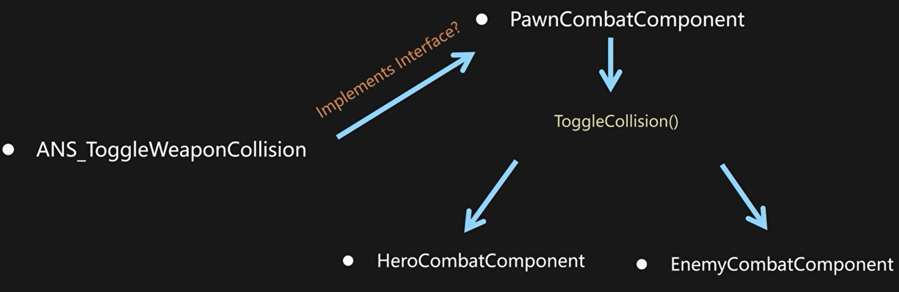

**PawnCombatInterface类**

```c++
//PawnCombatInterface.h

#pragma once

#include "CoreMinimal.h"
#include "UObject/Interface.h"
#include "PawnCombatInterface.generated.h"

// 前向声明战斗组件类（避免循环依赖）
class UPawnCombatComponent;

UINTERFACE(MinimalAPI) 
class UPawnCombatInterface : public UInterface
{
    GENERATED_BODY()
};

/**
 * 战斗角色接口定义（纯C++接口类）
 * 作用：提供统一访问角色战斗组件的方式
 */
class MYWARRIOR_API IPawnCombatInterface
{
    GENERATED_BODY() 

public:
    // 纯虚函数：强制派生类实现战斗组件获取逻辑
    // 返回值：指向UPawnCombatComponent的常量指针
    virtual UPawnCombatComponent* GetPawnCombatComponent() const = 0;
};
```

**WarriorBaseCharacter类**

```c++
//WarriorBaseCharacter.h
#pragma once
#include "CoreMinimal.h"
#include "GameFramework/Character.h"
#include "AbilitySystemInterface.h"
#include "Interfaces/PawnCombatInterface.h"
#include "WarriorBaseCharacter.generated.h"
// 包含生成的头文件，用于序列化和反射

class UWarriorAbilitySystemComponent;
// 声明UWarriorAbilitySystemComponent类，用于前向声明
class UWarriorAttributeSet;
// 声明UWarriorAttributeSet类，用于前向声明
class UDataAsset_StartUpDataBase;


UCLASS()
class MYWARRIOR_API AWarriorBaseCharacter : public ACharacter, public IAbilitySystemInterface,public IPawnCombatInterface
{
    GENERATED_BODY()

public:

    // 构造函数，设置角色的默认属性
    AWarriorBaseCharacter();

    //~ Begin IPawnCombatComponent Interface
    virtual UPawnCombatComponent* GetPawnCombatComponent() const override;
    //~ End IPawnCombatComponent Interface

};
//WarriorBaseCharacter.cpp
UPawnCombatComponent* AWarriorBaseCharacter::GetPawnCombatComponent() const
{
    return nullptr;
}
```

**WarriorHeroCharacter类**

```c++
//WarriorHeroCharacter.h
public:
    // 构造函数声明
    AWarriorHeroCharacter();

    //~ Begin IPawnCombatInterface Interface
    // 重写战斗接口的纯虚函数
    virtual UPawnCombatComponent* GetPawnCombatComponent() const override;
    //~ End IPawnCombatInterface Interface
public:
    // 内联函数：获取英雄专属战斗组件（类型安全）
    FORCEINLINE UHeroCombatComponent* GetHeroCombatComponent() const 
    { 
        return HeroCombatComponent; 
    }
private:
    UPROPERTY(VisibleAnywhere, BlueprintReadOnly, Category = "Combat", meta = (AllowPrivateAccess = "true"))
    UHeroCombatComponent* HeroCombatComponent;
//WarriorHeroCharacter.cpp
// Tcohneyn All Rights Reserved

#include "Components/Combat/HeroCombatComponent.h"

AWarriorHeroCharacter::AWarriorHeroCharacter()
{    // 创建默认的英雄战斗组件实例
    // 参数1：组件类模板
    // 参数2：组件名称（用于调试和序列化）
    HeroCombatComponent = CreateDefaultSubobject<UHeroCombatComponent>(TEXT("HeroCombatComponent"));
}

UPawnCombatComponent* AWarriorHeroCharacter::GetPawnCombatComponent() const
{
    // 返回基类指针（实现多态）
    return HeroCombatComponent;
}
```

**WarriorEnemyCharacter类同上**

**WarriorFunctionLibrary类**

```c++
//WarriorFunctionLibrary.h
class UPawnCombatComponent;
// 原生函数：从Actor获取战斗组件 (C++专用)
	static UPawnCombatComponent* NativeGetPawnCombatComponentFromActor(AActor* InActor);
// 蓝图函数：从Actor获取战斗组件 (蓝图可调用)
// ExpandEnumAsExecs：将输出枚举转换为蓝图执行分支引脚
// DisplayName：蓝图节点显示名称
	UFUNCTION(BlueprintCallable, Category = "Warrior|FunctionLibrary", meta = (DisplayName = "Get Pawn Combat Component From Actor", ExpandEnumAsExecs = "OutValidType"))
	static UPawnCombatComponent* BP_GetPawnCombatComponentFromActor(AActor* InActor, EWarriorValidType& OutValidType);
//WarriorFunctionLibrary.cpp
#include "Interfaces/PawnCombatInterface.h"
/**
 * @brief 从Actor获取战斗组件的原生实现
 * @param InActor 目标Actor
 * @return 战斗组件指针，无效时返回nullptr
 * @note 基于IPawnCombatInterface接口实现
 */
UPawnCombatComponent* UWarriorFunctionLibrary::NativeGetPawnCombatComponentFromActor(AActor* InActor)
{
    check(InActor); // 确保输入参数有效 (仅在开发模式编译)
    
    // 1. 验证Actor是否实现战斗接口
    if (IPawnCombatInterface* PawnCombatInterface = Cast<IPawnCombatInterface>(InActor))
    {
        // 2. 通过接口直接获取组件指针
        return PawnCombatInterface->GetPawnCombatComponent();
    }
    return nullptr; // 无战斗组件
}

/**
 * @brief 蓝图可调用的战斗组件获取方法
 * @param InActor 目标Actor
 * @param OutValidType 输出参数：组件有效性
 * @return 战斗组件指针 (无效时为nullptr)
 * @note ExpandEnumAsExecs元数据使蓝图中自动生成执行分支
 */
UPawnCombatComponent* UWarriorFunctionLibrary::BP_GetPawnCombatComponentFromActor(
    AActor* InActor, 
    EWarriorValidType& OutValidType)
{
    // 1. 调用原生实现获取组件
    UPawnCombatComponent* CombatComponent = NativeGetPawnCombatComponentFromActor(InActor);
    
    // 2. 设置有效性枚举值
    OutValidType = CombatComponent ? 
        EWarriorValidType::Valid :      // 有效组件
        EWarriorValidType::InValid;     // 无效组件
    
    return CombatComponent;
}
```

**PawnCombatComponent类**

```c++
//PawnCombatComponent.h
UCLASS()
class MYWARRIOR_API UPawnCombatComponent : public UPawnExtensionComponentBase
{
    GENERATED_BODY()
    /**
     * @brief 开关武器碰撞体的核心接口（蓝图可调用）
     * @param bShouldEnable 是否启用碰撞
     * @param ToggleDamageType 碰撞体类型（默认为当前装备武器）
     *
     * @note 此函数通过蓝图在动画通知中被调用，实现攻击动作期间武器碰撞体的精确激活
     * @tip 使用EToggleDamageType定义不同碰撞源（武器/身体）
     */
      UFUNCTION(BlueprintCallable, Category = "Warrior|Combat")
    void ToggleWeaponCollision(bool bShouldEnable, EToggleDamageType ToggleDamageType = EToggleDamageType::CurrentEquippedWeapon);
};
//PawnCombatComponent.cpp
#include "Components/BoxComponent.h"
void UPawnCombatComponent::ToggleWeaponCollision(bool bShouldEnable, EToggleDamageType ToggleDamageType)
{
    // 1. 处理装备武器碰撞体
    if (ToggleDamageType == EToggleDamageType::CurrentEquippedWeapon)
    {
        // 1.1 获取当前装备的武器实例
        AWarriorWeaponBase* WeaponToToggle = GetCharacterCurrentEquippedWeapon();
        check(WeaponToToggle); // 确保武器存在（开发期崩溃防护）
        
        // 1.2 获取武器碰撞盒组件
        UBoxComponent* WeaponCollisionBox = WeaponToToggle->GetWeaponCollisionBox();
        
        // 1.3 碰撞开关逻辑
        if (bShouldEnable) 
        {
            // 启用武器碰撞（仅检测查询，不发生物理反馈）
            WeaponCollisionBox->SetCollisionEnabled(ECollisionEnabled::QueryOnly);
            
            // 调试输出 (开发期使用)
            //Debug::Print(WeaponToToggle->GetName() + TEXT(" Collision Enabled"), FColor::Green);
        }
        else 
        {
            // 禁用武器碰撞
            WeaponCollisionBox->SetCollisionEnabled(ECollisionEnabled::NoCollision);
            
            // 清空当前记录的受击Actor列表（防止重复计算伤害）
            OverlappedActors.Empty();
            
            // 调试输出
            //Debug::Print(WeaponToToggle->GetName() + TEXT(" Collision Disabled"), FColor::Red);
        }
    }
    
    // 2. TODO: 未来扩展点 - 处理身体碰撞盒的开关逻辑
    // if (ToggleDamageType == EToggleDamageType::BodyCollision) 
    // {
    //    // 实现身体碰撞体控制
    // }
}
```

**ANS_ToggleWeaponCollision_C蓝图类**

```lua
---@type ANS_ToggleWeaponCollision_C
local M = UnLua.Class()

function M:Received_NotifyBegin(MeshComp)
    local Owner = MeshComp:GetOwner()-- 获取骨骼网格组件的拥有者（通常为角色Actor）
    local CombatComponet = UE.UWarriorFunctionLibrary.BP_GetPawnCombatComponentFromActor(Owner)
    if CombatComponet then
    CombatComponet:ToggleWeaponCollision(true,self.ToggleDamageType)
else
    print("ERROR: Missing combat component on "..Owner:GetName())
end
    return false -- 返回 false 以阻止动画继续播放
end


function M:Received_NotifyEnd(MeshComp)
    local Owner = MeshComp:GetOwner()
    local CombatComponet = UE.UWarriorFunctionLibrary.BP_GetPawnCombatComponentFromActor(Owner)
    CombatComponet:ToggleWeaponCollision(false,self.ToggleDamageType)
    return false -- 返回 false 以阻止动画继续播放
end

return M
```

### 命中检查

接下来需要处理的是**命中检测（Hit Check）**——我们需要确保武器***仅对玩家和敌人的预设目标***造成伤害。具体实现方案如下：

1. **逻辑起点：武器基类（Weapon Base Class）**——在基类中为碰撞体的**重叠事件（Overlap Events）**创建回调函数。当武器碰撞盒与目标发生重叠时，首先验证目标是否属于 **敌对关系（Hostile）**。
2. **敌对关系验证流程**——若目标**非敌对**，则无需任何操作。若目标为**敌对目标**，将此信息传递给角色的**战斗组件（CombatComponent）**。
3. **战斗组件处理**——CombatComponent` 将接管后续流程，执行**伤害处理逻辑**

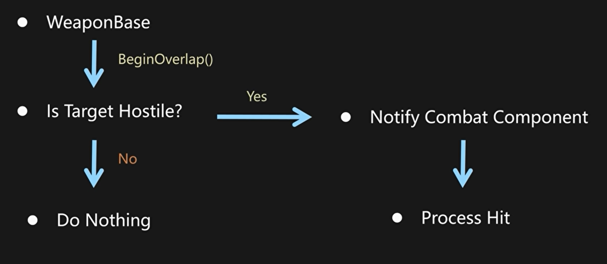

```c++
//WarriorWeaponBase.h
DECLARE_DELEGATE_OneParam(FOnTargetInteractedDelegate,AActor*)//委托声明

UCLASS()
class MYWARRIOR_API AWarriorWeaponBase : public AActor
{
    GENERATED_BODY()
    public:
    // 武器击中目标时触发的委托
    FOnTargetInteractedDelegate OnWeaponHitTarget;
    // 武器离开目标时触发的委托
    FOnTargetInteractedDelegate OnWeaponPulledFromTarget;
    protected:
    // 碰撞盒开始重叠事件处理函数
    UFUNCTION()
    virtual void OnCollisonBoxBeginOverlap(UPrimitiveComponent* OverlappedComponent, AActor* OtherActor, UPrimitiveComponent* OtherComp,
        int32 OtherBodyIndex, bool bFromSweep, const FHitResult& SweepResult);
    // 碰撞盒结束重叠事件处理函数
    UFUNCTION()
    virtual void OnCollisonBoxEndOverlap(
        UPrimitiveComponent* OverlappedComponent, AActor* OtherActor, UPrimitiveComponent* OtherComp, int32 OtherBodyIndex);    
};
//WarriorWeaponBase.cpp
AWarriorWeaponBase::AWarriorWeaponBase()
{
    WeaponCollisionBox->OnComponentBeginOverlap.AddUniqueDynamic(this,&ThisClass::OnCollisionBoxBeginOverlap);
    WeaponCollisionBox->OnComponentEndOverlap.AddUniqueDynamic(this,&ThisClass::OnCollisionBoxEndOverlap);
}
void AWarriorWeaponBase::OnCollisionBoxBeginOverlap(UPrimitiveComponent* OverlappedComponent, AActor* OtherActor,
    UPrimitiveComponent* OtherComp, int32 OtherBodyIndex, bool bFromSweep, const FHitResult& SweepResult)
{
    // 获取武器持有者（玩家或AI控制的Pawn）
    APawn* WeaponOwningPawn = GetInstigator<APawn>();
    // 验证持有者有效性（防御性编程）
    checkf(WeaponOwningPawn, TEXT("Forget to assign an instiagtor as the owning pawn for the weapon %s"),*GetName());
    // 检查重叠对象是否为Pawn（排除场景物体）
    if (APawn* HitPawn = Cast<APawn>(OtherActor))
    {
        // 防止攻击自身（如角色武器碰到自己）
        if (WeaponOwningPawn != HitPawn)
        {
            // 触发命中事件（通知CombatComponent处理伤害逻辑）
            OnWeaponHitTarget.ExecuteIfBound(OtherActor);
            
            // TODO: 扩展敌对检测逻辑（如阵营系统/队伍关系）
            // 当前实现仅排除自身，需增加敌人识别
        }
    }
}

void AWarriorWeaponBase::OnCollisionBoxEndOverlap(
    UPrimitiveComponent* OverlappedComponent, AActor* OtherActor, UPrimitiveComponent* OtherComp, int32 OtherBodyIndex)
{
    APawn* WeaponOwningPawn = GetInstigator<APawn>();
    checkf(WeaponOwningPawn, ...); // 同上有效性检查

    if (APawn* HitPawn = Cast<APawn>(OtherActor))
    {
        if (WeaponOwningPawn != HitPawn)
        {
            // 通知目标离开（可用于结束连击/重置状态）
            OnWeaponPulledFromTarget.ExecuteIfBound(OtherActor);
        }
    }
}
```

**PawnCombatComponent类**

```c++
//PawnCombatComponent.h
// 声明武器命中目标时的回调函数（虚函数支持子类重写）
    virtual void OnHitTargetActor(AActor* HitActor);
// 声明武器离开目标时的回调函数（虚函数支持子类重写）
    virtual void OnWeaponPulledFromTargetActor(AActor* InteractedActor);
//PawnCombatComponent.cpp
void UPawnCombatComponent::RegisterSpawnedWeapon(
    FGameplayTag InWeaponTagToRegister, AWarriorWeaponBase* InWeaponToRegister, bool bRegisterAsEquippedWeapon)
{
     // 将武器的命中事件委托绑定到当前战斗组件的回调函数
    // BindUObject 确保委托调用时保留对象上下文（避免野指针）
    InWeaponToRegister->OnWeaponHitTarget.BindUObject(this,&ThisClass::OnHitTargetActor);
    // 将武器的离开事件委托绑定到当前战斗组件的回调函数
    InWeaponToRegister->OnWeaponPulledFromTarget.BindUObject(this, &ThisClass::OnWeaponPulledFromTargetActor);
}
void UPawnCombatComponent::OnHitTargetActor(AActor* HitActor) {}

void UPawnCombatComponent::OnWeaponPulledFromTargetActor(AActor* InteractedActor) {}
```

**HeroCombatComponent类**

```c++
//HeroCombatComponent.h
    virtual void OnHitTargetActor(AActor* HitActor) override;
    virtual void OnWeaponPulledFromTargetActor(AActor* InteractedActor) override;
//HeroCombatComponent.cpp
#include "WarriorDebugHelper.h"
void UHeroCombatComponent::OnHitTargetActor(AActor* HitActor) 
{
    Debug::Print(GetOwningPawn()->GetActorNameOrLabel() + TEXT("hit") + HitActor->GetActorNameOrLabel(), FColor::Green);
}

void UHeroCombatComponent::OnWeaponPulledFromTargetActor(AActor* InteractedActor) 
{
    Debug::Print(GetOwningPawn()->GetActorNameOrLabel() + TEXT("s weapon pulled from") + InteractedActor->GetActorNameOrLabel(), FColor::Red);
}
```

### 处理命中

* 现在来处理伤害并且通知我们的游戏能力来实施伤害
* 首先要全部只能伤害目标一次，新建一个用来存储重叠的Actor
* 每次碰撞状态通知结束后，清除一下数组

**PawnCombatComponent类**

```c++
//PawnCombatComponent.h
protected:
    TArray<AActor*> OverlappedActors;
//PawnCombatComponent.cpp
void UPawnCombatComponent::ToggleWeaponCollision(bool bShouldEnable, EToggleDamageType ToggleDamageType)
{
       .........
            WeaponToToggle->GetWeaponCollisionBox()->SetCollisionEnabled(ECollisionEnabled::NoCollision);
            //Debug::Print(WeaponToToggle->GetName() + TEXT(" Collision Disabled"), FColor::Red);
            OverlappedActors.Empty();//清空命中计数数组
        }
    }
    //TODO:Handle body collision boxes
}
```

* 在碰撞时，确保只造成了一次伤害

**HeroCombatComponent类**

```c++
// HeroCombatComponent.cpp

// 函数功能：处理武器命中目标Actor时的逻辑，避免重复触发伤害
void UHeroCombatComponent::OnHitTargetActor(AActor* HitActor) 
{
    // 检查目标Actor是否已被记录（避免单次攻击多次命中同一目标）
    if (OverlappedActors.Contains(HitActor))
    {
        return; // 若已命中过，直接返回（不重复处理）
    }
    
    // 将新命中的目标加入已命中列表
    OverlappedActors.AddUnique(HitActor);
}
```

### 通知结果

接下来要处理的是：在检测到有效命中时，通知游戏技能（Gameplay Ability）应用伤害。具体流程如下：

以轻攻击技能（GA_LightAttack）为例：游戏技能 将播放攻击动画蒙太奇（Montage），并在播放期间等待游戏事件（Gameplay Event）。该事件由战斗组件（Combat Component）发送。当战斗组件检测到命中时，它会向游戏技能发送此事件。事件传递至游戏技能蓝图后，我们将在此处应用伤害。

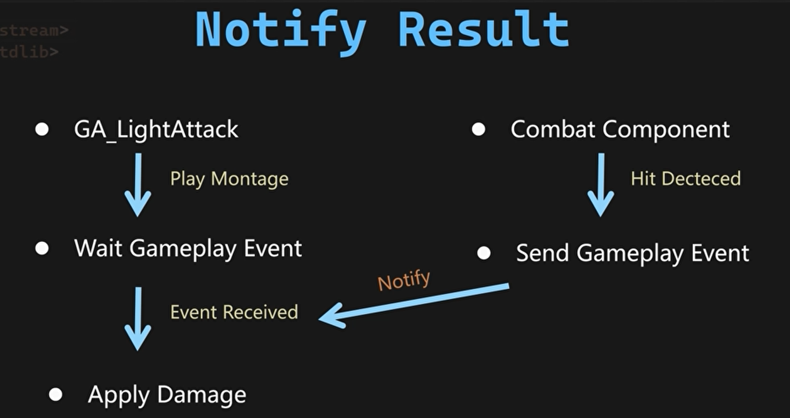

**HeroCombatComponent类**

```c++
//HeroCombatComponent.cpp
#include "WarriorGameplayTags.h"         // 引用自定义的游戏标签库（用于标识事件类型）
#include "AbilitySystemBlueprintLibrary.h" // 提供GAS蓝图库功能

void UHeroCombatComponent::OnHitTargetActor(AActor* HitActor) 
{
    // 3. 构造游戏事件数据（传递伤害计算所需上下文）
    FGameplayEventData Data;
    Data.Instigator = GetOwningPawn();  // 伤害发起者（玩家角色）
    Data.Target = HitActor;              // 伤害承受者（被击中的Actor）

    // 4. 发送近战命中事件（触发伤害技能）
    UAbilitySystemBlueprintLibrary::SendGameplayEventToActor(
        GetOwningPawn(),                       // 事件发送给玩家角色的AbilitySystemComponent
        WarriorGameplayTags::Shared_Event_MeleeHit, // 标签：标识"近战命中"事件类型
        Data                                    // 包含攻击者/目标的上下文数据
    );
}
```

**Hero_LightAttackMaster类**

```c++
//Hero_LightAttackMaster.cpp
void UHero_LightAttackMaster::ActivateAbility(const FGameplayAbilitySpecHandle Handle, const FGameplayAbilityActorInfo* ActorInfo,
    const FGameplayAbilityActivationInfo ActivationInfo, const FGameplayEventData* TriggerEventData)
{
    UsedComboCount = CurrentLightAttackComboCount;//用另一个变量存储当前计数防止CurrentLightAttackComboCount因同时增加错误
}
void UHero_LightAttackMaster::RunSequenceTasks()
{
    // 定义任务序列中的第一个任务（Lambda 函数封装）
    auto Task1 = [this]  // 捕获当前类的上下文
    {
        // 创建等待游戏事件的异步任务
        // 参数说明：
        //   this: 当前技能对象（Owner）
        //   EventTag: 需监听的游戏事件标签（如"Event.Combat.Hit"）
        WaitEventTask = UAbilityTask_WaitGameplayEvent::WaitGameplayEvent(this, EventTag);

        // 绑定事件回调：当接收到指定标签的游戏事件时，触发OnGameplayEventReceived
        WaitEventTask->EventReceived.AddDynamic(
            this, 
            &ThisClass::OnGameplayEventReceived  // 事件处理函数
        );

        // 激活任务（使任务进入可执行状态）
        WaitEventTask->ReadyForActivation();
    };

}
```

* 现在选中这个类的默认设置（在高级下拉菜单下），我需要取消勾选   **在编辑器中显示触发效果”（show fire in editor）**选项

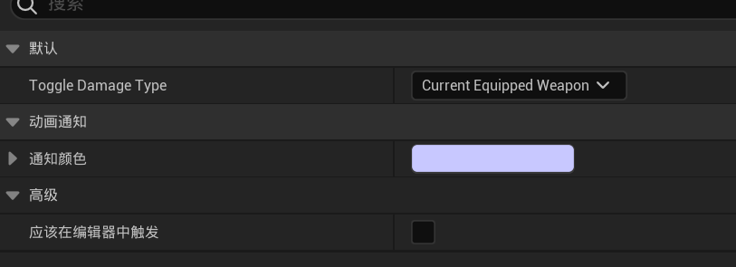

1. **`Show Fire in Editor` 的作用**

* 控制编辑器内是否预览动画通知（如粒子特效、音效），取消勾选可避免

  未初始化时触发逻辑错误。

* 典型应用场景：攻击动画的伤害判定通知需在运行时激活，而非编辑阶段。

2. **断言错误（Assertion）的成因**

* 当`NM Notify State`尝试访问`Mesh Component`时，若组件的**所有者（Owner）未完成初始化**（如`Pong Comeback`组件未注入依赖），会触发引擎的安全检查机制。
* 解决方案：通过**延迟初始化**或**事件驱动**（如`BeginPlay`）确保资源就绪。

## 自定义计算

接下来要处理的是**自定义伤害计算（Custom Damage Calculation）**。这一步将综合所有相关属性数据，最终对目标施加伤害。具体流程如下：

1. **起点：攻击技能（Attack Ability）**
     当技能接收到战斗组件（CombatComponent）发送的**游戏事件（Gameplay Event）**后创建**GameplayFX句柄（Gameplay Effect Spec Handle）** 用于承载最终伤害数据。
2. **GameplayFX句柄的作用** 
     通过此句柄可存储扩展信息（如攻击类型、连击数、武器伤害系数、触发源等）其本质是**GameplayEffectSpec**的封装容器，支持动态配置伤害参数
3. **应用伤害句柄** 
    将存储完整伤害数据的句柄**应用至目标对象**（ApplySpecToTarget）；
4. **执行计算阶段**
    通过**GameplayEffectExecutionCalculation**类捕获所有相关属性，基于公式（如攻击力-防御力**系数）计算最终伤害值
5. **属性更新与通知**
    在**属性集（AttributeSet）** 中更新生命值等属性，自动通知UI层刷新属性变化（如血条UI实时响应）

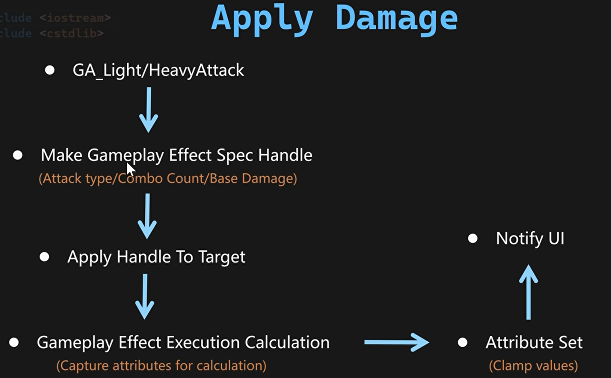

### 制作GameplayEffect句柄 

**WarriorHeroGameplayAbility类**

```c++
//WarriorHeroGameplayAbility.h
public:
    UFUNCTION(BlueprintPure, Category = "Warrior|Ability")
    FGameplayEffectSpecHandle MakeHeroDamageEffectSpecHandle(TSubclassOf<UGameplayEffect> EffectClass, float InWeaponBaseDamage,FGameplayTag InCurrentAttackTypeTag,int32 InUsedComboCount);
//WarriorHeroGameplayAbility.cpp
#include "WarriorGameplayTags.h"
#include "AbilitySystem/WarriorAbilitySystemComponent.h"
/**
 * 功能：创建用于伤害计算的 GameplayEffectSpec 句柄
 * 
 * 参数说明：
 *   - EffectClass: 伤害效果对应的 GameplayEffect 类（如伤害计算公式的蓝图类）
 *   - InWeaponBaseDamage: 武器基础伤害值（动态传递）
 *   - InCurrentAttackTypeTag: 当前攻击类型的标签（如轻击、重击、暴击）
 *   - InUsedComboCount: 当前连击次数（用于动态调整伤害系数）
 * 
 * 返回值：配置完成的 GameplayEffectSpec 句柄，用于后续应用伤害效果
 */
FGameplayEffectSpecHandle UWarriorHeroGameplayAbility::MakeHeroDamageEffectSpecHandle(
    TSubclassOf<UGameplayEffect> EffectClass, float InWeaponBaseDamage, FGameplayTag InCurrentAttackTypeTag, int32 InUsedComboCount)
{
    // 防御性检查：确保传入的EffectClass有效
    check(EffectClass);

    // 1. 创建效果上下文（Context）并设置关键信息
    FGameplayEffectContextHandle ContextHandle = 
        GetWarriorAbilitySystemComponentFromActorInfo()->MakeEffectContext();
    
    ContextHandle.SetAbility(this);         // 关联当前Ability实例[1,2](@ref)
    ContextHandle.AddSourceObject(GetAvatarActorFromActorInfo()); // 设置伤害源对象（角色模型）
    ContextHandle.AddInstigator(GetAvatarActorFromActorInfo(), GetAvatarActorFromActorInfo()); // 设置触发者（通常与源对象相同）

    // 2. 创建GameplayEffectSpec（效果规格）[4](@ref)
    FGameplayEffectSpecHandle EffectSpecHandle =
        GetWarriorAbilitySystemComponentFromActorInfo()->MakeOutgoingSpec(
            EffectClass, 
            GetAbilityLevel(), // 根据Ability等级调整效果强度
            ContextHandle
        );

    // 3. 动态注入伤害参数（SetByCaller机制）
    // 将武器基础伤害通过标签 `Shared_SetByCaller_BaseDamage` 动态绑定到效果[4](@ref)
    EffectSpecHandle.Data->SetSetByCallerMagnitude(
        WarriorGameplayTags::Shared_SetByCaller_BaseDamage, 
        InWeaponBaseDamage
    );

    // 4. 若攻击类型标签有效，注入连击次数作为动态参数
    if (InCurrentAttackTypeTag.IsValid()) {
        EffectSpecHandle.Data->SetSetByCallerMagnitude(
            InCurrentAttackTypeTag, 
            InUsedComboCount // 例如：连击次数越高，伤害倍率越大
        );
    }

    return EffectSpecHandle; // 返回配置完成的句柄
}
```

1. GameplayEffectSpec 的作用  
   • 是 GameplayEffect 的临时实例化配置，存储运行时动态参数  

   • 通过 SetSetByCallerMagnitude 实现伤害公式的动态注入（如武器伤害、连击倍率）

2. SetByCaller 动态参数系统  
   • 标签映射数值：Shared_SetByCaller_BaseDamage 标签对应基础伤害，InCurrentAttackTypeTag 对应连击数  

   • 公式灵活性：伤害公式可在 GameplayEffect 中定义为：  
     FinalDamage = BaseDamage × (1 + ComboCount × 0.1) 
   
     其中 BaseDamage 和 ComboCount 由 SetByCaller 提供

3. 上下文（Context）的重要性  
   • SetAbility() 确保效果可回溯到触发的技能  

   • AddSourceObject() 和 AddInstigator() 用于确定伤害来源，影响：  

     ◦ 阵营判断（友军免伤）  

     ◦ 受击反馈方向计算  

     ◦ 伤害责任归属（如击杀统计）


新建GE_Shared_DealDamage类作为造成伤害，然后新建一个计算类，用来编码造成伤害的逻辑。

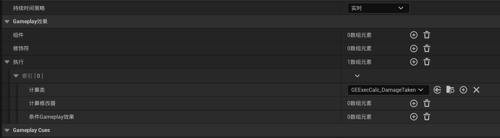

**WarriorStructTypes类**

```c++
#include "ScalableFloat.h"
USTRUCT(BlueprintType)
struct FWarriorHeroWeaponData
{
    GENERATED_BODY()
    UPROPERTY(EditDefaultsOnly, BlueprintReadOnly)
    FScalableFloat WeaponBaseDamage;   //添加武器基础伤害

};
```

**HeroCombatComponent类**

```c++
//HeroCombatComponent.h
     // 声明：获取当前装备的武器对象（蓝图可调用）
     UFUNCTION(BlueprintCallable, Category = "Warrior|Combat")
    AWarriorHeroWeapon* GetHeroCurrentEquippedWeapon() const;
     // 声明：根据等级获取当前武器的伤害值（蓝图可调用）
    UFUNCTION(BlueprintCallable, Category = "Warrior|Combat")
    float GetHeroCurrentEquippedWeaponDamageAtLevel(float InLevel) const;
//HeroCombatComponent.cpp
// 函数：获取当前角色装备的武器对象
AWarriorHeroWeapon* UHeroCombatComponent::GetHeroCurrentEquippedWeapon() const
{
    // 1. 调用父类方法获取基础武器对象
    AWeapon* BaseWeapon = GetCharacterCurrentEquippedWeapon();
    
    // 2. 安全转换为自定义武器类型 `AWarriorHeroWeapon`
    return Cast<AWarriorHeroWeapon>(BaseWeapon);
}

// 函数：根据输入等级计算当前武器的伤害值
float UHeroCombatComponent::GetHeroCurrentEquippedWeaponDamageAtLevel(float InLevel) const
{
    // 1. 获取当前武器对象
    AWarriorHeroWeapon* CurrentWeapon = GetHeroCurrentEquippedWeapon();
    if (!CurrentWeapon) 
    {
        UE_LOG(LogCombat, Error, TEXT("No equipped weapon!"));
        return 0.0f; // 防御性检查：武器无效时返回0
    }

    // 2. 从武器数据中获取基础伤害曲线（`FRealCurve` 或 `UCurveTable`）
    const FHeroWeaponData& WeaponData = CurrentWeapon->HeroWeaponData;
    
    // 3. 通过等级参数查询动态伤害值
    return WeaponData.WeaponBaseDamage.GetValueAtLevel(InLevel);
}
```

* 新建一个曲线表格，作为武器的伤害等级

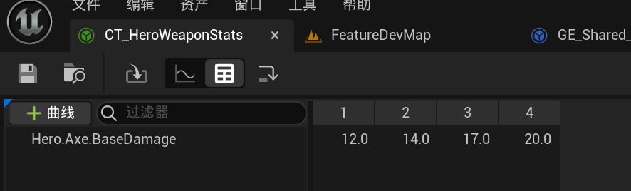


**Hero_LightAttackMaster类**

```c++
//Hero_LightAttackMaster.h
public:
    UPROPERTY(EditDefaultsOnly, Category = "GameplayEffect")
    FGameplayTag InCurrentAttackTypeTag;
    UPROPERTY(EditDefaultsOnly, Category = "GameplayEffect")
    TSubclassOf<UGameplayEffect> EffectClass;
    int UsedComboCount;
protected:
    void HandleApplyDamage(FGameplayEventData Payload);
//Hero_LightAttackMaster.cpp

/**
 * 功能：处理轻攻击技能的伤害应用逻辑
 * 触发时机：接收到战斗组件发送的伤害事件（如武器命中目标）
 * 
 * @param Payload 包含事件数据的结构体（如目标Actor、命中位置等）
 */
void UHero_LightAttackMaster::HandleApplyDamage(FGameplayEventData Payload)
{
    // 1. 获取武器基础伤害（动态计算）
    //   - 通过角色战斗组件获取当前装备武器在 *当前技能等级* 下的伤害值
    float InWeaponBaseDamage = GetHeroCombatComponentFromActorInfo()->GetHeroCurrentEquippedWeaponDamageAtLevel(GetAbilityLevel());
    
    // 2. 创建伤害效果规格句柄（GameplayEffectSpec）
    //   - EffectClass: 预配置的伤害效果蓝图（如暴击/穿透等）
    //   - InWeaponBaseDamage: 动态计算的武器基础伤害
    //   - InCurrentAttackTypeTag: 攻击类型标签（如"Attack.Light"）
    //   - UsedComboCount: 当前连击次数（用于动态调整伤害倍率）
    FGameplayEffectSpecHandle InSpecHandle = 
        MakeHeroDamageEffectSpecHandle(EffectClass, InWeaponBaseDamage, InCurrentAttackTypeTag, UsedComboCount);
    
    // 3. 注：此处应添加伤害应用逻辑（未完整展示）
    //   通常需调用：ApplyGameplayEffectSpecToTarget(InSpecHandle, Payload.TargetActor);
}
```

### 应用句柄到目标

```c++
//WarriorGameplayAbility.h
   FActiveGameplayEffectHandle NativeApplyEffectSpecHandleToTarget(AActor* TargetActor, const FGameplayEffectSpecHandle& InSpecHandle);
    UFUNCTION(BlueprintCallable, Category = "Warrior|Ability", meta = (DisplayName = "Apply Gameplay Effect Spec Handle To Target Actor", ExpandEnumAsExecs = "OutSuccessType"))
    FActiveGameplayEffectHandle BP_ApplyEffectSpecHandleToTarget(AActor* TargetActor, const FGameplayEffectSpecHandle& InSpecHandle,EWarriorSuccessType& OutSuccessType);
//WarriorGameplayAbility.cpp

/**
 * 功能：将效果规格（GameplayEffectSpec）应用到目标Actor（原生C++实现）
 * 
 * 参数说明：
 *   - TargetActor: 目标Actor（需包含AbilitySystemComponent）
 *   - InSpecHandle: 预配置的GameplayEffectSpec句柄（包含伤害公式、标签等数据）
 * 
 * 返回值：应用后生成的活跃效果句柄（FActiveGameplayEffectHandle），用于后续追踪或移除效果
 * 网络同步：此函数在服务端和客户端均可调用，但实际效果应用需服务端权威验证[2,4](@ref)
 */
FActiveGameplayEffectHandle UWarriorGameplayAbility::NativeApplyEffectSpecHandleToTarget(
    AActor* TargetActor, const FGameplayEffectSpecHandle& InSpecHandle)
{
    // 1. 获取目标Actor的AbilitySystemComponent（ASC）
    UAbilitySystemComponent* TargetASC = 
        UAbilitySystemBlueprintLibrary::GetAbilitySystemComponent(TargetActor);
    
    // 防御性检查：确保目标ASC和效果规格有效
    check(TargetASC && InSpecHandle.IsValid()); // 任一无效时触发断言崩溃

    // 2. 通过自身ASC将效果应用到目标ASC
    return GetAbilitySystemComponentFromActorInfo()->ApplyGameplayEffectSpecToTarget(
        *InSpecHandle.Data,  // 解引用获取GameplayEffectSpec实例
        TargetASC            // 目标组件
    );
}

//----------------------------------------------------------------//

/**
 * 功能：蓝图可调用的效果应用函数（扩展执行分支逻辑）
 * 
 * 参数说明：
 *   - TargetActor: 目标Actor
 *   - InSpecHandle: 效果规格句柄
 *   - OutSuccessType: 输出枚举（通过ExpandEnumAsExecs生成蓝图分支引脚）
 * 
 * 返回值：同原生函数，但额外提供执行状态标识
 * 设计意图：为蓝图提供可视化成功/失败分支[1](@ref)
 */
FActiveGameplayEffectHandle UWarriorGameplayAbility::BP_ApplyEffectSpecHandleToTarget(
    AActor* TargetActor, const FGameplayEffectSpecHandle& InSpecHandle, 
    EWarriorSuccessType& OutSuccessType)
{
    // 调用原生应用函数
    FActiveGameplayEffectHandle ActiveHandle = 
        NativeApplyEffectSpecHandleToTarget(TargetActor, InSpecHandle);
    
    // 判断应用是否成功（底层验证ASC有效性及网络权限）
    OutSuccessType = ActiveHandle.WasSuccessfullyApplied() ? 
        EWarriorSuccessType::Successful : 
        EWarriorSuccessType::Failed;
    
    return ActiveHandle;
}
```

**Hero_LightAttackMaster类**

```c++
//Hero_LightAttackMaster.cpp
void UHero_LightAttackMaster::HandleApplyDamage(FGameplayEventData Payload)
{
    // 1. 获取武器基础伤害（动态计算）
    //   - 通过角色战斗组件获取当前装备武器在 *当前技能等级* 下的伤害值
    float InWeaponBaseDamage = GetHeroCombatComponentFromActorInfo()->GetHeroCurrentEquippedWeaponDamageAtLevel(GetAbilityLevel());
    
    // 2. 创建伤害效果规格句柄（GameplayEffectSpec）
    //   - EffectClass: 预配置的伤害效果蓝图（如暴击/穿透等）
    //   - InWeaponBaseDamage: 动态计算的武器基础伤害
    //   - InCurrentAttackTypeTag: 攻击类型标签（如"Attack.Light"）
    //   - UsedComboCount: 当前连击次数（用于动态调整伤害倍率）
    FGameplayEffectSpecHandle InSpecHandle = 
        MakeHeroDamageEffectSpecHandle(EffectClass, InWeaponBaseDamage, InCurrentAttackTypeTag, UsedComboCount);
    
    // 3. 获取目标Actor（需包含AbilitySystemComponent）
    //   - 从事件数据中提取目标，静态转换避免运行时开销
    //   - 防御性检查：实际项目中需验证Payload.Target有效性
    AActor* LocalTargetActor = static_cast<AActor*>(Payload.Target);
    
    // 4. 将伤害效果应用到目标
    //   - NativeApplyEffectSpecHandleToTarget内部处理ASC获取和网络同步[5](@ref)
    //   - 返回FActiveGameplayEffectHandle用于后续追踪（如移除效果）
    FActiveGameplayEffectHandle ActiveGameplayEffectHandle = 
        NativeApplyEffectSpecHandleToTarget(LocalTargetActor, InSpecHandle);
}
```

### **GameplayEffect执行计算**‌

**GEExecCalc_DamageTaken类**

```c++
//GameplayEffectExecutionCalculation.h

#pragma once
#include "CoreMinimal.h"
#include "GameplayEffectExecutionCalculation.h" // 继承GAS的执行计算基类
#include "GEExecCalc_DamageTaken.generated.h"   // Unreal 反射生成头文件

/**
 * 功能：自定义伤害承受执行计算器
 * 核心作用：实时计算角色受到的最终伤害值，支持动态修正（如防御减伤、抗性等）
 * 设计原理：
 *   - 继承自UGameplayEffectExecutionCalculation，重写Execute_Implementation
 *   - 通过属性捕获（Attribute Capture）读取攻击方和受击方的属性值
 *   - 基于游戏逻辑（如护甲公式、元素抗性）动态修正伤害值
 * 网络同步：自动处理客户端预测与服务端权威验证
 */
UCLASS()
class MYWARRIOR_API UGEExecCalc_DamageTaken : public UGameplayEffectExecutionCalculation
{
    GENERATED_BODY()
public:
    // 构造函数：声明需要捕获的属性（如攻击力、护甲值、抗性等）
    UGEExecCalc_DamageTaken();

    /**
     * 核心计算逻辑：执行伤害计算
     * 
     * @param ExecutionParams  提供计算所需上下文数据（攻击方/受击方ASC、标签、属性值等）
     * @param OutExecutionOutput 输出计算结果（最终修改的属性值）
     */
    virtual void Execute_Implementation(
        const FGameplayEffectCustomExecutionParameters& ExecutionParams,
        FGameplayEffectCustomExecutionOutput& OutExecutionOutput
    ) const override;
};
//GameplayEffectExecutionCalculation.cpp
#pragma once
#include "AbilitySystem/GEExecCalc/GEExecCalc_DamageTaken.h"
#include "AbilitySystem/WarriorAttributeSet.h"
#include "WarriorGameplayTags.h"
#include "WarriorDebugHelper.h"

// 定义捕获属性的结构体（封装攻击力、防御力、承受伤害属性）
struct FWarriorDamageCapture
{
    // 声明属性捕获宏（自动生成属性定义）
    DECLARE_ATTRIBUTE_CAPTUREDEF(AttackPower) // 攻击力（源）
    DECLARE_ATTRIBUTE_CAPTUREDEF(DefensePower) // 防御力（目标）
    DECLARE_ATTRIBUTE_CAPTUREDEF(DamageTaken)  // 承受伤害（目标）

    // 构造函数：初始化属性捕获定义
    FWarriorDamageCapture()
    {
        // 参数：属性集类、属性名、捕获源（Source/Target）、是否快照
        DEFINE_ATTRIBUTE_CAPTUREDEF(UWarriorAttributeSet, AttackPower, Source, false)   // 从攻击方捕获
        DEFINE_ATTRIBUTE_CAPTUREDEF(UWarriorAttributeSet, DefensePower, Target, false) // 从受击方捕获
        DEFINE_ATTRIBUTE_CAPTUREDEF(UWarriorAttributeSet, DamageTaken, Target, false)   // 输出到受击方
    }
};

// 单例模式获取属性捕获结构体（避免重复初始化）
static const FWarriorDamageCapture& GetWarriorDamageCapture()
{
    static FWarriorDamageCapture WarriorDamageCapture; // 静态局部变量（线程安全）
    return WarriorDamageCapture;
}

// 构造函数：注册需要捕获的属性
UGEExecCalc_DamageTaken::UGEExecCalc_DamageTaken()
{
    // 添加属性到捕获列表（通过单例获取定义）
    RelevantAttributesToCapture.Add(GetWarriorDamageCapture().AttackPowerDef);   // 攻击力
    RelevantAttributesToCapture.Add(GetWarriorDamageCapture().DefensePowerDef);   // 防御力
    RelevantAttributesToCapture.Add(GetWarriorDamageCapture().DamageTakenDef);     // 承受伤害
}

// 核心执行函数：计算最终伤害
void UGEExecCalc_DamageTaken::Execute_Implementation(
    const FGameplayEffectCustomExecutionParameters& ExecutionParams, 
    FGameplayEffectCustomExecutionOutput& OutExecutionOutput
) const 
{
    // 1. 获取当前GameplayEffect规格（包含伤害参数）
    const FGameplayEffectSpec& EffectSpec = ExecutionParams.GetOwningSpec();

    // 2. 设置评估参数（聚合源/目标标签）
    FAggregatorEvaluateParameters EvaluateParameters;
    EvaluateParameters.SourceTags = EffectSpec.CapturedSourceTags.GetAggregatedTags(); // 攻击方标签
    EvaluateParameters.TargetTags = EffectSpec.CapturedTargetTags.GetAggregatedTags(); // 受击方标签

    // 3. 捕获源属性：攻击力
    float SourceAttackPower = 0.f;
    ExecutionParams.AttemptCalculateCapturedAttributeMagnitude(
        GetWarriorDamageCapture().AttackPowerDef, EvaluateParameters, SourceAttackPower
    );

    // 4. 从SetByCaller动态参数获取基础值和连击数
    float BaseDamage = 0.f;
    int32 UsedLightAttackComboCount = 0;
    int32 UsedHeavyAttackComboCount = 0;
    
    // 遍历SetByCaller键值对
    for (const TPair<FGameplayTag, float>& TagMagnitude : EffectSpec.SetByCallerTagMagnitudes) 
    {
        // 匹配基础伤害标签
        if (TagMagnitude.Key.MatchesTagExact(WarriorGameplayTags::Shared_SetByCaller_BaseDamage)) {
            BaseDamage = TagMagnitude.Value;
        }
        // 匹配轻攻击连击数标签
        if (TagMagnitude.Key.MatchesTagExact(WarriorGameplayTags::Player_SetByCaller_AttackType_Light)) {
            UsedLightAttackComboCount = TagMagnitude.Value;
        }
        // 匹配重攻击连击数标签
        if (TagMagnitude.Key.MatchesTagExact(WarriorGameplayTags::Player_SetByCaller_AttackType_Heavy)) {
            UsedHeavyAttackComboCount = TagMagnitude.Value;
        }
    }

    // 5. 捕获目标属性：防御力
    float TargetDefensePower = 0.f;
    ExecutionParams.AttemptCalculateCapturedAttributeMagnitude(
        GetWarriorDamageCapture().DefensePowerDef, EvaluateParameters, TargetDefensePower
    );

    // 6. 连击伤害倍率计算
    // 轻攻击：每连击+5%伤害（第1击100%，第2击105%，第3击110%...）
    if (UsedLightAttackComboCount != 0) {
        const float DamageIncreasePercentLight = (UsedLightAttackComboCount - 1) * 0.05f + 1.f;
        BaseDamage *= DamageIncreasePercentLight;
    }
    // 重攻击：每连击+15%伤害（第1击115%，第2击130%...）
    if (UsedHeavyAttackComboCount != 0) {
        const float DamageIncreasePercentHeavy = UsedHeavyAttackComboCount * 0.15f + 1.f;
        BaseDamage *= DamageIncreasePercentHeavy;
    }

    // 7. 最终伤害公式：基础伤害 × 攻击力 ÷ 防御力
    const float FinalDamageDone = BaseDamage * SourceAttackPower / TargetDefensePower;

    // 8. 输出结果到DamageTaken属性（覆盖写入）
    if (FinalDamageDone > 0.f) {
        OutExecutionOutput.AddOutputModifier(
            FGameplayModifierEvaluatedData(
                GetWarriorDamageCapture().DamageTakenProperty, // 目标属性
                EGameplayModOp::Override,                     // 操作类型（覆盖）
                FinalDamageDone                               // 计算值
            )
        );
    }
}
```

### 属性集

* 重写UAttributeSet类中的PostGameplayEffectExecute函数

```c++
 //WarriorAttributeSet.h
virtual void PostGameplayEffectExecute(const struct FGameplayEffectModCallbackData& Data) override;
 //WarriorAttributeSet.cpp
#include "GameplayEffectExtension.h"
#include "WarriorFunctionLibrary.h"
#include "WarriorGameplayTags.h"
// 在 GameplayEffect 成功修改属性后触发的回调函数
void UWarriorAttributeSet::PostGameplayEffectExecute(const FGameplayEffectModCallbackData& Data)
{

    // 4. 处理生命值（CurrentHealth）属性变化
    if (Data.EvaluatedData.Attribute == GetCurrentHealthAttribute()) 
    {
        // 4.1 约束生命值范围 [0, MaxHealth]
        const float NewCurrentHealth = FMath::Clamp(GetCurrentHealth(), 0.f, GetMaxHealth());
        SetCurrentHealth(NewCurrentHealth); // 更新属性值

    }

    // 5. 处理怒气值（CurrentRage）属性变化
    if (Data.EvaluatedData.Attribute == GetCurrentRageAttribute()) 
    {
        // 5.1 约束怒气值范围 [0, MaxRage]
        const float NewCurrentRage = FMath::Clamp(GetCurrentRage(), 0.f, GetMaxRage());
        SetCurrentRage(NewCurrentRage);

    }

    // 6. 处理承受伤害（DamageTaken）属性变化
    if (Data.EvaluatedData.Attribute == GetDamageTakenAttribute()) 
    {
        // 6.1 记录旧生命值并获取伤害值
        const float OldHealth = GetCurrentHealth();
        const float DamageDone = GetDamageTaken(); 

        // 6.2 计算新生命值（扣减伤害并约束范围）
        const float NewCurrentHealth = FMath::Clamp(OldHealth - DamageDone, 0.f, GetMaxHealth());
        SetCurrentHealth(NewCurrentHealth);

        // 6.3 调试输出伤害详情（服务端可见）
        const FString DebugString = FString::Printf(
            TEXT("Old Health: %f, Damage Done: %f, NewCurrentHealth: %f"), 
            OldHealth, DamageDone, NewCurrentHealth
        );
        Debug::Print(DebugString, FColor::Green);
    }
}
```

## **击中反应（Hit React）**

* 为敌人创建击中反应能力

敌人能力创建流程

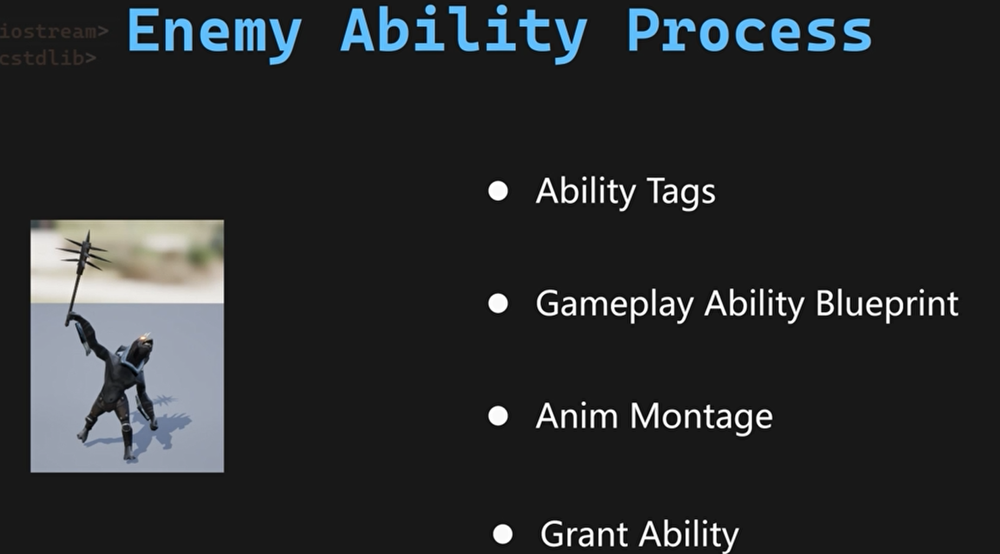

首先添加**Shared_Ability_HitReact，Shared_Event_HitReact，Enemy_Ability_Melee**和**Enemy_Ability_Ranged**标签

创建**Enemy_HitReact_Base**，其子类这样设置。

通过这两项配置，默认情况下，敌人的受击反应能力可 **中断并封锁** 其自身的攻击能力。确保受击反应期间敌人无法继续攻击，提升战斗流畅性。

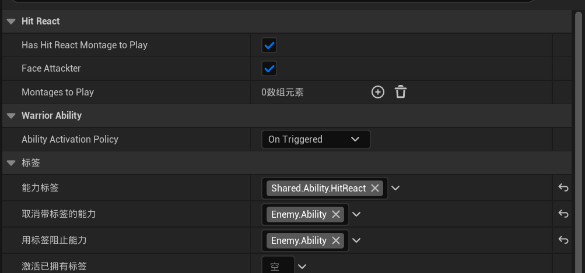

接下来配置 **实例化策略（Instancing Policy）**。由于受击反应能力会被频繁激活……

将其从 **Per Execution（每次执行）** 改为 **Per Actor（每个角色）**。

* **Per Actor**：每个角色仅保留一个能力实例，后续激活复用该实例
* **适用场景**：受击、跳跃等高频能力，减少内存碎片和初始化耗时。

向下滚动至 **Ability Triggers（能力触发器）**，点击添加按钮新增元素。在触发器标签的下拉菜单中，选择刚创建的 **Shared.Event.HitReact** 事件标签。

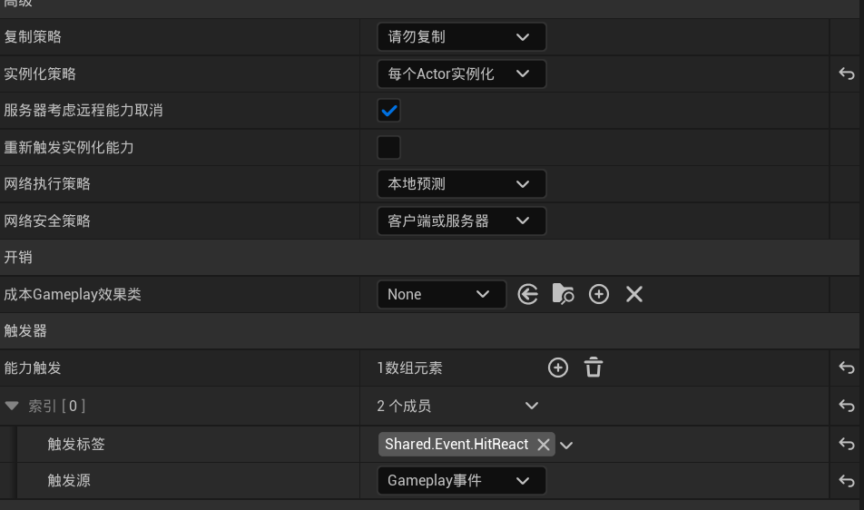

**Enemy_HitReact_Base类**

```c++
//Enemy_HitReact_Base.h
#pragma once
#include "CoreMinimal.h"
#include "AbilitySystem/Abilities/WarriorEnemyGameplayAbility.h" // 继承自定义敌人能力基类
#include "Enemy_HitReact_Base.generated.h"

class UAnimMontage;
class UAbilityTask_PlayMontageAndWait;

UCLASS()
class MYWARRIOR_API UEnemy_HitReact_Base : public UWarriorEnemyGameplayAbility {
    GENERATED_BODY()
public:
    // 配置参数：是否播放受击动画
    UPROPERTY(EditDefaultsOnly, Category = "HitReact")
    bool HasHitReactMontageToPlay = true;

    // 配置参数：是否转向攻击者
    UPROPERTY(EditDefaultsOnly, Category = "HitReact")
    bool FaceAttackter = true;

    // 配置参数：可随机播放的受击动画蒙太奇列表
    UPROPERTY(EditDefaultsOnly, Category = "HitReact")
    TArray<UAnimMontage*> MontagesToPlay;

protected:
    // 动画播放完成回调函数
    UFUNCTION()
    void OnMontage();

    // 重写能力激活逻辑
    virtual void ActivateAbility(const FGameplayAbilitySpecHandle Handle, 
        const FGameplayAbilityActorInfo* ActorInfo,
        const FGameplayAbilityActivationInfo ActivationInfo, 
        const FGameplayEventData* TriggerEventData) override;

    // 重写能力结束逻辑
    virtual void EndAbility(const FGameplayAbilitySpecHandle Handle, 
        const FGameplayAbilityActorInfo* ActorInfo,
        const FGameplayAbilityActivationInfo ActivationInfo, 
        bool bReplicateEndAbility, bool bWasCancelled) override;

private:
    // 动画播放任务实例
    UAbilityTask_PlayMontageAndWait* PlayMontageTask;

    // 随机选择蒙太奇动画
    UAnimMontage* ShuffleMontage();
};
//Enemy_HitReact_Base.cpp
#include "AbilitySystem/Abilities/Shared/Enemy_HitReact_Base.h"
#include "Abilities/Tasks/AbilityTask_PlayMontageAndWait.h" // 动画任务类
#include "Kismet/KismetSystemLibrary.h" // 延迟函数
#include "Kismet/KismetMathLibrary.h"   // 数学计算（转向逻辑）
#include "Engine/LatentActionManager.h" // 延迟回调管理
#include "Characters/WarriorEnemyCharacter.h" // 敌人角色类

// 能力激活核心逻辑
void UEnemy_HitReact_Base::ActivateAbility(...) {
    // Lambda 1: 转向攻击者
    auto Task1 = [this, EventDataCopy = *TriggerEventData] {
        if (FaceAttackter) {
            FVector Start = GetEnemyCharacterFromActorInfo()->GetActorLocation();
            FVector Target = EventDataCopy.Instigator->GetActorLocation(); // 攻击者位置
            FRotator NewRotation = UKismetMathLibrary::FindLookAtRotation(Start, Target);
            GetEnemyCharacterFromActorInfo()->SetActorRotation(NewRotation); // 立即转向[5](@ref)
        }
    };

    // Lambda 2: 播放受击动画或延迟结束
    auto Task2 = [this] {
        if (HasHitReactMontageToPlay) {
            UAnimMontage* MontageToPlay = ShuffleMontage(); // 随机选择动画
            PlayMontageTask = UAbilityTask_PlayMontageAndWait::CreatePlayMontageAndWaitProxy(...);
            // 绑定动画事件回调
            PlayMontageTask->OnCompleted.AddDynamic(this, &ThisClass::OnMontage);
            PlayMontageTask->OnBlendOut.AddDynamic(this, &ThisClass::OnMontage);
            PlayMontageTask->ReadyForActivation(); // 启动任务
            // 激活受击材质特效（如角色高亮）
            GetOwningComponentFromActorInfo()->SetScalarParameterValueOnMaterials("HitFxSwitch", 1.f);
        } 
        else { // 无动画时延迟结束
            UKismetSystemLibrary::Delay(GetWorld(), 0.2f, FLatentActionInfo(...));
            GetOwningComponentFromActorInfo()->SetScalarParameterValueOnMaterials("HitFxSwitch", 1.f);
        }
    };

    // 顺序执行任务（确保转向在动画前完成）
    Task1(); 
    Task2();
}

// 动画播放完成回调
void UEnemy_HitReact_Base::OnMontage() {
    if (PlayMontageTask) PlayMontageTask->EndTask(); // 清理任务
    EndAbility(...); // 结束能力
}

// 随机选择蒙太奇动画
UAnimMontage* UEnemy_HitReact_Base::ShuffleMontage() {
    int32 Index = FMath::RandRange(0, MontagesToPlay.Num() - 1);
    return MontagesToPlay[Index]; // 避免重复受击动画
}

// 能力结束逻辑
void UEnemy_HitReact_Base::EndAbility(...) {
    Super::EndAbility(...); // 调用父类
    // 关闭受击材质特效
    GetOwningComponentFromActorInfo()->SetScalarParameterValueOnMaterials("HitFxSwitch", 0.f);
}
```

创建GA_Enemy_HitReact_Base子类GA_Guardian_HitReact添加动画蒙太奇。

 

之后为了触发击中反应能力在Hero_LightAttackMaster类

**Hero_LightAttackMaster类**

```c++
//Hero_LightAttackMaster.cpp
// 处理轻攻击伤害应用的核心函数
void UHero_LightAttackMaster::HandleApplyDamage(FGameplayEventData Payload)
{
    // 1. 获取当前武器基础伤害值（基于能力等级）
    float InWeaponBaseDamage = GetHeroCombatComponentFromActorInfo()
        ->GetHeroCurrentEquippedWeaponDamageAtLevel(GetAbilityLevel());

    // 2. 创建伤害效果规格（GameplayEffectSpec）
    FGameplayEffectSpecHandle InSpecHandle = 
        MakeHeroDamageEffectSpecHandle( // 自定义封装函数
            EffectClass,                // 伤害效果类（如扣血、附加异常状态）
            InWeaponBaseDamage,         // 基础伤害值
            InCurrentAttackTypeTag,     // 当前攻击类型标签（如Light_Attack）
            UsedComboCount              // 当前连击数（用于动态伤害倍率）
        );

    // 3. 转换目标对象为Actor指针
    AActor* LocalTargetActor = static_cast<AActor*>(Payload.Target);


    // 5. 将伤害效果应用到目标Actor
    FActiveGameplayEffectHandle ActiveGameplayEffectHandle = 
        NativeApplyEffectSpecHandleToTarget(LocalTargetActor, InSpecHandle);

    // 6. 若效果应用成功，发送GameplayEvent通知目标
    if (ActiveGameplayEffectHandle.WasSuccessfullyApplied()) 
    {
        UAbilitySystemBlueprintLibrary::SendGameplayEventToActor(
            LocalTargetActor, 
            ToActorEventTag, // 事件标签（如Event.HitReact）
            Payload          // 传递原始事件数据（含伤害来源、数值等）
        );
    }
}
```

重击同理

## 击中/声音特效（Hit/SoundFx）

### 材质击中特效(Material Hit FX)

* 使用准备好的材质函数进行添加到怪物的材质上

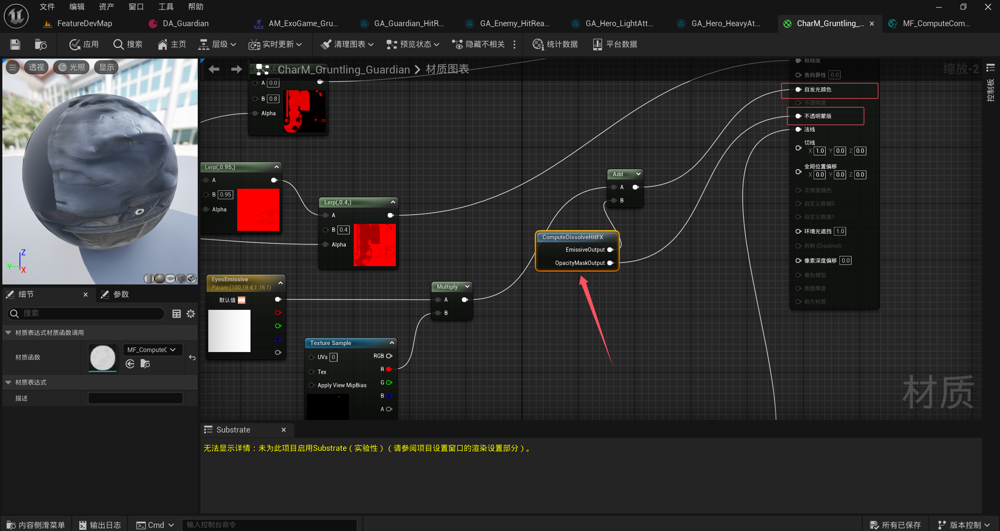

**Enemy_HitReact_Base类**看上方

### 声音特效(Sound FX)

**1. 击中反应声效**

在动画蒙太奇中添加声音

**2. 近战击中声效**

由于不是每次播放蒙太奇就要播放声音，这里选择用GameplayCues。

**Hero_AxeHit_GCNotify_Base类**

```c++
//Hero_AxeHit_GCNotify_Base.h
#pragma once
#include "CoreMinimal.h"
#include "GameplayCueNotify_Static.h"  // 静态GameplayCue基类（非动态生成）
#include "Hero_AxeHit_GCNotify_Base.generated.h"

class USoundBase;

/**
 * 功能：斧头命中特效的静态GameplayCue通知器
 * 设计特点：
 *   - 继承自UGameplayCueNotify_Static，适用于无需动态生成的简单特效
 *   - 通过覆写OnExecute_Implementation实现基础音效播放逻辑
 *   - 可扩展性：支持后续添加粒子、动画等特效
 */
UCLASS()
class MYWARRIOR_API UHero_AxeHit_GCNotify_Base : public UGameplayCueNotify_Static
{
    GENERATED_BODY()
public:
    // 配置斧头命中音效资源（通过编辑器设置）
    UPROPERTY(EditDefaultsOnly, Category = "Sound")
    USoundBase* Sound;

    /**
     * 处理GameplayCue事件入口
     * @param MyTarget   目标Actor（被斧头击中的对象）
     * @param EventType  Cue事件类型（如OnActive、WhileActive、Executed、Removed）
     * @param Parameters 包含伤害数值、命中位置等上下文数据
     */
    virtual void HandleGameplayCue(
        AActor* MyTarget, 
        EGameplayCueEvent::Type EventType, 
        const FGameplayCueParameters& Parameters
    ) override;

    /**
     * 执行核心逻辑（实际播放音效）
     * @param Target    目标Actor
     * @param Parameters 上下文参数
     * @return 是否执行成功
     */
    virtual bool OnExecute_Implementation(
        AActor* Target, 
        const FGameplayCueParameters& Parameters
    ) const override;
};
//Hero_AxeHit_GCNotify_Base.cpp
#include "AbilitySystem/GameplayCues/Hero_AxeHit_GCNotify_Base.h"
#include "Kismet/GameplayStatics.h"  // 音效播放API
#include "GameplayEffectTypes.h"     // FGameplayCueParameters定义

void UHero_AxeHit_GCNotify_Base::HandleGameplayCue(...)
{
    Super::HandleGameplayCue(MyTarget, EventType, Parameters); // 保留父类基础处理
    // 可在此处扩展其他事件逻辑（如WhileActive持续播放声音）
}

bool UHero_AxeHit_GCNotify_Base::OnExecute_Implementation(...) const
{
    // 1. 获取目标Actor位置作为音效播放位置
    FVector Location = Target->GetActorLocation();
    
    // 2. 在目标位置播放配置的音效
    UGameplayStatics::PlaySoundAtLocation(
        GetWorld(),   // 获取当前World上下文
        Sound,        // 配置的音效资源
        Location      // 命中位置
    );
    
    // 3. 调用父类实现（通常返回true表示成功）
    return Super::OnExecute_Implementation(Target, Parameters);
}
```

**Hero_LightAttackMaster类**

```c++
//Hero_LightAttackMaster.cpp
// 处理轻攻击伤害应用的核心函数
void UHero_LightAttackMaster::HandleApplyDamage(FGameplayEventData Payload)
{
    // 1. 获取当前武器基础伤害值（基于能力等级）
    float InWeaponBaseDamage = GetHeroCombatComponentFromActorInfo()
        ->GetHeroCurrentEquippedWeaponDamageAtLevel(GetAbilityLevel());

    // 2. 创建伤害效果规格（GameplayEffectSpec）
    FGameplayEffectSpecHandle InSpecHandle = 
        MakeHeroDamageEffectSpecHandle( // 自定义封装函数
            EffectClass,                // 伤害效果类（如扣血、附加异常状态）
            InWeaponBaseDamage,         // 基础伤害值
            InCurrentAttackTypeTag,     // 当前攻击类型标签（如Light_Attack）
            UsedComboCount              // 当前连击数（用于动态伤害倍率）
        );

    // 3. 转换目标对象为Actor指针
    AActor* LocalTargetActor = static_cast<AActor*>(Payload.Target);

    // 4. 触发武器命中音效的GameplayCue
    GetWarriorAbilitySystemComponentFromActorInfo()
        ->ExecuteGameplayCue(WeaponHitSoundGameplayCueTag); // 播放音效/粒子特效

    // 5. 将伤害效果应用到目标Actor
    FActiveGameplayEffectHandle ActiveGameplayEffectHandle = 
        NativeApplyEffectSpecHandleToTarget(LocalTargetActor, InSpecHandle);

    // 6. 若效果应用成功，发送GameplayEvent通知目标
    if (ActiveGameplayEffectHandle.WasSuccessfullyApplied()) 
    {
        UAbilitySystemBlueprintLibrary::SendGameplayEventToActor(
            LocalTargetActor, 
            ToActorEventTag, // 事件标签（如Event.HitReact）
            Payload          // 传递原始事件数据（含伤害来源、数值等）
        );
    }
}
```

* 然后在DefaultGame.ini文件中添加路径

```
[/Script/GameplayAbilities.AbilitySystemGlobals]
GameplayCueNotifyPaths="/Game/GameplayCues"
```

* **功能**：指定GameplayCue资源的搜索路径。
* **优化意义**：
  - 默认情况下，GAS会扫描整个 `/Game`目录查找GameplayCue资源，**大型项目可能引发性能问题**（如加载卡顿、内存占用高）。
  - 通过限制路径为 `/Game/GameplayCues`，引擎仅扫描该目录，**显著提升资源加载效率和运行时性能**。

### 击中停顿(Hit Pause)

添加**Player_Ability_HitPause**和**Player_Event_HitPause**标签。

**HeroCombatComponent类**

```c++
// HeroCombatComponent.cpp

// 函数功能：处理武器命中目标Actor时的逻辑，避免重复触发伤害
//HeroCombatComponent.cpp
#include "WarriorGameplayTags.h"         // 引用自定义的游戏标签库（用于标识事件类型）
#include "AbilitySystemBlueprintLibrary.h" // 提供GAS蓝图库功能

void UHeroCombatComponent::OnHitTargetActor(AActor* HitActor) 
{
    // 3. 构造游戏事件数据（传递伤害计算所需上下文）
    FGameplayEventData Data;
    Data.Instigator = GetOwningPawn();  // 伤害发起者（玩家角色）
    Data.Target = HitActor;              // 伤害承受者（被击中的Actor）

    // 4. 发送命中停顿
        UAbilitySystemBlueprintLibrary::SendGameplayEventToActor(
        GetOwningPawn(),               // 事件发送给玩家角色的AbilitySystemComponent
        WarriorGameplayTags::Player_Event_HitPause,   // 标签：标识"命中停顿"事件类型
        FGameplayEventData()           // 空
        );
}
```

**GA_Hero_Hit_Pause_C类**

```lua
local Screen = require("Widgets.Screen")
--
-- DESCRIPTION
--
-- @COMPANY **
-- @AUTHOR **
-- @DATE ${date} ${time}
--
require("LuaPanda").start("127.0.0.1",8818);

---@type GA_Hero_Hit_Pause_C
local M = UnLua.Class()

function M:ExecuteHitPause()
    local world = self:GetWorld()
    -- 启动协程处理延迟逻辑
--[[     coroutine.wrap(function()
        -- 记录当前时间膨胀状态
        UE.UGameplayStatics.SetGlobalTimeDilation(world, 0.1)
        Screen.Print("时间膨胀已激活，当前膨胀系数: 0.1")

        -- 关键！使用Unreal原生延迟函数（Latent Function）
        UE.UKismetSystemLibrary.Delay(world, self.HitPauseDuration)
        
        -- 恢复时间并结束技能
        UE.UGameplayStatics.SetGlobalTimeDilation(world, 1.0)
        Screen.Print("时间膨胀已恢复，当前膨胀系数: 1.0")
        self:K2_EndAbility()
    end)() ]]
    coroutine.resume(coroutine.create(function()
        -- 记录当前时间膨胀状态
        UE.UGameplayStatics.SetGlobalTimeDilation(world, 0.1)
        --Screen.Print("时间膨胀已激活，当前膨胀系数: 0.1")

        -- 关键！使用Unreal原生延迟函数（Latent Function）
        UE.UKismetSystemLibrary.Delay(world, self.HitPauseDuration)

        -- 恢复时间并结束技能
        UE.UGameplayStatics.SetGlobalTimeDilation(world, 1.0)
        --Screen.Print("时间膨胀已恢复，当前膨胀系数: 1.0")
        self:K2_EndAbility()
    end))
end

function M:K2_ActivateAbilityFromEvent(EventData)
    self:ExecuteHitPause()
end

return M

```

## 相机抖动（Camera Shake）

**GA_Hero_Hit_Pause_C类**

```lua
local Screen = require("Widgets.Screen")
--
-- DESCRIPTION
--
-- @COMPANY **
-- @AUTHOR **
-- @DATE ${date} ${time}
--
require("LuaPanda").start("127.0.0.1",8818);

---@type GA_Hero_Hit_Pause_C
local M = UnLua.Class()

function M:camerashake()
    -- 获取当前角色的控制器
    local HeroController = self:GetHeroControllerFromActorInfo()
    if HeroController then
        -- 获取当前角色的摄像机组件
         HeroController:ClientStartCameraShake(self.CameraShakeClass, 1.0)
    end
end
function M:ExecuteHitPause()
    local world = self:GetWorld()
    -- 启动协程处理延迟逻辑
--[[     coroutine.wrap(function()
        -- 记录当前时间膨胀状态
        UE.UGameplayStatics.SetGlobalTimeDilation(world, 0.1)
        Screen.Print("时间膨胀已激活，当前膨胀系数: 0.1")

        -- 关键！使用Unreal原生延迟函数（Latent Function）
        UE.UKismetSystemLibrary.Delay(world, self.HitPauseDuration)
        
        -- 恢复时间并结束技能
        UE.UGameplayStatics.SetGlobalTimeDilation(world, 1.0)
        Screen.Print("时间膨胀已恢复，当前膨胀系数: 1.0")
        self:K2_EndAbility()
    end)() ]]
    coroutine.resume(coroutine.create(function()
        -- 记录当前时间膨胀状态
        UE.UGameplayStatics.SetGlobalTimeDilation(world, 0.1)
        --Screen.Print("时间膨胀已激活，当前膨胀系数: 0.1")

        -- 关键！使用Unreal原生延迟函数（Latent Function）
        UE.UKismetSystemLibrary.Delay(world, self.HitPauseDuration)

        -- 恢复时间并结束技能
        UE.UGameplayStatics.SetGlobalTimeDilation(world, 1.0)
        --Screen.Print("时间膨胀已恢复，当前膨胀系数: 1.0")
        -- 执行摄像机震动
        self:camerashake()
        -- 结束技能
        self:K2_EndAbility()
    end))
end

function M:K2_ActivateAbilityFromEvent(EventData)
    self:ExecuteHitPause()
end

return M

```

## 死亡效果（Death）

本节将实现敌人生命值归零时的死亡逻辑，流程如下：

1. **属性集（Attribute Set）检测**：从属性集获取当前生命值。
2. **生命值归零判定**：当该属性集的持有者（Actor）生命值降至零时…………为其添加一个 **死亡标签（GameplayTag）**。
3. **死亡能力（Death Ability）**：通过另一项游戏能力播放死亡蒙太奇动画。该能力在 **死亡标签添加至持有者时自动触发**。
4. **死亡效果**：通过材质与粒子特效增强表现力。

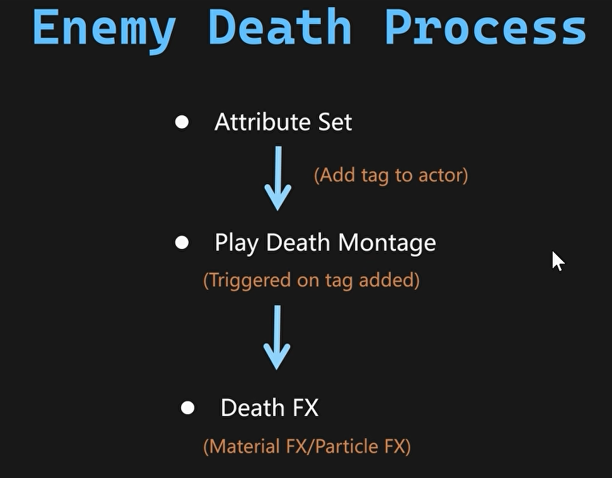

添加**Shared_Ability_Death**和**Shared_Status_Dead**标签

**WarriorAttributeSet类**

```c++
//WarriorAttributeSet.cpp
void UWarriorAttributeSet::PostGameplayEffectExecute(const FGameplayEffectModCallbackData& Data)
{
    // 角色死亡处理逻辑
    if (GetCurrentHealth() == 0.f)
    {
        // 通过工具函数为角色添加死亡标签（若尚未添加）
        UWarriorFunctionLibrary::AddGameplayTagToActorIfNone(
            Data.Target.GetAvatarActor(),      // 目标角色（AvatarActor）
            WarriorGameplayTags::Shared_Status_Dead // 死亡状态标签（如"Status.Dead"）
        );
    }
}
```

创建**Enemy_Death_Base**类其子类**GA_Enemy_Death_Base**这样配置

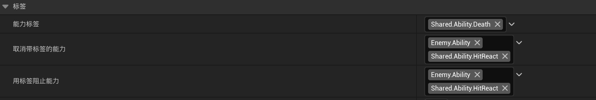


死亡效果得GC和**Hero_AxeHit_GCNotify_Base**逻辑一样直接从这里继承**GC_Guardian_DeathSound**

**Enemy_Death_Base类**

```c++
// Enemy_Death_Base.h
#pragma once
#include "CoreMinimal.h"
#include "AbilitySystem/Abilities/WarriorEnemyGameplayAbility.h"
#include "Enemy_Death_Base.generated.h"

class UAbilityTask_PlayMontageAndWait;
class UNiagaraSystem;

/**
 * 功能：敌人死亡能力的基类
 * 设计特点：
 *   - 继承自 UWarriorEnemyGameplayAbility，复用自定义敌人能力逻辑
 *   - 支持随机播放多个死亡动画蒙太奇（Montage）
 *   - 集成 GameplayCue 触发死亡特效/音效
 *   - 尸体溶解特效（Niagara 系统）
 */
UCLASS()
class MYWARRIOR_API UEnemy_Death_Base : public UWarriorEnemyGameplayAbility {
    GENERATED_BODY()
public:
    // 配置多个死亡动画蒙太奇（支持随机选择）
    UPROPERTY(EditDefaultsOnly, Category = "Death")
    TArray<UAnimMontage*> MontagesArray;

    // 死亡时触发的 GameplayCue 标签（如播放粒子特效、音效）
    UPROPERTY(EditDefaultsOnly, Category = "GameplayCue")
    FGameplayTag DeathGameplayCueTag;


protected:
    // 蒙太奇任务完成时的回调函数
    UFUNCTION()
    void OnMontage();

    // 核心：激活死亡能力（播放动画、触发特效）
    virtual void ActivateAbility(
        const FGameplayAbilitySpecHandle Handle,
        const FGameplayAbilityActorInfo* ActorInfo,
        const FGameplayAbilityActivationInfo ActivationInfo,
        const FGameplayEventData* TriggerEventData
    ) override;

    // 结束能力时处理尸体溶解
    virtual void EndAbility(
        const FGameplayAbilitySpecHandle Handle,
        const FGameplayAbilityActorInfo* ActorInfo,
        const FGameplayAbilityActivationInfo ActivationInfo,
        bool bReplicateEndAbility,
        bool bWasCancelled
    ) override;

    // 从数组中随机选择一个蒙太奇动画
    UAnimMontage* MontagesArrayRandom(TArray<UAnimMontage*> MontagesArrayToRandom);

private:
    // 异步任务：播放蒙太奇动画
    UAbilityTask_PlayMontageAndWait* PlayMontageTask;
};
// Enemy_Death_Base.cpp
#include "AbilitySystem/Abilities/Shared/Enemy_Death_Base.h"
#include "Abilities/Tasks/AbilityTask_PlayMontageAndWait.h"
#include "AbilitySystem/WarriorAbilitySystemComponent.h"
#include "Characters/WarriorEnemyCharacter.h"
#include "Kismet/KismetMathLibrary.h"
#include "NiagaraFunctionLibrary.h"

// 1. 激活死亡能力
void UEnemy_Death_Base::ActivateAbility(...) {
    // 随机选择死亡动画
    UAnimMontage* MontageToPlay = MontagesArrayRandom(MontagesArray);
    
    // 创建异步任务：播放蒙太奇动画
    PlayMontageTask = UAbilityTask_PlayMontageAndWait::CreatePlayMontageAndWaitProxy(
        this, 
        FName("PlayMontageTask"), 
        MontageToPlay
    );

    // 绑定动画结束回调（完成/混合结束/中断/取消均触发）
    PlayMontageTask->OnCompleted.AddDynamic(this, &ThisClass::OnMontage);
    PlayMontageTask->OnBlendOut.AddDynamic(this, &ThisClass::OnMontage);
    PlayMontageTask->OnInterrupted.AddDynamic(this, &ThisClass::OnMontage);
    PlayMontageTask->OnCancelled.AddDynamic(this, &ThisClass::OnMontage);
    
    // 启动异步任务
    PlayMontageTask->ReadyForActivation();

    // 2. 触发死亡GameplayCue（如特效、音效）[7](@ref)
    GetWarriorAbilitySystemComponentFromActorInfo()->ExecuteGameplayCue(DeathGameplayCueTag);
}


// 4. 随机选择蒙太奇动画
UAnimMontage* UEnemy_Death_Base::MontagesArrayRandom(TArray<UAnimMontage*> MontagesArrayToRandom) {
    int32 RandomIndex = FMath::RandRange(0, MontagesArrayToRandom.Num() - 1);
    return MontagesArrayToRandom[RandomIndex];
}

// 5. 蒙太奇动画结束回调
void UEnemy_Death_Base::OnMontage() {
    // 安全结束异步任务
    if (PlayMontageTask) PlayMontageTask->EndTask();
    
    // 结束能力（触发尸体溶解）
    EndAbility(CurrentSpecHandle, CurrentActorInfo, CurrentActivationInfo, true, false);
}
```

当前的问题是：死亡能力结束后，守卫者（Guardian）会**瞬间切回闲置状态**。

这是我们需要修复的问题，解决方案如下：

**死亡能力结束时**，通过能力类中的函数通知 `BP_EnemyCharacter_Base`（敌人角色基类）处理后续逻辑。

**死亡后需处理的任务**：

1. **暂停角色动画**
2. **禁用碰撞体**
3. **播放材质与粒子特效**
4. **销毁Actor**

核心问题：**如何从游戏能力（Gameplay Ability）中通知 `BP_EnemyCharacter_Base`？**

**方案一：直接类型转换（Casting）**

在能力类中硬引用 `BP_EnemyCharacter_Base`，直接调用其函数。

**方案二：蓝图接口（Blueprint Interface）**

更解耦的方案，需三步：

1. 创建接口资产并声明函数
2. 在敌人角色中实现接口
3. 能力类中检查接口并调用函数

**蓝图接口 vs 直接类型转换**

|     **方案**     |     **适用场景**     |      **优势**      |       **风险**       |
| :--------------: | :------------------: | :----------------: | :------------------: |
|   **蓝图接口**   |  多类型敌人共享逻辑  |    解耦、易扩展    |  需额外创建接口资产  |
| **直接类型转换** | 单一敌人类型专用逻辑 | 实现简单、性能更高 | 代码耦合度高、难复用 |

**Enemy_Death_Interface类**

```c++
// Enemy_Death_Interface.h
#pragma once

#include "CoreMinimal.h"
#include "UObject/Interface.h"
#include "Enemy_Death_Interface.generated.h" // 自动生成反射代码

// 声明一个无需自定义的轻量接口（UINTERFACE）
// - MinimalAPI: 仅导出必要的类型信息，减少编译依赖[6](@ref)
UINTERFACE(MinimalAPI)
class UEnemy_Death_Interface : public UInterface {
    GENERATED_BODY() // UE宏，生成反射代码和基础函数
};

// 前置声明避免头文件依赖
class UNiagaraSystem;

// 实际接口类（IEnemy_Death_Interface）
// - 继承自UObject，支持UE反射系统
class MYWARRIOR_API IEnemy_Death_Interface {
    GENERATED_BODY()

public:
    // 纯虚函数：敌人死亡时触发的接口
    // - 作用：解耦死亡能力与角色逻辑，支持多态调用[1](@ref)
    // - 参数 `Dissolve_Niagara_System`：软指针指向Niagara溶解特效资源
    virtual void OnEnemyDeath() = 0;
};
```

**Enemy_Death_Base类**

```c++
//Enemy_Death_Base.h   
// 尸体溶解特效的 Niagara 系统资源（软引用避免强制加载）
    UPROPERTY(EditDefaultsOnly, Category = "Death")
    TSoftObjectPtr<UNiagaraSystem> Dissolve_Niagara_System;
//Enemy_Death_Base.cpp
// 3. 结束能力时处理尸体溶解
void UEnemy_Death_Base::EndAbility(...) {
    Super::EndAbility(...);
    
    // 调用敌人角色的死亡逻辑（如启用物理模拟、溶解特效）
    GetEnemyCharacterFromActorInfo()->OnEnemyDeath();
}
```

**WarriorEnemyCharacter类**

```c++
//WarriorEnemyCharacter.h
#include "Interfaces/Enemy_Death_Interface.h"
#include "Components/TimelineComponent.h"

class MYWARRIOR_API AWarriorEnemyCharacter : 
    public AWarriorBaseCharacter, 
    public IEnemy_Death_Interface {
    GENERATED_BODY()
public:
    // 实现死亡接口函数
    virtual void OnEnemyDeath(TSoftObjectPtr<UNiagaraSystem> Dissolve_Niagara_System) override;

#pragma region DissolveCurve // 溶解特效配置区域
    // 时间轴委托：用于更新溶解进度和结束回调
    FOnTimelineFloat OnDissolveTimelineUpdate; 
    FOnTimelineEvent OnDissolveTimelineFinished;

    UPROPERTY(EditDefaultsOnly, Category = "Death")
    TSoftObjectPtr<UNiagaraSystem> Dissolve_Niagara_System;
    UPROPERTY(EditDefaultsOnly, Category = "Dissolve")
    float DissolveTime = 2.0f; // 溶解总时长（秒）
    UPROPERTY(EditDefaultsOnly, Category = "Dissolve")
    UCurveFloat* DissolveCurve; // 控制溶解程度的曲线（0起始→1结束）
    UPROPERTY(EditDefaultsOnly, Category = "Dissolve")
    FName DissolveParameterName; // 材质参数名（如"DissolveAmount"）
    UPROPERTY(EditDefaultsOnly, Category = "Dissolve")
    FString ParameterNameString; // Niagara粒子系统参数名（如"User.DissolveColor"）

    UPROPERTY()
    UTimelineComponent* DissolveTimeline; // 控制溶解动画的时间轴组件

    // 时间轴回调函数
    UFUNCTION() void OnDissolveUpdate(float Value); // 每帧更新材质参数
    UFUNCTION() void OnDissolveFinished(); // 溶解结束时销毁角色

    void SetDissolveTimeline(); // 初始化时间轴绑定
    void LoadNiagaraAsync(TSoftObjectPtr<UNiagaraSystem> Dissolve_Niagara_System); // 异步加载Niagara特效
    void OnNiagaraLoaded(); // 特效加载完成后的回调
    UNiagaraSystem* DissolveSystem; // 缓存加载的Niagara资源
#pragma endregion
};
//WarriorEnemyCharacter.cpp
void AWarriorEnemyCharacter::BeginPlay()
{
    // 调用父类（AActor）的BeginPlay()，确保基础初始化逻辑（如组件注册、变量初始化）被执行
    Super::BeginPlay();

    // 创建时间轴组件（UTimelineComponent）实例
    // - NewObject：动态创建UObject派生类对象
    // - this：指定Outer（所有者）为当前角色，确保生命周期绑定
    // - TEXT("DissolveTimeline")：定义组件名称，便于调试识别
    DissolveTimeline = NewObject<UTimelineComponent>(this, TEXT("DissolveTimeline"));

    // 设置组件创建方式为用户构造脚本（UserConstructionScript）
    // - 避免引擎自动管理冲突，显式声明组件创建来源
    DissolveTimeline->CreationMethod = EComponentCreationMethod::UserConstructionScript;

    // 将组件添加到蓝图创建组件列表（BlueprintCreatedComponents）
    // - 关键作用：防止GC回收！若不添加，组件可能因未被引用而被垃圾回收
    this->BlueprintCreatedComponents.Add(DissolveTimeline);

    // 注册组件到Actor
    // - 使组件进入活跃状态，触发OnRegister等事件
    // - 必要的步骤：未注册的组件无法参与Tick或渲染
    DissolveTimeline->RegisterComponent();
}
void AWarriorEnemyCharacter::OnEnemyDeath(...) {
    // Lambda 1: 暂停动画 + 禁用碰撞
    auto Task1 = [this] {
        GetMesh()->bPauseAnims = true; // 冻结骨骼动画
        GetCapsuleComponent()->SetCollisionEnabled(ECollisionEnabled::NoCollision); // 关闭碰撞
    };
    
    // Lambda 2: 异步加载特效 + 启动溶解时间轴
    auto Task2 = [this, Dissolve_Niagara_System] {
        LoadNiagaraAsync(Dissolve_Niagara_System); // 异步加载Niagara
        DissolveTimeline->SetPlayRate(1.0f / DissolveTime); // 计算时间轴播放速率（2秒播完）
        SetDissolveTimeline(); // 绑定时间轴委托
    };

    Task1(); // 立即执行
    Task2(); // 立即执行（异步加载在后台进行）
}


void AWarriorEnemyCharacter::SetDissolveTimeline() {
    DissolveTimeline->PlayFromStart(); // 从头播放
    // 绑定委托到时间轴事件
    OnDissolveTimelineUpdate.BindDynamic(this, &ThisClass::OnDissolveUpdate); 
    OnDissolveTimelineFinished.BindDynamic(this, &ThisClass::OnDissolveFinished);
    
    if (DissolveCurve) {
        // 关联曲线：驱动OnDissolveUpdate的Value参数（0→1）
        DissolveTimeline->AddInterpFloat(DissolveCurve, OnDissolveTimelineUpdate); 
    }
    DissolveTimeline->SetTimelineFinishedFunc(OnDissolveTimelineFinished);
    DissolveTimeline->SetLooping(false); // 仅播放一次
}

void AWarriorEnemyCharacter::OnDissolveUpdate(float Value) {
    // 更新角色材质的溶解参数（如设置标量参数"DissolveAmount"）
    GetMesh()->SetScalarParameterValueOnMaterials(DissolveParameterName, Value);
    
    // 更新武器材质的相同参数（同步溶解效果）
    if (AWarriorWeaponBase* Weapon = EnemyCombatComponent->GetCharacterCurrentEquippedWeapon()) {
        Weapon->WeaponMesh->SetScalarParameterValueOnMaterials(DissolveParameterName, Value);
    }
}

void AWarriorEnemyCharacter::OnDissolveFinished() {
    Destroy(); // 销毁角色Actor
    // 同步销毁武器（避免残留）
    if (AWarriorWeaponBase* Weapon = EnemyCombatComponent->GetCharacterCurrentEquippedWeapon()) {
        Weapon->Destroy();
    }
}
void AWarriorEnemyCharacter::LoadNiagaraAsync(...) {
    DissolveSystem = Dissolve_Niagara_System.Get(); // 尝试直接获取（若已加载）
    FSoftObjectPath NiagaraPath = Dissolve_Niagara_System.ToSoftObjectPath();
    // 异步加载委托：加载完成后触发OnNiagaraLoaded
    StreamableManager.RequestAsyncLoad(NiagaraPath, 
        FStreamableDelegate::CreateUObject(this, &ThisClass::OnNiagaraLoaded)
    );
}

void AWarriorEnemyCharacter::OnNiagaraLoaded() {
    if (!DissolveSystem) return; // 安全校验

    // 1. 附加Niagara特效到骨骼网格体
    UNiagaraComponent* NiagaraComp = UNiagaraFunctionLibrary::SpawnSystemAttached(
        DissolveSystem, 
        GetMesh(), 
        FName("Root"), // 绑定到根骨骼
        FVector::ZeroVector, 
        FRotator::ZeroRotator, 
        EAttachLocation::KeepRelativeOffset, 
        true // 自动激活
    );

    // 2. 创建动态材质实例（MID）
    UMaterialInstanceDynamic* DynamicMat = 
        GetMesh()->CreateDynamicMaterialInstance(0, GetMesh()->GetMaterial(0));

    // 3. 从MID获取颜色参数并传递给Niagara
    FLinearColor DissolveColor = DynamicMat->K2_GetVectorParameterValue(DissolveParameterName);
    if (NiagaraComp) {
        // 设置Niagara系统中的颜色变量（需与编辑器内变量名一致）
        NiagaraComp->SetNiagaraVariableLinearColor(ParameterNameString, DissolveColor);
    }
}
```

## **UI**

对于UI部分，显然我们需要在屏幕上绘制大量不同的控件。包括所有角色的血条、怒气条，以及英雄角色的不同图标。将所有需要的控件绘制到屏幕上很简单。难点在于如何正确绑定需要在UI上显示的值？例如，我们需要从原生类 `WarriorAttributeSet`更新角色血条。通过该类可监测属性变化。每当当前生命值属性变化时，需更新玩家和敌人的血条。此外，在英雄的游戏能力蓝图中（如 `HeroEquipX`）当英雄装备斧头时，需更新当前武器图标（仅玩家需此功能）。

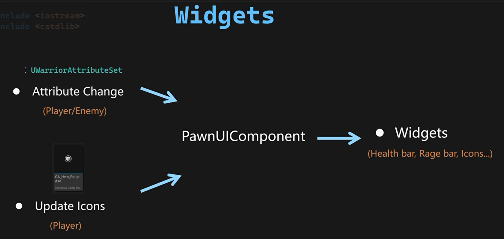

如何设计通用方案，将多来源数据同步至UI？方案需同时支持玩家和敌人，且必须解耦——`AttributeSet`无需感知控件，控件也无需感知 `AttributeSet`或 `GameplayAbility`蓝图。解决方案是引入中间层：为Pawn添加新组件 `PwnUIComponent`。

组件类结构如下：

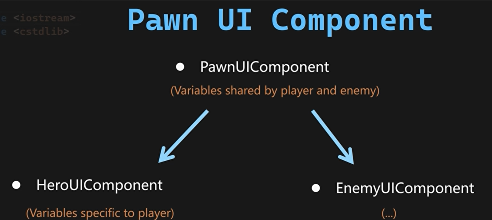

在完成角色的UI组件设置后，我们将通过以下方式更新UI：当 `WarriorAttributeSet`中的属性发生变更时（无论玩家或敌人），我们会通过接口获取其 `PwnUIComponent`。通过该组件广播变更后的属性值。屏幕上绘制的控件将监听来自 `PwnUIComponent`的广播，并据此更新UI数值。

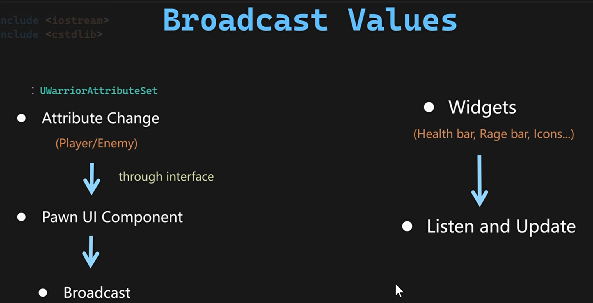

创建以**PawnExtensionComponentBase**为父类的**PawnUIComponent**同时创建子类**HeroUIComponent**和**EnemyUIComponent**

创建**PawnUIInterface**，并完成初始化。

**广播值**

**PawnUIComponent类**

```c++
#pragma once
#include "CoreMinimal.h"
#include "Components/PawnExtensionComponentBase.h"  // 继承自Pawn扩展组件基类
#include "PawnUIComponent.generated.h"  // 必需的头文件，支持UCLASS宏

// 声明动态多播委托：用于传递百分比变化（如血条/怒气条）
DECLARE_DYNAMIC_MULTICAST_DELEGATE_OneParam(FOnPercentChangedDelegate, float, NewPercent);

UCLASS()
class MYWARRIOR_API UPawnUIComponent : public UPawnExtensionComponentBase {
    GENERATED_BODY()
public:
    UPROPERTY(BlueprintAssignable)  // 允许蓝图绑定该委托
    FOnPercentChangedDelegate OnCurrentHealthChanged;  // 当前生命值变更委托
};
```

**HeroUIComponent同理**

**WarriorAttributeSet类**添加UI部分

```c++
//WarriorAttributeSet.h
class IPawnUIInterface;
private:
    TWeakInterfacePtr<IPawnUIInterface> CachedPawnUIInterface;
//WarriorAttributeSet.cpp
void UWarriorAttributeSet::PostGameplayEffectExecute(const FGameplayEffectModCallbackData& Data) {
    // 1. 获取PawnUI接口
    if (!CachedPawnUIInterface.IsValid()) {
        CachedPawnUIInterface = TWeakInterfacePtr<IPawnUIInterface>(Data.Target.GetAvatarActor());
    }
    checkf(CachedPawnUIInterface.IsValid(), TEXT("角色未实现IPawnUIInterface接口"));

    // 2. 提取UI组件
    UPawnUIComponent* PawnUIComponent = CachedPawnUIInterface->GetPawnUIComponent();
    checkf(PawnUIComponent, TEXT("无法从角色获取PawnUIComponent"));
    
    if (Data.EvaluatedData.Attribute == GetCurrentHealthAttribute()) {
    const float NewCurrentHealth = FMath::Clamp(GetCurrentHealth(), 0.f, GetMaxHealth());
    SetCurrentHealth(NewCurrentHealth);  // 约束生命值范围
    PawnUIComponent->OnCurrentHealthChanged.Broadcast(GetCurrentHealth() / GetMaxHealth()); // 广播百分比
    }    
    if (Data.EvaluatedData.Attribute == GetCurrentRageAttribute()) {
    const float NewCurrentRage = FMath::Clamp(GetCurrentRage(), 0.f, GetMaxRage());
    SetCurrentRage(NewCurrentRage);
    // 仅英雄角色更新怒气条
    if (UHeroUIComponent* HeroUIComponent = CachedPawnUIInterface->GetHeroUIComponent()) {
        HeroUIComponent->OnCurrentRageChanged.Broadcast(GetCurrentRage() / GetMaxRage());
    }
    }
   if (Data.EvaluatedData.Attribute == GetDamageTakenAttribute()) {
    const float OldHealth = GetCurrentHealth();
    const float DamageDone = GetDamageTaken();
    const float NewCurrentHealth = FMath::Clamp(OldHealth - DamageDone, 0.f, GetMaxHealth());
    SetCurrentHealth(NewCurrentHealth);

    // 广播生命变更
    PawnUIComponent->OnCurrentHealthChanged.Broadcast(GetCurrentHealth() / GetMaxHealth());

    // 死亡判定
    if (GetCurrentHealth() == 0.f) {
        UWarriorFunctionLibrary::AddGameplayTagToActorIfNone(
            Data.Target.GetAvatarActor(), 
            WarriorGameplayTags::Shared_Status_Dead
        );
    }
   }
}
```

