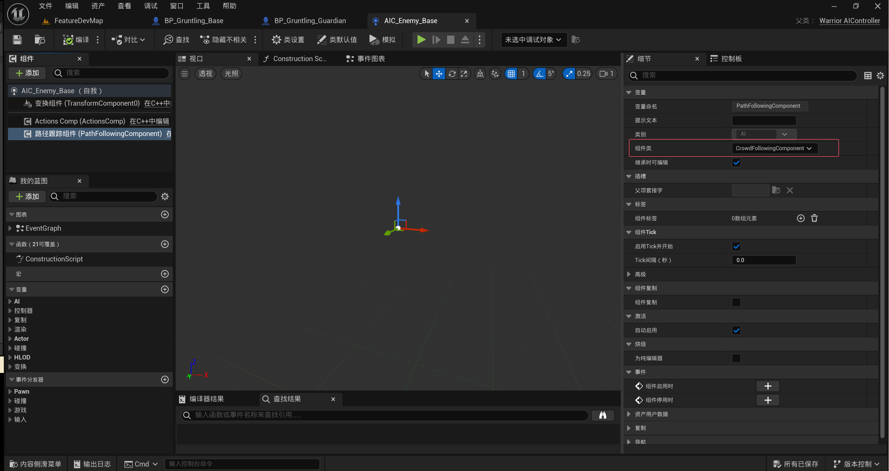
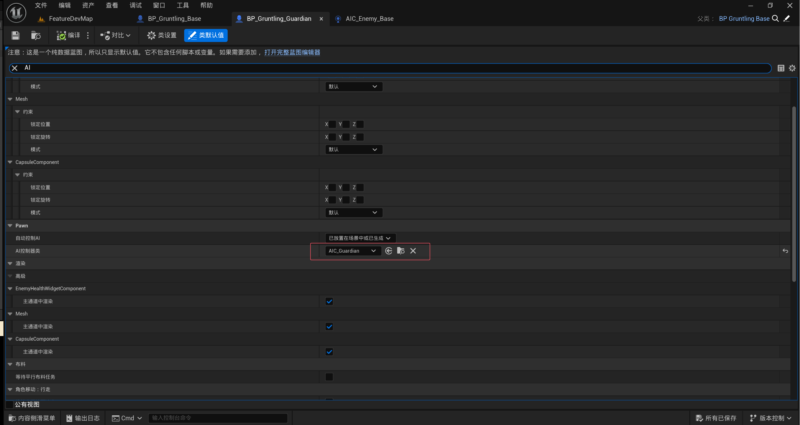
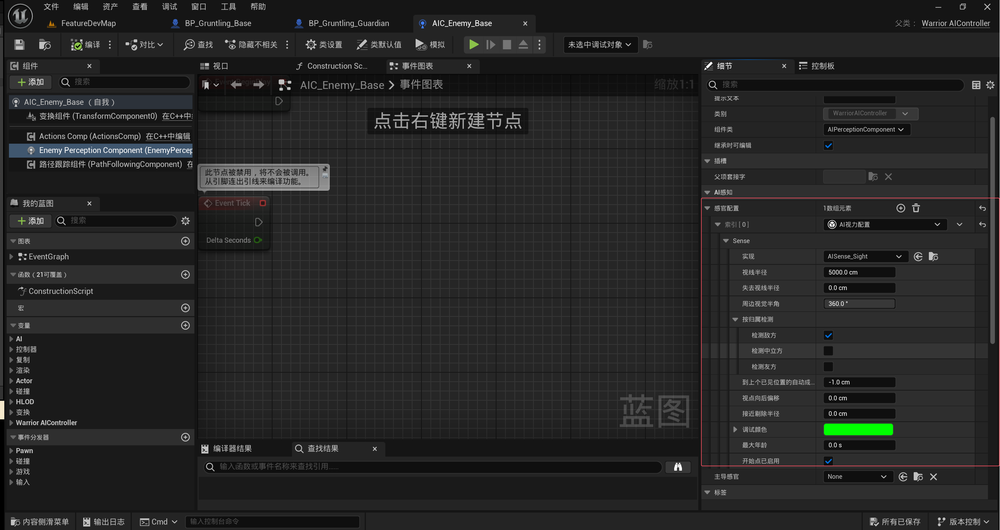
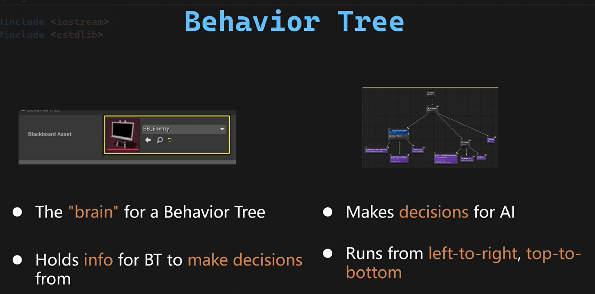
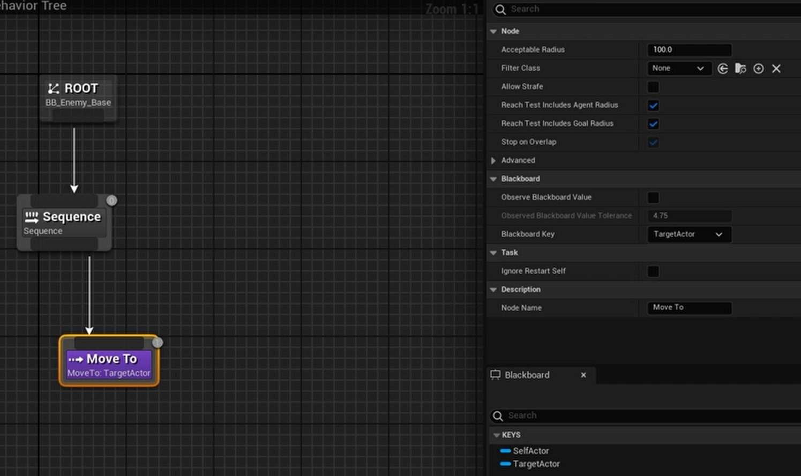
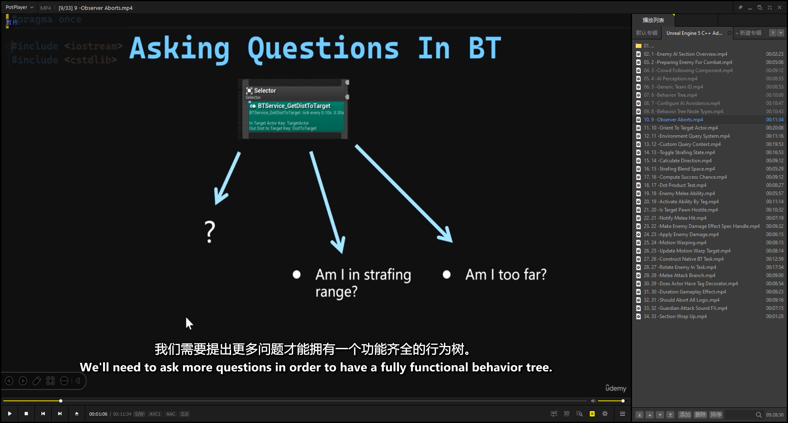
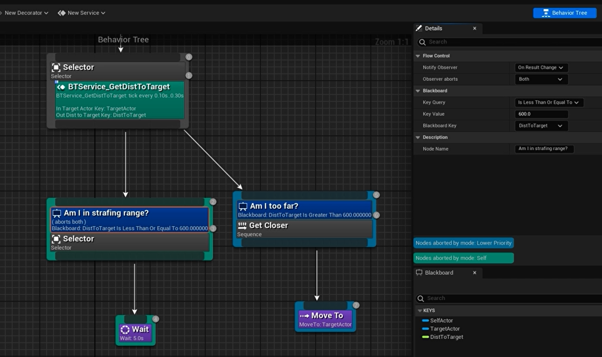
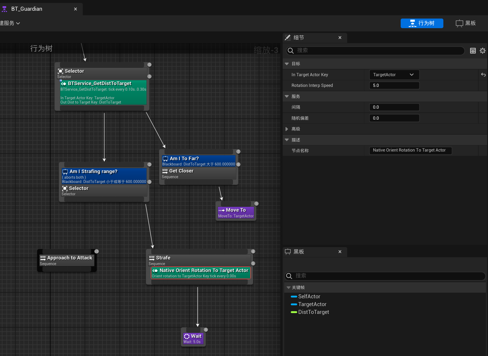

# 敌人AI部分

## 前言

本节将结合**蓝图(Blueprint)**与**C++自定义行为树节点**，实现AI规避、侧移及高级近战行为。

首先配置**CorralFollowing组件**实现路径规避。通过**TeamAsian通用接口**配置敌方感知系统，实现阵营感知逻辑。为可感知玩家的敌人配置**AVA规避系统(Advanced Avoidance)**，优化规避质量。

基于C++开发**原生行为树服务(Native BT Service)**，使AI持续朝向目标角色。利用**环境查询系统(EQS)**生成AI侧移路径点。

配置侧移动画逻辑，创建守卫角色的**瞬移空间资产(BlinkSpace Asset)**。

开发近战行为树：为敌人**赋予近战能力**，并通过行为树激活。构建**自定义装饰器与任务(Custom Decorators/Tasks)**，实现高级战斗行为。

## 敌人战斗系统的准备

本节将配置敌人战斗系统，重点聚焦两个核心模块：**敌人AI控制器**与**行为树(Behavior Tree)**。

在AI控制器中，由于需支持多敌人同时作战，需配置**AI避障(AI Avoidance)**机制。战斗中需避免敌人路径阻塞，需实现智能避障与路径规划。除避障外，需配置**感知系统(Perception System)**，我们需要让敌人能够“看到”玩家，并将其视为目标。。需通过**通用队伍 ID(Generic Team ID)**区分敌我单位，确保感知系统精准识别敌对目标。

* **敌人AI控制器(Enemy AI Controller)**
  * **AI避障(AI Avoidance)**
  * **感知系统(Perception System)**
  * **通用队伍 ID(Generic Team ID)**

一旦 AI 控制器设置完成，接下来我们会处理行为树部分。这是我们为敌人战斗逻辑进行主要设置的地方。我们将结合 Blueprint 与 C++ 创建各种行为树任务、服务（service）和装饰器（decorator）。我们还会在这里使用**环境查询系统（EQS）**，并设置敌人的**侧移行为（strafing behavior）**。我们还将学习如何直接从行为树中激活**攻击技能**。

* **行为树(Behavior Tree)**
  * **行为树任务/服务/装饰器(BTTask/Service/Decorator)**
  * **环境查询系统（EQS）**
  * **侧移行为（strafing behavior）**
  * **攻击技能(Attackability)**

## **AI避障(AI Avoidance)**

在 Unreal 中，有两种 AI 避障的构建方式。第一种叫做 RVO 避障，第二种叫做 Detour 群体避障（Detour crowd avoidance）。

### RVO 避障

RVO 是 reciprocal velocity obstacles（互相速度障碍） 的缩写。使用该方法时，代理（也就是 AI）会互相推开。但这样会忽略场景中导航网格内的障碍物。因此在移动时，很可能会将 AI 推出导航网格边界，这会导致 AI 被卡在某个地方。而这显然是我们在战斗中想要避免的情况。

### Detour 群体避障

这就引出了第二种方法：Detour 群体避障。这种方法与 RVO 不同，它能感知其他代理的存在，并为每个代理生成新的路径以绕过彼此。此外它还能感知导航网格的大小。所以使用这种方法时，AI 不会像 RVO 那样被推出导航区域。正因为这种特性，它非常适合我们所需的避障场景。这种移动效果明显比 RVO 避障方式更自然、更美观。因此我们将采用这种方式。


新建一个AI控制器类，命名为 WarriorAIController，为了让 AI 控制器使用 Detour 群体避障，在父类AIController找到这个组件，也就是 PathFollowingComponent。这个组件负责 AI 的路径查找。为了使用 Detour 群体避障，我们需要重写这个组件的类。不再使用 UPathFollowingComponent，而是它的子类 UCrowdFollowingComponent。也就是说我们需要在 WarriorAIController 中重写这个类。

 **WarriorAIController类**

```c++
// WarriorAIController.h
#pragma once

#include "CoreMinimal.h"
#include "AIController.h"
#include "WarriorAIController.generated.h"

UCLASS()
class MYWARRIOR_API AWarriorAIController : public AAIController
{
    GENERATED_BODY()

public:
    // 构造函数：
    // 通过 FObjectInitializer 替换父类默认的 PathFollowingComponent
    // 为 UCrowdFollowingComponent，以支持 Detour 群体避障
    AWarriorAIController(const FObjectInitializer& ObjectInitializer);
};

//WarriorAIController.cpp
#include "Controllers/WarriorAIController.h"
#include "Navigation/CrowdFollowingComponent.h"  // 包含群体避障组件定义
#include "WarriorDebuggedHelper.h"              // 包含 Debug::Print 函数声明

// 构造函数实现
// 使用初始化列表调用父类构造，并将名为 "PathFollowingComponent" 的子对象类型
// 设置为 UCrowdFollowingComponent，从而启用 Detour 群体避障
AWarriorAIController::AWarriorAIController(const FObjectInitializer& ObjectInitializer)
    : Super(ObjectInitializer.SetDefaultSubobjectClass<UCrowdFollowingComponent>("PathFollowingComponent"))
{
    // 验证替换是否生效：尝试将当前的路径跟随组件转换为群体避障组件
    if (UCrowdFollowingComponent* CrowdComp = Cast<UCrowdFollowingComponent>(GetPathFollowingComponent()))
    {
        // 成功时在屏幕上打印绿色调试信息
        Debug::Print(TEXT("CrowdFollowingComponent Valid"), FColor::Green);
    }
}

```



* 然后创建一个子蓝图添加到敌人身上



### 配置AI避障（补充）

上一讲中，我们成功为守卫设置了行为树，移动功能已经完成。我们现在要看看如何调整 AI 避障相关的参数，
以提升避障质量。

为了可视化避障算法，我们可以使用控制台命令：ai.crowd.debug selected actors 1。

AIC_Guardian 中点击“完全打开编辑器”，选中 PathFollowingComponent，但其属性未暴露给蓝图，
因此需要在 C++ 中调整。

**WarriorAIController类**

```c++
// WarriorAIController.h
private:
    // 是否启用 Detour 群体避障；在编辑器中仅可修改默认值
    UPROPERTY(EditDefaultsOnly, Category = "Detour Crowd Avoidance Config")
    bool bEnableDetourCrowdAvoidance = true;

    // 群体避障质量等级（1–4）；仅在 bEnableDetourCrowdAvoidance 为 true 时可编辑，
    // 编辑器中使用滑块调节最小值 1 和最大值 4
    UPROPERTY(EditDefaultsOnly, Category = "Detour Crowd Avoidance Config",
        meta = (EditCondition = "bEnableDetourCrowdAvoidance", UIMin = "1", UIMax = "4"))
    int32 DetourCrowdAvoidanceQuality = 4;

    // 碰撞查询范围（单位：UU），仅在启用避障时可编辑
    UPROPERTY(EditDefaultsOnly, Category = "Detour Crowd Avoidance Config", meta = (EditCondition = "bEnableDetourCrowdAvoidance"))
    float CollisionQueryRange = 600.f;

// WarriorAIController.cpp
void AWarriorAIController::BeginPlay() 
{
    Super::BeginPlay();

    // 获取并验证是否为群体避障组件
    if (UCrowdFollowingComponent* CrowdComp = Cast<UCrowdFollowingComponent>(GetPathFollowingComponent()))
    {
        // 根据布尔开关启用或禁用群体避障模拟
        CrowdComp->SetCrowdSimulationState(
            bEnableDetourCrowdAvoidance 
                ? ECrowdSimulationState::Enabled 
                : ECrowdSimulationState::Disabled
        );

        // 根据编辑器中设置的质量等级，选择不同的避障质量
        switch (DetourCrowdAvoidanceQuality)
        {
            case 1:
                CrowdComp->SetCrowdAvoidanceQuality(ECrowdAvoidanceQuality::Low);
                break;
            case 2:
                CrowdComp->SetCrowdAvoidanceQuality(ECrowdAvoidanceQuality::Medium);
                break;
            case 3:
                CrowdComp->SetCrowdAvoidanceQuality(ECrowdAvoidanceQuality::Good);
                break;
            case 4:
                CrowdComp->SetCrowdAvoidanceQuality(ECrowdAvoidanceQuality::High);
                break;
            default:
                break;
        }

        // 设置避障分组：本组为 1，需与其他组的避免标志配合使用
        CrowdComp->SetAvoidanceGroup(1);//设置回避组
        CrowdComp->SetGroupsToAvoid(1);//设置要避免的组

        // 设置用于碰撞检测的查询半径，影响避障检测范围
        CrowdComp->SetCrowdCollisionQueryRange(CollisionQueryRange);
    }
}

```

随后打开项目设置 → 引擎 → Crowd Manager，
调整 MaxAgentRadius (100→300)、SeparationDirectionClamp (-1→0)，
勾选 ResolveCollisions，优化避障表现。

## **感知系统(Perception System)**

上一部分我们已经成功将 CrowdFollowingComponent 用作 AI 的路径跟随组件。在测试之前，我们的 AI 需要先具备移动能力，也就是说能够看到目标并移动到目标。这就需要感知系统。为此，我们需要在 AI 控制器中添加更多组件。

```c++
// WarriorAIController.h
#pragma once

#include "CoreMinimal.h"
#include "AIController.h"
#include "WarriorAIController.generated.h"

// 前向声明感知组件和感知配置
class UAIPerceptionComponent;
class UAISenseConfig_Sight;

UCLASS()
class MYWARRIOR_API AWarriorAIController : public AAIController
{
    GENERATED_BODY()

protected:
    // 敌人感知组件：用于接收各种感知刺激（视线、听觉等）
    UPROPERTY(VisibleAnywhere, BlueprintReadOnly)
    UAIPerceptionComponent* EnemyPerceptionComponent;

    // 视线感知配置：定义检测敌人/友方/中立、生效半径、视野角度等
    UPROPERTY(VisibleAnywhere, BlueprintReadOnly)
    UAISenseConfig_Sight* AISenseConfig_Sight;

    // 当感知到目标时调用的回调函数
    UFUNCTION()
    virtual void OnEnemyPerceptionUpdated(AActor* Actor, FAIStimulus Stimulus);
};

// WarriorAIController.cpp
#include "Controllers/WarriorAIController.h"
#include "Navigation/CrowdFollowingComponent.h"    // Detour 群体避障组件
#include "Perception/AIPerceptionComponent.h"      // 感知组件定义
#include "Perception/AISenseConfig_Sight.h"        // 视线感知配置定义

#include "WarriorDebugHelper.h"                    // Debug 打印助手

// 构造函数：
// 1) 使用 CrowdFollowingComponent 替换默认的 PathFollowingComponent，启用群体避障。
// 2) 创建并配置视线感知配置（AISenseConfig_Sight）。
// 3) 创建感知组件（EnemyPerceptionComponent），并绑定视线配置与回调。
AWarriorAIController::AWarriorAIController(const FObjectInitializer& ObjectInitializer)
    : Super(ObjectInitializer
        .SetDefaultSubobjectClass<UCrowdFollowingComponent>("PathFollowingComponent"))
{
    // 创建视线感知配置子对象，并设置检测规则
    AISenseConfig_Sight = CreateDefaultSubobject<UAISenseConfig_Sight>("EnemySenseConfig_Sight");
    // 仅检测敌对目标
    AISenseConfig_Sight->DetectionByAffiliation.bDetectEnemies   = true;
    AISenseConfig_Sight->DetectionByAffiliation.bDetectFriendlies = false;
    AISenseConfig_Sight->DetectionByAffiliation.bDetectNeutrals   = false;
    // 设置视距和丢失视距（0.f 表示对象永不脱离视线）
    AISenseConfig_Sight->SightRadius             = 5000.f;
    AISenseConfig_Sight->LoseSightRadius         = 0.f;
    // 设置周边视野角度为 360°，敌人可全方位感知
    AISenseConfig_Sight->PeripheralVisionAngleDegrees = 360.f;

    // 创建感知组件，用于侦听感知配置产生的刺激
    EnemyPerceptionComponent = CreateDefaultSubobject<UAIPerceptionComponent>("EnemyPerceptionComponent");
    // 将视线配置附加到感知组件
    EnemyPerceptionComponent->ConfigureSense(*AISenseConfig_Sight);
    // 将视线设为主要感知方式
    EnemyPerceptionComponent->SetDominantSense(UAISenseConfig_Sight::StaticClass());
    // 绑定感知更新事件，当侦测到变化时调用 OnEnemyPerceptionUpdated
    EnemyPerceptionComponent->OnTargetPerceptionUpdated.AddUniqueDynamic(
        this, &ThisClass::OnEnemyPerceptionUpdated);
}

// 回调函数：当 EnemyPerceptionComponent 感知到新刺激时被调用
void AWarriorAIController::OnEnemyPerceptionUpdated(AActor* Actor, FAIStimulus Stimulus)
{
    // TODO: 在此处理敌人对 Actor（通常是玩家）的感知更新逻辑
}

```



## **通用队伍 ID(Generic Team ID)**

在上一部分中，我们连续设置了敌人的感知组件及其视线配置。为了让视线感知正常工作，我们需要使用通用队伍 ID 来定义哪个角色是敌人，哪个是友军。而这只能通过 C++ 来实现。

首先需要重写一个接口中的函数，该接口已由 AIController 实现。在IGenericTeamAgent 接口。为玩家和敌人分别指定不同的通用队伍 ID，然后重写 GetTeamAttitudeTowards 函数，以定义哪些队伍是友好，哪些是敌对。

```c++
// WarriorAIController.h

public:
    //~ Begin IGenericTeamAgentInterface Interface
    // 实现 IGenericTeamAgentInterface 接口，用于根据通用队伍 ID 判断与其他 Actor 的态度
    virtual ETeamAttitude::Type GetTeamAttitudeTowards(const AActor& Other) const override;
    //~ End IGenericTeamAgentInterface Interface

// WarriorAIController.cpp

// 构造函数：
// 1) 使用 CrowdFollowingComponent 替换默认的 PathFollowingComponent，启用群体避障
// 2) 设置本 AI 控制器的队伍 ID 为 1（代表敌方队伍）
AWarriorAIController::AWarriorAIController(const FObjectInitializer& ObjectInitializer) 
    : Super(ObjectInitializer.SetDefaultSubobjectClass<UCrowdFollowingComponent>("PathFollowingComponent"))
{
    // 将本控制器分配到通用队伍 ID = 1
    SetGenericTeamId(FGenericTeamId(1));
}

// 重写接口方法：根据 Other Actor 的通用队伍 ID 判断态度
ETeamAttitude::Type AWarriorAIController::GetTeamAttitudeTowards(const AActor& Other) const
{
    // 尝试将 Other 转换为 APawn 指针，以便获取其控制器
    const APawn* PawnToCheck = Cast<const APawn>(&Other);
    // 获取该 Pawn 的控制器，并将其转换为 IGenericTeamAgentInterface 接口指针
    const IGenericTeamAgentInterface* OtherTeamAgent =
        PawnToCheck ? Cast<const IGenericTeamAgentInterface>(PawnToCheck->GetController()) : nullptr;

    // 如果成功获取到 OtherTeamAgent 且其队伍 ID 与本控制器不同
    if (OtherTeamAgent && OtherTeamAgent->GetGenericTeamId() != GetGenericTeamId())
    {
        // 返回敌对态度
        return ETeamAttitude::Hostile;
    }
    // 否则返回友好态度
    return ETeamAttitude::Friendly;
}
// 回调函数：当感知组件侦测到目标（玩家或其他 Actor）时被调用
void AWarriorAIController::OnEnemyPerceptionUpdated(AActor* Actor, FAIStimulus Stimulus) 
{
    // 检查刺激是否成功感知且 Actor 非空
    if (Stimulus.WasSuccessfullySensed() && Actor)
    {
        // 打印调试信息：输出被感知 Actor 的名称或标签
        Debug::Print(
            Actor->GetActorNameOrLabel() + TEXT(" Was Sensed"),
            FColor::Green
        );
    }
}

```

* 然后在HeroController中设置角色的团队属性，这里这个函数记得加Override

```c++
// WarriorHeroController.h
#pragma once

#include "CoreMinimal.h"
#include "GameFramework/PlayerController.h"
#include "GenericTeamAgentInterface.h"
#include "WarriorHeroController.generated.h"

/**
 * 玩家英雄的控制器类：继承自 APlayerController 并实现 IGenericTeamAgentInterface 接口
 */
UCLASS()
class MYWARRIOR_API AWarriorHeroController : public APlayerController, public IGenericTeamAgentInterface
{
    GENERATED_BODY()

public:
    // 构造函数：为英雄控制器分配默认队伍 ID
    AWarriorHeroController();

    //~ Begin IGenericTeamAgentInterface Interface.
    // 实现 IGenericTeamAgentInterface 接口，返回本角色的通用队伍 ID
    virtual FGenericTeamId GetGenericTeamId() const override;
    //~ End IGenericTeamAgentInterface Interface

private:
    // 存储英雄的通用队伍 ID（此处设为 0 表示友方阵营）
    FGenericTeamId HeroTeamID;
};
// WarriorHeroController.cpp
#include "Controllers/WarriorHeroController.h"

// 构造函数实现：在实例化时将 HeroTeamID 设置为 0（友方队伍）
AWarriorHeroController::AWarriorHeroController()
{
    HeroTeamID = FGenericTeamId(0);
}

// 返回英雄控制器所属的通用队伍 ID，用于 AI 感知系统判断阵营
FGenericTeamId AWarriorHeroController::GetGenericTeamId() const
{
    return HeroTeamID;
}
```

## **行为树(Behavior Tree)**

本节我们将进入行为树部分，并学习如何使用感知到的目标为敌人分配可移动的目标。但在此之前，先了解什么是行为树。简单来说，行为树用于为 AI 做决策。它类似蓝图或材质图，可在节点中执行不同逻辑。行为树会从左到右、从上到下依次运行节点。要让行为树正常工作，还需一个黑板资源。黑板就像行为树的数据仓库，存储决策所需信息。它包含用户定义的黑板键，例如 TargetActor 键。本节我们将创建行为树和黑板。



创建名为 BP_Enemy_Base 的黑板资源，所有敌人共用此黑板。创建名为 BT_Guardian 的行为树。打开行为树，黑板已自动指向 BB_Enemy_Base。

在黑板中新建 Key → Object，命名为 TargetActor，类型选择 Actor，保存。回到 BT_Guardian，在 Blackboard 面板可见 TargetActor 键。在详细面板，将 Blackboard Key 改为 TargetActor。将 Acceptable Radius 从 5 改为 100。



接下来两件事：

1. 在 AI 控制器中运行行为树  
2. 从 C++ 设置黑板键的值

**AIC_Enemy_Base_C类**

```lua
--
-- DESCRIPTION
--
-- @COMPANY **
-- @AUTHOR **
-- @DATE ${date} ${time}
--

---@type AIC_Enemy_Base_C
local M = UnLua.Class()

function M:ReceivePossess(PossessedPawn)
    if self.BehaviorTreeToRun and self.BehaviorTreeToRun:IsValid() then
        -- 确保行为树有效并且可以运行
        self:RunBehaviorTree(self.BehaviorTreeToRun)
    else
        -- 如果行为树无效，打印错误信息
        UE.UKismetSystemLibrary.PrintString(self, "Error: Behavior Tree is not valid or not set.")
    end
end

return M

```

回到 AIC_Guardian 蓝图，选择 BehaviorTreeToRun → BT_Guardian。

**WarriorAIController类**

```c++
//WarriorAIController.cpp
#include "BehaviorTree/BlackboardComponent.h"
// 当 AI 的感知系统（如视觉）更新时会调用该函数
void AWarriorAIController::OnEnemyPerceptionUpdated(AActor* Actor, FAIStimulus Stimulus) 
{
    // 检查 Stimulus 是否为一次成功感知（例如：视觉成功看到）且 Actor 不为空
    if (Stimulus.WasSuccessfullySensed() && Actor)
    {
        // 获取 AI 控制器所绑定的黑板组件（用于行为树决策的数据容器）
        if (UBlackboardComponent* BlackboardComponent = GetBlackboardComponent())
        {
            // 将感知到的 Actor 作为对象，写入黑板的 TargetActor 键中
            // 注意：这里的 "TargetActor" 必须与黑板中定义的 Key 名字完全一致
            BlackboardComponent->SetValueAsObject("TargetActor", Actor);
        }
    }
}

```

### 行为树节点类型

在上一节中，我们已配置了 AI 避障质量，到目前为止效果不错。但理想状态下，我们希望这样——让敌人分散开，从不同方向接近目标，而不是都挤在同一条直线上。要实现这一点，避障算法本身无法自动完成，我们需要手动指示敌人移动到这些位置。这部分逻辑应当写在行为树中。为了构建一个可以选择这些位置的完整行为树，首先要了解可用的节点类型。

行为树中共有四种节点：复合节点、装饰节点、服务节点和任务节点。

* 复合节点(Composite Nodes)

最常用的复合节点是 Sequence 和 Selector。Sequence 会按顺序执行所有子节点，直到某个子节点失败时停止。Selector 会依次评估子节点，并执行第一个成功的分支。

* 装饰节点(Decorated Nodes)

那么如何判断分支成功或失败？这就要靠装饰节点。装饰节点可以附加到复合或任务节点上，通过条件来决定分支是否可执行。稍后我们会示范自定义装饰节点。

* 服务节点(Surface Nodes)

服务节点也可附加在复合节点上，在设定频率下运行逻辑，更新黑板值。由于其特性，我们常用它来执行定期检查和更新黑板键。后续构建行为树时会创建多个自定义服务。

* 任务节点(Task Nodes)

它是复合节点下的叶子节点，用来执行具体操作。例如移动到指定点或攻击目标，任务节点也可附装饰和服务节点。


以上就是四种节点：复合定义分支结构，装饰决定执行条件，服务定期更新信息，任务执行具体行为。


新建一个蓝图服务重命名为 BTS_GetDistanceToTarget 并保存。在其事件图中，重写 ReceiveTickAI 函数，它会周期性调用，并提供 Controller 和 Pawn。创建InTargetActorKey和OutDistToTargetKey局部参数。

**BTService_GetDistToTarget_C类**

```lua
--
-- DESCRIPTION
-- 服务：获取 AI 与目标之间距离并写入黑板
--
-- @COMPANY **
-- @AUTHOR **
-- @DATE ${date} ${time}
--

---@type BTService_GetDistToTarget_C
local M = UnLua.Class()

-- 引入用于在屏幕上打印调试信息的模块
local Screen = require "Widgets.Screen"

-- 每帧调用：为行为树服务提供定时更新逻辑
-- @param _OwnerController 行为树所属的 AI 控制器
-- @param ControlledPawn    被控制的 Pawn（本例为敌人角色）
-- @param DeltaSeconds      距离上次 Tick 的时间间隔
function M:ReceiveTickAI(_OwnerController, ControlledPawn, DeltaSeconds)
    -- 从黑板读取目标 Actor（使用 InTargetActorKey 指定的键名）
    local OtherActor = UE.UBTFunctionLibrary.GetBlackboardValueAsObject(self, self.InTargetActorKey)
    -- 如果目标为 nil，则打印错误并跳过后续处理
    if not OtherActor then
        Screen.Print("ERROR: Target actor is nil, check your blackboard key.")
        return
    end

    -- 计算 ControlledPawn 与目标之间的距离
    local Distance = ControlledPawn:GetDistanceTo(OtherActor)

    -- 将距离写入黑板，使用 OutDistToTargetKey 键名
    UE.UBTFunctionLibrary.SetBlackboardValueAsFloat(self, self.OutDistToTargetKey, Distance)
end

return M
```

### 观察器中断

首先讨论两个问题，一个是是否进入扫射，第一个：我离目标太远了吗？第二个：我处于侧移攻击（strafing）范围内吗？我们还需要问更多的问题，以便形成完整的行为树。我们还需要问更多的问题，以便形成完整的行为树。本讲集中先来看这两个分支。



左边的分支优先级高于右边，行为树中高优先级的分支可以中断低优先级分支。右边的分支，我使用 Sequence 节点作为根。然后，我们需要给这个分支加一个 Decorator 作为分支条件。首先指定黑板键为DistToTarget，键查询方式为大于，阈值设为 600 单位。如果到目标的距离大于这个值，分支就会被选中并执行。接下来，在这个分支下，我拖出一个引脚，添加 Move To 任务。设置键为 Target Actor。

然后返回 Selector 节点，拖出另一条引脚，创建第二个分支。第二个分支是 strafing 分支，所以我加了一个装饰器。键改为 DistToTarget，查询方式设为 小于等于。动作范围 <= 600 单位时走这个分支。我还临时加了一个 Wait 任务来测试分支是否生效。



接下来我们要做的是：定义什么时候可以中断另一个分支。

在流控制下配置通知观察者和观察器中断。

* 通知观察者：它决定在什么时候开始中断。有值改变时和结果改变时两个选项。这里选择结果改变时。
* 观察器中断：然后设置 观察器中断中断哪些分支。选项包括 None、Self、Lower Priority、Both。
  * None 不中断任何分支。
  * Self 表示当前分支条件为假时中断自身。
  * Lower Priority 表示条件为真时中断优先级更低的分支。
  * Both 则同时做以上两项。

当距离大于 600 时立即停止 strafing 并切换为 chase；当距离小于等于 600 时立即 strafing；因此我们使用 Both 选项。

## 侧移流程

1. AI 始终面向目标旋转；
2. 选择侧移目标点；
3. 切换到 strafing 动作姿态；
4. 实现姿态之间的切换逻辑。

### AI 始终面向目标旋转

在C++创建自定义服务以BTService为父类的**BTService_OrientToTargetActor类**

**BTService_OrientToTargetActor类**

```c++
// BTService_OrientToTargetActor.h

#pragma once

#include "CoreMinimal.h"
#include "BehaviorTree/BTService.h"
#include "BTService_OrientToTargetActor.generated.h"

/**
 * 自定义 Behavior Tree Service：每帧平滑地朝向目标 Actor。
 */
UCLASS()
class MYWARRIOR_API UBTService_OrientToTargetActor : public UBTService
{
    GENERATED_BODY()
    
    UBTService_OrientToTargetActor(); // 构造函数，用于初始化默认值和开启 Tick 通知

    //~Begin UBTNode Interface
    virtual void InitializeFromAsset(UBehaviorTree& Asset) override; // 在载入 Behavior Tree 时，解析黑板键
    virtual FString GetStaticDescription() const override; // 在编辑器中显示节点说明
    //~End UBTNode Interface

    virtual void TickNode(UBehaviorTreeComponent& OwnerComp, uint8* NodeMemory, float DeltaSeconds) override; 
    // 每帧回调，用于更新 AI 朝向

    UPROPERTY(EditAnywhere, Category = "Target")
    FBlackboardKeySelector InTargetActorKey; // 黑板中保存目标 Actor 的键

    UPROPERTY(EditAnywhere, Category = "Target")
    float RotationInterpSpeed; // 插值速度，控制旋转的平滑程度
};
// BTService_OrientToTargetActor.cpp

#include "AI/BTService_OrientToTargetActor.h"
#include "BehaviorTree/BlackboardComponent.h"
#include "AIController.h"
#include "Kismet/KismetMathLibrary.h" // FindLookAtRotation 定义

UBTService_OrientToTargetActor::UBTService_OrientToTargetActor()
{
    NodeName = TEXT("Native Orient Rotation To Target Actor"); 
    // 在编辑器中显示的节点名称

    INIT_SERVICE_NODE_NOTIFY_FLAGS(); 
    // 启用 bNotifyTick，以确保 TickNode 被调用 :contentReference[oaicite:1]{index=1}

    RotationInterpSpeed = 5.f; 
    Interval = 0.f; 
    RandomDeviation = 0.f; 
    // 设置为每帧调用，也可调节

    InTargetActorKey.AddObjectFilter(
        this, 
        GET_MEMBER_NAME_CHECKED(ThisClass, InTargetActorKey), 
        AActor::StaticClass()
    ); 
    // 限定黑板键类型为 Actor
}

void UBTService_OrientToTargetActor::InitializeFromAsset(UBehaviorTree& Asset)
{
    Super::InitializeFromAsset(Asset);
    if (UBlackboardData* BBAsset = GetBlackboardAsset())
    {
        // 解析选择的黑板键名，确保后续能正确从黑板获取值
        InTargetActorKey.ResolveSelectedKey(*BBAsset);
    }
}

FString UBTService_OrientToTargetActor::GetStaticDescription() const
{
    const FString KeyDescription = InTargetActorKey.SelectedKeyName.ToString();
    return FString::Printf(
        TEXT("Orient rotation to %s Key %s"), 
        *KeyDescription, 
        *GetStaticServiceDescription()
    );
    // 编辑器中显示：例如 “Orient rotation to TargetActor Key every 0s”
}

void UBTService_OrientToTargetActor::TickNode(
    UBehaviorTreeComponent& OwnerComp, 
    uint8* NodeMemory, 
    float DeltaSeconds
)
{
    Super::TickNode(OwnerComp, NodeMemory, DeltaSeconds);

    // 从黑板获取目标 Actor
    UObject* ActorObject = OwnerComp
        .GetBlackboardComponent()
        ->GetValueAsObject(InTargetActorKey.SelectedKeyName);
    AActor* TargetActor = Cast<AActor>(ActorObject);

    // 获取 AI 控制器控制的 Pawn
    APawn* OwningPawn = OwnerComp.GetAIOwner()->GetPawn();

    if (OwningPawn && TargetActor)
    {
        // 计算从 Pawn 指向目标的理想旋转角度
        const FRotator LookAtRot = UKismetMathLibrary::FindLookAtRotation(
            OwningPawn->GetActorLocation(),
            TargetActor->GetActorLocation()
        );
        // FindLookAtRotation 是纯函数，用于定位旋转 :contentReference[oaicite:2]{index=2}

        // 插值计算，使旋转平滑过渡
        const FRotator TargetRot = FMath::RInterpTo(
            OwningPawn->GetActorRotation(),
            LookAtRot,
            DeltaSeconds,
            RotationInterpSpeed
        );

        // 应用最终旋转
        OwningPawn->SetActorRotation(TargetRot);
    }
}

```



### 选择侧移目标点

## **环境查询系统（EQS）**

上一节旋转逻辑已经准备就绪，下一步我们要处理的是为 AI 选择一个侧移位置、这需要使用环境查询系统（EQS）。

环境查询系统，也称 EQS，简单来说，它会收集环境中的信息，并利用这些信息指导 AI 找到最佳位置，例如侧移点。下面是我们创建首个 EQS 时会遇到的一些术语：

**生成器(generator)**

* EQS 生成器会生成一系列点，这些点称为 “items（项）”。
* 随后我们会对这些项进行不同测试，并根据设定条件赋予不同权重。
* 最终返回权重最高的项给行为树。

创建一个新 EQS 文件，命名为 “EQS_test。

**环境查询背景(Environment Query Context)**

* EQS 背景提供参考点给生成器。
* EQS 背景可以像查询器一样简单，查询表示运行此EQS的实体。
* EQS 背景也可以更复杂，比如关卡中所有特定类型的 Actor，或者多次射线检测得到的位置，具体可根据需求扩展多种类型。

**EQS测试Pawn(EQS testing pawn)**

创建EQS testing pawn蓝图类，在EQS里的查询模板中选择EQS test，就可以在场景视口中看到生成器生成的点了。

**EQS测试(Test)/过滤和评分**

EQS 测试用于判断生成器生成的各项哪一个最优。记住，这些点就是所谓的 “items（项目）”。它通过对所有项目进行过滤和评分来实现目标。这里的“过滤”意味着剔除不合格的项目，而“评分”则是为每个合格项目赋予权重。

### 自定义EQS查询背景

```c++
void AWarriorAIController::OnEnemyPerceptionUpdated(
    AActor* Actor,
    FAIStimulus Stimulus
)
{
    // 获取黑板组件（确保 AIController 已正确初始化并运行行为树）
    if (UBlackboardComponent* BlackboardComponent = GetBlackboardComponent())
    {
        // 如果黑板中还没有设置目标 Actor
        if (!BlackboardComponent->GetValueAsObject(FName("TargetActor")))
        {
            // 检查是否成功感知到新目标，并且 Actor 指针有效
            if (Stimulus.WasSuccessfullySensed() && Actor)
            {
                // 将 Actor 写入黑板，为后续行为树逻辑提供目标
                BlackboardComponent->SetValueAsObject(FName("TargetActor"), Actor);
            }
        }
    }
}
```

