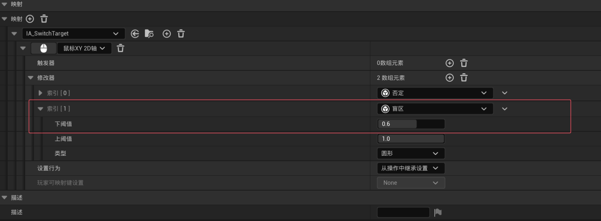

# 英雄战斗能力部分

## 前言

本部分我们将专注于为主角创建更多的游戏能力。

* **定向翻滚(Directional Rolling)**
* **定向击中反应(Directional Hit React)**
* **防御格挡(Block/Parry)**
* **目标锁定(Target Lock)**
* **英雄死亡机制(Hero Death)**

## **定向翻滚(Directional Rolling)**

现在创建第一个能力，也就是角色的方向翻滚。为了实现这个能力我们需要做几件事。

第一项是设置一个 “双键输入” 操作。

和之前的能力不同，要触发翻滚能力，必须同时按下多个按键。通过玩家的输入，我们才能决定翻滚的方向。除了方向，我还Gameplay Ability 中确定翻滚的距离。先来谈谈这个双键输入操作。对于翻滚，应支持 8 个方向供玩家滚动。这 8 个方向完全取决于用户的输入。也就是 W、S、A、D 四键。目前我们用这些键控制角色移动，同时也用它们判断翻滚方向。稍后我们会展示具体如何处理这些按键逻辑。除了这些方向键，玩家还需要按下空格键来触发翻滚能力，这才是双键输入的完整形式。要设置这一切，首先需要创建这个能力，我们需要再次经历为主角创建能力的流程。包括设置能力标签、Gameplay Ability Blueprint、Montage 结束处理能力输入操作，以及将能力赋予主角。


### “双键输入” 操作

* 能力标签

```c++
//WarriorGameplayTags.h
MYWARRIOR_API UE_DECLARE_GAMEPLAY_TAG_EXTERN(InputTag_Roll);
MYWARRIOR_API UE_DECLARE_GAMEPLAY_TAG_EXTERN(Player_Ability_Roll);
MYWARRIOR_API UE_DECLARE_GAMEPLAY_TAG_EXTERN(Player_Status_Rolling);
```

以WarriorHeroGameplayAbility为父类创建GA_Hero_Roll蓝图类，类设置。然后在DA_Hero和DA_InputConfig配置好。


### 滚动方向

在本讲中，我们将学习如何通过输入确定翻滚方向。首先创建AM_Hero_Roll动画蒙太奇。将 Slot 改为 Full Body Slot。

通过输入确定翻滚方向，我们可以使用 Motion Morphing 完成。因此，我们需要在蒙太奇的 Notify track 中添加 Motion Morphing 这个 Notify State。这个状态的开始帧应设为第 0 帧，结束帧拖至大约第 5 帧左右。这样我们不会太早让角色位移。然后展开 Root Motion Modifier 的设置。Warp Target Name 填入 “rolling direction”，取消勾选 Warp Translation（我们只关注旋转）。
Rotation 类型保持默认即可，因为我们会手动计算朝向。其余设置保持默认，保存蒙太奇。

**GA_Hero_Roll_C类**

```lua
---@type GA_Hero_Roll_C
local M = UnLua.Class()

function M:K2_ActivateAbility()
    local world = self:GetWorld()
    -- 模仿蓝图中，先延迟0.05秒等待输入捕获（对应字幕里 delay 在启动 Compute Roll Direction 之前）
    coroutine.resume(coroutine.create(function()
        UE.UKismetSystemLibrary.Delay(world, self.Duration)
        self:ComputeRollDirectionAndDistance()
        -- 设置并播放翻滚的 Montage（Subtitle 中“Play Montage and Wait”节点）
        local PlayMontageTask = UE.UAbilityTask_PlayMontageAndWait.CreatePlayMontageAndWaitProxy(
            self, "PlayMontageTask", self.MontagetoPlay)
        PlayMontageTask.OnCompleted:Add(self, M.OnMontage)
        PlayMontageTask.OnBlendOut:Add(self, M.OnMontage)
        PlayMontageTask.OnInterrupted:Add(self, M.OnMontage)
        PlayMontageTask.OnCancelled:Add(self, M.OnMontage)
        PlayMontageTask:ReadyForActivation()
    end))
end

function M:OnMontage()
    -- Montage 播放结束后结束 Ability（对应蓝图连接 EndAbility）
    self:K2_EndAbility()
end

function M:ComputeRollDirectionAndDistance()
    local Character = self:GetHeroCharacterFromActorInfo()
    if not Character then
        UE.UKismetSystemLibrary.PrintString(self, "Character is invalid!")
        return
    end
    -- 获取最后一次有效移动输入向量，并归一化
    local vector = Character:GetLastMovementInputVector()
    self.CachedRollingDirection = UE.UKismetMathLibrary.Normal(vector)
    -- 启动两个顺序任务：Task1 设置 WarpTarget，Task2/3 后续处理
    self:RunSequence()
end

function M:RunSequence()
    -- 对应字幕中“Sequence”节点的行为
    local Delay1 = UE.UAbilityTask_WaitDelay.WaitDelay(self, 0.05)  -- 延迟保证输入与角色方向已准备
    Delay1.OnFinish:Add(self, function()
        self:Task1()
        local Delay2 = UE.UAbilityTask_WaitDelay.WaitDelay(self, 0.05)  -- 等待让WarpTarget应用后
        Delay2.OnFinish:Add(self, function()
            self:Task2()
        end)
        Delay2:ReadyForActivation()
    end)
    Delay1:ReadyForActivation()
end

-- Task1: 设置第一个 WarpTarget，与动画内的 Motion Morphing Notify 对应
function M:Task1()
    local Character = self:GetHeroCharacterFromActorInfo()
    -- 构建旋转朝向：根据输入方向决定面向
    local rot = UE.UKismetMathLibrary.MakeRotFromX(self.CachedRollingDirection)
    -- 预设位置 self.TargetLocation，可以是起点或射线检测前的估算位置
    Character.MotionWarpingComponent:AddOrUpdateWarpTargetFromLocationAndRotation(
        self.WarpTargetName, self.TargetLocation, rot)
end

-- Task2: 使用射线检测动态查找地面位置，设置第二 WarpTarget（用于控制翻滚落点）
function M:Task2()
    UE.UKismetSystemLibrary.PrintString(self, "任务2执行")
end

return M

```

### **滚动距离**

现在处理的第三个问题就是翻滚距离。为了动态计算距离，我们可以使用另一个 Motion Morphing 的 Unnotified 状态。接着，我将添加一个新的通知轨道，再右键点击添加一个 Motion Morphing 的 Unnotified 状态。第二个 Unnotified 状态用于控制翻滚距离。然后我们就可以开始配置它的属性。进入 Details 面板，将 World Target Name 设置为：“RollTargetLocation”，并勾选 Warp Translation，取消勾选 Warp Rotation。这样第二个 Morphing 就只控制位移而不改变旋转。设置完成后点击保存。然后返回我们的 Gameplay Ability Blueprint，来计算翻滚距离。

**GA_Hero_Roll_C类**

```lua
function M:Task2()
    local Character = self:GetHeroCharacterFromActorInfo()
    --UE.UKismetSystemLibrary.PrintString(self, "任务2执行")

    -- 从角色获取当前位置
    local vec = Character:K2_GetActorLocation()

    -- 根据 Ability 等级取翻滚距离（Scalable Float），后续可替代硬编码
    local levelfloat = UE.UWarriorFunctionLibrary.GetScalableFloatValueAtLevel(
        self.RollingDistanceScalableFloat, self:GetAbilityLevel())

    -- Start = actor location + direction * 距离 （字幕中硬编码 100，此处由 Scalable Float 替换）
    local startvec = vec + self.CachedRollingDirection * levelfloat

    -- 向下方向向量（UpVector * -1），用于生成 End 点
    local vec2 = Character:GetActorUpVector()
    local endvec = startvec + vec2 * -1.0 * 500.0  -- 下探 500 单位查找地面 —— 来源字幕说明

    -- 执行 LineTraceSingleForObjects 查询地面 ImpactPoint
    local HitResult = UE.FHitResult()
    UE.UKismetSystemLibrary.LineTraceSingleForObjects(
        self,
        startvec,
        endvec,
        self.ObjectTypes,       -- EObjectTypeQuery 数组变量
        false,                  -- TraceComplex = false（只需要碰撞体）
        UE.TArray(UE.AActor),   -- 忽略列表为空
        self.DrawDebugType or UE.EDrawDebugTrace.Persistent,
        HitResult,
        true
    )

    -- 如果撞击有效，用 ImpactPoint 更新第二个 WarpTarget（只控制 translation）
    if HitResult:HasBlockingHit() then
        local MotionWarpingComp = Character.MotionWarpingComponent
        -- AddOrUpdateWarpTargetFromLocation: 只更新位移，不旋转，与第二个 Unnotified WarpAlign 区块一致 :contentReference[oaicite:1]{index=1}
        MotionWarpingComp:AddOrUpdateWarpTargetFromLocation(
            self.WarpTargetName1,
            HitResult.ImpactPoint
        )
    end
end

```

**WarriorFunctionLibrary类**

```c++
//WarriorFunctionLibrary.h  
struct FScalableFloat;

UFUNCTION(BlueprintPure, Category = "Warrior|FunctionLibrary", meta = (CompactNodeTitle = "Get Value At Level"))
    static float GetScalableFloatValueAtLevel(const FScalableFloat& InScalableFloat, float InLevel = 1.f);
//WarriorFunctionLibrary.cpp
float UWarriorFunctionLibrary::GetScalableFloatValueAtLevel(const FScalableFloat& InScalableFloat, float InLevel)
{
    return InScalableFloat.GetValueAtLevel(InLevel);
}
```


后面在蒙太奇中加入声音效果。

## **定向击中反应(Directional Hit React)**

从本节开始，我们将着手实现角色的“方向性击中反应”（directional hit react ability）。基本上，为了这个功能我们需要处理两个部分：击中反应能力本身，以及如何计算击中方向。

### 击中反应能力

首先来看实现击中反应能力本身需要做哪些内容。我们首先需要创建一个击中反应能力蓝图，然后为击中反应准备动画蒙太奇（anim montages）。接着，需要将该能力授予英雄角色，最后设计触发方式触发它。

* 击中反应能力蓝图
* 击中反应蒙太奇
* 授予击中反应能力
* 触发击中反应能力

首先创建蓝图和蒙太奇，选择 “Warrior Hero Gameplay Ability” 作为父类，将其重命名为 `GA_Hero_HitReact`。

创建蒙太奇，将它们的 Slot Name 从 `DefaultSlot` 改为 `UpperBody`，因为角色可在击中时移动下半身。


在本节中，我们要学习怎样授予该能力，并触发’命中反应’（hit react ability）。

我切回 Content Browser → 打开角色数据资产，在 ReactiveAbilities 数组中添加 GA_Hero_HitReact。完成后保存。至此，能力授予已完成。下一步，我们需要触发角色的 hit react 能力。这个触发操作我们会放在敌人的近战攻击能力中。切到 Shared → GameplayAbility → 打开 GA_Warrior_Enemy_MeleeAttack_Base 函数 HandleApplyDamage。在收到 shared.event.meleehit 并应用伤害后，我们可以在这里触发英雄的 hit react 能力。随后我们添加hit react 的特效。

添加完特效后计算“命中反应方向”，我们需要知道从我们角色指向敌人的向量与我们角色的向前向量之间的角度差，根据在这里得到的角度差，我们可以知道要播放哪个蒙太奇。

```lua
-- GA_Warrior_Enemy_MeleeAttack_Base_C.lua
-- UnLua：敌人近战攻击能力中的 Hit React / Block 流程逻辑（带延迟效果）

---@type GA_Warrior_Enemy_MeleeAttack_Base_C
local M = UnLua.Class()

-- 当 Ability 接收到 GameplayEvent 时执行（客户端、服务器均可执行）
-- @param Payload：包含 Instigator、Target 等上下文信息的 FGameplayEventData 结构体
function M:OnEventReceived(Payload)
    -- 原注释的调试代码略写在这里方便日后启用 Debug
    --[[
    local instigatorName = "InvalidInstigator"
    local targetName = "InvalidTarget"
    if Payload.Instigator and Payload.Instigator:IsValid() then
        instigatorName = Payload.Instigator:GetName()
    end
    if Payload.Target and Payload.Target:IsValid() then
        targetName = Payload.Target:GetName()
    end
    UE.UKismetSystemLibrary.PrintString(self, string.format("OnEventReceived: %s -> %s", instigatorName, targetName))
    ]]

    -- 1. Payload 不合法时直接退出
    if not Payload then
        return
    end

    -- 2. 转入处理 Apply Damage + 后续反馈逻辑
    self:HandleApplyDamage(Payload)
end

-- 核心伤害处理流程，包括施加GE Effect、播放Cue、延迟过程，最后触发效果事件
-- @param InPayload：FGameplayEventData 包含 Instigator、Target、Effect causer 等信息
function M:HandleApplyDamage(InPayload)
    -- 2.4 在完成 Effect 应用后，开始顺序流程模拟 Blueprint 中的 Sequence 结构
    self:RunSequence()
end

-- 模拟 BP Sequence 延迟执行 Task1、Task2
function M:RunSequence()
    -- 3.1 创建第一个 Delay AbilityTask（延迟 0.1 秒）
    local Delay1 = UE.UAbilityTask_WaitDelay.WaitDelay(self, 0.1)
    Delay1.OnFinish:Add(self, function()
        -- 3.1.1 延迟完成后执行 Task1
        self:Task1()

        -- 3.2 创建第二个 Delay Task（再延迟 0.1 秒执行 Task2）
        local Delay2 = UE.UAbilityTask_WaitDelay.WaitDelay(self, 0.1)
        Delay2.OnFinish:Add(self, function()
            self:Task2()
        end)
        -- 激活第二个 Delay
        Delay2:ReadyForActivation()
    end)
    -- 激活第一个 Delay
    Delay1:ReadyForActivation()
end

-- 第一个任务：播放击中音效 Cue（无短暂根运动）
function M:Task1()
    -- 创建 FGameplayEffectContext（可包含 Instigator、SourceObject 等上下文）
    local Context = UE.FGameplayEffectContextHandle()
    -- 使用 Ability 自带方法通过 tag 触发声效 Cue
    self:K2_ExecuteGameplayCue(self.WeaponHitSoundGameplayCueTag, Context)
end

-- 第二个任务：击中之后触发玩家的 Hit React Ability
function M:Task2()
    -- 向收件实体 Player 发送 Gameplay Event，激活 Hit React Ability
    UE.UAbilitySystemBlueprintLibrary.SendGameplayEventToActor(self.Targetactor, self.EventTag1, self.Payload)
end

return M

```

### 计算击中方向

创建一个新的辅助函数，用于计算命中反应方向。

首先我们需要搞明白，向量积：在向量代数中，两个向量的向量积被称为“cross product”。

- 它是两个向量的二元运算
- 它将返回另一个与两者垂直的向量


当我们用右手表示这个过程的时候

- 当我们得到第三个向量是指向上方的，就知道了第二个向量b是在第二个向量a的左侧还是右侧

但是在虚幻引擎中使用的是左手坐标系，我们实际需要使用左手，而不是右手法则来表示这三个向量，这样我们的结果就是完全相反的

- 当第二个变量位于第一个变量的右侧时，第三个变量向上，如果在左侧，第三个变量就指向下

**WarriorGameplayTags类**

```c++
MYWARRIOR_API UE_DECLARE_GAMEPLAY_TAG_EXTERN(Shared_Status_HitReact_Front);
MYWARRIOR_API UE_DECLARE_GAMEPLAY_TAG_EXTERN(Shared_Status_HitReact_Back);
MYWARRIOR_API UE_DECLARE_GAMEPLAY_TAG_EXTERN(Shared_Status_HitReact_Right);
MYWARRIOR_API UE_DECLARE_GAMEPLAY_TAG_EXTERN(Shared_Status_HitReact_Left);
```

**UWarriorFunctionLibrary类**

```c++
USTRUCT(BlueprintType)
struct FHitReactResult
{
    GENERATED_BODY()
    UPROPERTY(BlueprintReadOnly)
    float Angle;
    UPROPERTY(BlueprintReadOnly)
    FGameplayTag Tag;
};


UFUNCTION(BlueprintCallable, Category = "Warrior|FunctionLibrary")
// ① 导出给 Blueprint / UnLua 调用，返回自定义的 FHitReactResult（需用 USTRUCT 定义，并在字段加 UPROPERTY(BlueprintReadWrite)）
static FHitReactResult ComputeHitReactDirectionTag(
    AActor* InAttacker,
    AActor* InVictim
);
#include "Kismet/KismetMathLibrary.h"
FHitReactResult UWarriorFunctionLibrary::ComputeHitReactDirectionTag(
    AActor* InAttacker,
    AActor* InVictim
) {
    // ⚠️ 必须提前在cpp开头 include "Kismet/KismetMathLibrary.h"

    check(InAttacker && InVictim);
    // ② 确保传入的头发攻击者和受击者都有效（UBT 做为空判断后再调用）

    // --------------------------------------------
    // 向量计算：受击者朝向 & 攻击者相对向量
    // --------------------------------------------
    const FVector VictimForward = InVictim->GetActorForwardVector();
    // ③ 受击者当前的前方向量（单位长度）

    FVector Diff = InAttacker->GetActorLocation() - InVictim->GetActorLocation();
    const FVector VictimToAttackerNormalized = Diff.GetSafeNormal();
    // ④ 攻击者相对于受击者的位置向量归一化

    // --------------------------------------------
    // 计算夹角 —— use dot product + acos = 得到 [0°,180°]
    // --------------------------------------------
    const float DotResult = FVector::DotProduct(VictimForward, VictimToAttackerNormalized);
    FHitReactResult HitReactResult;
    HitReactResult.Angle = UKismetMathLibrary::DegAcos(DotResult);
    // ⑤ 计算两向量的 cos θ，然后反余弦转角度。这里返回的是正值（绝对角度）

    // --------------------------------------------
    // 用 cross product 判断角度符号：左为负、右为正
    // 注意 UE 使用左手坐标系（与 DirectX / Unity 同轴向定义），cross_product 方向与手指方向对应[Source]
    // --------------------------------------------
    const FVector CrossResult = FVector::CrossProduct(VictimForward, VictimToAttackerNormalized);
    if (CrossResult.Z < 0.f) {
        HitReactResult.Angle *= -1.f;
    }
    // ⑥ UE/Unity 使用左手坐标系。若 cross 的 Z 分量小于 0 → 攻击者在角色左侧，因此将角度取负值 :contentReference[oaicite:1]{index=1}

    // --------------------------------------------
    // 根据角度范围分支，选择对应的 GameplayTag
    // ⚠️ 记得提前初始化：
    // Shared_Status_HitReact_XXX 都是静态 Tag 常量，必须在 .h 中提前用 FGameplayTag::RequestGameplayTag() 或 GameplayTags 管理器里建立
    // --------------------------------------------
    float A = HitReactResult.Angle;
    if (A >= -45.f && A <= +45.f) {
        // -45° ~ +45° → 正面（攻击者在正前方）
        HitReactResult.Tag = WarriorGameplayTags::Shared_Status_HitReact_Front;
    }
    else if (A < -45.f && A >= -135.f) {
        // -45° ~ -135° → 左侧（攻击来自左）
        HitReactResult.Tag = WarriorGameplayTags::Shared_Status_HitReact_Left;
    }
    else if (A < -135.f || A > +135.f) {
        // 超过 ±135° → 背面（攻击来自后方）
        HitReactResult.Tag = WarriorGameplayTags::Shared_Status_HitReact_Back;
    }
    else /*A > 45 && A <= 135*/ {
        // +45° ~ +135° → 右侧（攻击来自右）
        HitReactResult.Tag = WarriorGameplayTags::Shared_Status_HitReact_Right;
    }

    return HitReactResult;
}

```


```lua
--[[ 
   GA_Hero_Hit_React_C.lua 
   方向性 Hit React 能力逻辑流程解析
--]]

---@type GA_Hero_Hit_React_C
local M = UnLua.Class()

-- 能力通过 Gameplay Event 激活时调用
function M:K2_ActivateAbilityFromEvent(EventData)
    -- [1] 获取被击中目标角色
    local InVictim = self:GetHeroCharacterFromActorInfo()
    -- [2] 调用自定义函数计算击中方向标签和角度
    local HitResult = UE.UWarriorFunctionLibrary.ComputeHitReactDirectionTag(EventData.Instigator, InVictim)
    -- 当无有效结果时直接退出
    if not HitResult then
        UE.UKismetSystemLibrary.PrintString(self, "HitResult is invalid!")
        return
    end

    -- [3] 将角度格式化为两位小数便于调试输出
    local s = string.format("%.2f", HitResult.Angle)
    -- 获取 GameplayTag 的字符串形式
    local tag = UE.UBlueprintGameplayTagLibrary.GetDebugStringFromGameplayTag(HitResult.Tag)
    -- print 可以在调试时开启
    -- UE.UKismetSystemLibrary.PrintString(self, "AngleDiff" .. s .. " " .. tag)

    -- [4] 从 MontageMap（Unreal TMap< FGameplayTag, UAnimMontage* >）中查找对应动画
    -- 注意：Lua 端要使用 :Find() 而不是 .Find
    local MontagetoPlay = self.MontageMap:Find(HitResult.Tag)

    -- [5] 如果 MontageMap 中没有对应的动画，可以选 fallback
    -- if not MontagetoPlay then MontagetoPlay = self.DefaultMontage end

    -- [6] 创建并配置 PlayMontageAndWait 任务
    -- UAbilityTask_PlayMontageAndWait: 用于播放 Montage 然后等待其结束  
    local PlayMontageTask = UE.UAbilityTask_PlayMontageAndWait.CreatePlayMontageAndWaitProxy(
        self,                     -- 所属 Ability 对象
        "PlayMontageTask",        -- 任务名称（调试标识）
        MontagetoPlay             -- 要播放的动画资源
        -- 默认的未提供可选参数（速率/开始 Section 等）
    )

    -- [7] 为各个通知事件绑定回调函数 OnMontage
    PlayMontageTask.OnCompleted:Add(self, M.OnMontage)
    PlayMontageTask.OnBlendOut:Add(self, M.OnMontage)
    PlayMontageTask.OnInterrupted:Add(self, M.OnMontage)
    PlayMontageTask.OnCancelled:Add(self, M.OnMontage)
    -- 备注：如果不想被打断，可以去除 OnInterrupted 回调

    -- [8] 激活 Montage 播放任务
    PlayMontageTask:ReadyForActivation()

    -- [9] 播放 Montage 时打开材质击中特效
    local Target = self:GetOwningComponentFromActorInfo()
    Target:SetScalarParameterValueOnMaterials("HitFxSwitch", 1.0)
end

-- 所有 Montage 结束时调用，统一结束 Ability
function M:OnMontage()
    -- 等同于 Blueprint 中连接了 EndAbility 节点
    self:K2_EndAbility()
end

-- Ability 结束时调用（包括用户取消）
function M:K2_OnEndAbility()
    -- 关闭材质击中效果
    local Target = self:GetOwningComponentFromActorInfo()
    Target:SetScalarParameterValueOnMaterials("HitFxSwitch", 0.0)
end

return M

```

播放受击动作不明显是因为我们之前设置了上半身插槽的蒙太奇与下半身进行了混合，我们现在来重写设置一下，在角色静止不动的时候就不进行混合


被击中音效在蒙太奇中添加。

## 防御格挡(Block/Parry)

从本节开始，我们将着手为英雄角色创建——格挡能力。

- 流程：
  - 添加新能力
  - 触发这个的输入需要一直按着，松开就取消该能力
  - 触发了这个能力就要一直循环动画
  - 播放这个动画需要有视觉反馈
  - 格挡的逻辑

### 添加新能力和触发这个的输入需要一直按着，松开就取消该能力

首先创建需要的能力标签

```c++
MYWARRIOR_API UE_DECLARE_GAMEPLAY_TAG_EXTERN(InputTag_MustBeHeld);
MYWARRIOR_API UE_DECLARE_GAMEPLAY_TAG_EXTERN(InputTag_MustBeHeld_Block);
```

首先在我们角色的类中之前没有写入逻辑的关于能力输入的释放函数中去写入释放格挡能力的逻辑

**WarriorAbilitySystemComponent类**

```c++
//WarriorAbilitySystemComponent.h
// 输入释放时（例如玩家松开某个按键）调用本函数
void OnAbilityInputReleased(const FGameplayTag& InInputTag);
//WarriorAbilitySystemComponent.cpp
void UWarriorAbilitySystemComponent::OnAbilityInputReleased(const FGameplayTag& InInputTag)
{
    // ① 如果标签无效或不属于我们关心的“必须持续按下才能生效”的输入
    if (!InInputTag.IsValid()
        || !InInputTag.MatchesTag(WarriorGameplayTags::InputTag_MustBeHeld))
    {
        return; // 跳过所有能力取消逻辑
    }

    // ② 遍历当前 ASC 管理的所有 activatable ability specs
    for (const FGameplayAbilitySpec& AbilitySpec : GetActivatableAbilities())
    {
        // ③ 如果这个 spec 的 DynamicAbilityTags 精确包含传入的标签，
        //     并且该 Ability 现在正在运行（IsActive）
        if (AbilitySpec.DynamicAbilityTags.HasTagExact(InInputTag)
            && AbilitySpec.IsActive())
        {
            // ④ 使用该 spec 的 Handle 向 ASC 请求取消这个能力
            CancelAbilityHandle(AbilitySpec.Handle);
        }
    }
}

```

然后继续定义两个标签，用来表示角色的学习的格挡能力与当前能力的状态

```c++
MYWARRIOR_API UE_DECLARE_GAMEPLAY_TAG_EXTERN(Player_Ability_Block);
MYWARRIOR_API UE_DECLARE_GAMEPLAY_TAG_EXTERN(Player_Status_Blocking);
```

创建格挡能力


将这个能力给到角色，这个能力必须要在装备了武器之后才能使用


### 触发了这个能力就要一直循环动画和视觉反馈

* 循环蒙太奇片段


* 格挡蒙太奇的EndAbility，只需要连接中断与取消就行，因为阻挡能力不是阻挡所有的攻击，有些特别的攻击是不可以阻挡的。

使用Add GameplayCueWithParams To Owner节点添加一个持久的GC进行以及激活GC

**GA_Hero_Block_C类**

```lua
---@type GA_Hero_Block_C
local M = UnLua.Class()

-- 激活格挡技能时调用
function M:K2_ActivateAbility()
    -- 记录格挡触发时的世界时间，用以检测“完美格挡”
    self.HeroBlockTime = UE.UGameplayStatics.GetTimeSeconds(self:GetWorld())

    -- 播放蒙太奇（动画段），并等待其结束或被打断
    -- 使用 CreatePlayMontageAndWaitProxy 返回的代理 task
    local PlayMontageTask = UE.UAbilityTask_PlayMontageAndWait.CreatePlayMontageAndWaitProxy(
        self,
        "PlayMontageTask",     -- Task 的名字，用于内部标识
        self.MontagetoPlay     -- 要播放的动画蒙太奇
    )
    -- OnInterrupted / OnCancelled 都绑定到 M.OnMontage 方法
    PlayMontageTask.OnInterrupted:Add(self, M.OnMontage)
    PlayMontageTask.OnCancelled:Add(self, M.OnMontage)
    -- 手动调用 ReadyForActivation 才会启动 task（Lua 与 C++/BP 差异）
    PlayMontageTask:ReadyForActivation()

    -- 手动进入下一个逻辑阶段（在此用 RunSequence 模拟协程行为）
    self:RunSequence()
end

-- 模拟可串行的“序列执行”：Task1 然后 Task2
-- 注意：此处并不是 Await / Delay，而是立即触发两个 task
function M:RunSequence(MyTarget, Parameters)
    -- Task1：立即执行 Gameplay Cue 提示
    self:Task1()
    -- Task2：等待命中事件
    self:Task2()
end

-- 显式调用一次 Gameplay Cue 通知，通常用于格挡视觉反馈
function M:Task1()
    local GCvalue = self:MakeMakeGameplayCue()
    -- K2_AddGameplayCueWithParams 会在 ASC 中持续显示 cue，直到技能结束
    self:K2_AddGameplayCueWithParams(self.GameplayCueTag, GCvalue)
end

function M:OnMontage()
    -- Montage 播放结束后结束 Ability（对应蓝图连接 EndAbility）
    self:K2_EndAbility()
    self:StartResetJumpToFinisherTimer()
end
```

这次我们需要创建GC的下划线带Actor版本，而不是之前的Static版本，因为我们希望这个GC在该能力处于活动状态时保持活动状态。


* 重写这个GC里面的While Active函数，播放音效与特效，以及重写On Remove函数，来删除特效

**GC_Hero_Magic_Shield_C类**

```lua
--[[============================================================================
  碎片路径：GC_Hero_Magic_Shield_C.lua
  说明：为“魔法盾牌”特效的 GameplayCue 脚本，采用 UnLua 写法。
  触发时机：由 GameplayEffect 授予对应 GameplayTag 时激活。
============================================================================]]

---@type GC_Hero_Magic_Shield_C
local M = UnLua.Class()

--- 当 Gameplay Cue 被激活，并且 GamePlayEffect 持续生效时，
--- Unreal 会多次调用此函数（每帧一次、或每次特效重应用时）
--- 返回 false 表示 “自己不会再重生” （对同 tag 的重复调用不阻塞）
--- WaitingForRemoval 直到 trigger remove 时此 Cue 才 clean up。
function M:WhileActive(MyTarget, Parameters)
    self:RunSequence(MyTarget, Parameters)  -- 启动预设“任务链”
    return false
end

--[[ 用“顺序调用”模拟蓝图中 Sequence -> Delay 的行为。
   但目前缺少延迟机制，Task1 和 Task2 将在同一帧立即执行。 ]]
function M:RunSequence(MyTarget, Parameters)
    -- 延迟 0.1 秒后执行 Task1（注：此注释是预期，Lua 不自动延迟）
    self:Task1(MyTarget)

    -- 延迟 0.2 秒后执行 Task2（注：仍在同一帧执行）
    self:Task2(Parameters)
end

--- Task1：播放声音（可参考实时音效反馈）
function M:Task1(MyTarget)
    local location = MyTarget:K2_GetActorLocation()
    UE.UGameplayStatics.PlaySoundAtLocation(self, self.Sound, location)
end

--- Task2：生成 Niagara 特效并附加到目标组件的 MagicShieldSocket 插槽
function M:Task2(Parameters)
    -- SpawnSystemAttached 的签名：
    -- (NiagaraSystem, AttachToComponent, SocketName, ...)
    self.Magicsystem =
      UE.UNiagaraFunctionLibrary.SpawnSystemAttached(
        self.SystemTemplate,
        Parameters.TargetAttachComponent,
        "MagicShieldSocket"
    )
end

--- OnRemove：当 GameplayCue 被移除时调用（即 GameplayEffect 结束）
--- 切勿漏掉清理特效组件，以免残留内存或视觉垃圾
function M:OnRemove(MyTarget, Parameters)
    -- 如果 Niagara 组件确实存在，将其销毁
    if self.Magicsystem then
        self.Magicsystem:K2_DestroyComponent(self)
        self.Magicsystem = nil  -- 防止重销毁
    end

    -- 返回 false 表示继续执行标准 Cleanup（不阻止默认回收机制）
    return false
end

return M

```

### 格挡逻辑

本节中，我们将探讨如何**处理格挡逻辑**。以下是我们需要完成的逻辑判断。

* 玩家当前是否处于格挡状态？
* 判断格挡是否有效
* 执行“成功格挡”的后续操作
* 完美格挡

在格挡的能力中，我们设置了触发此能力就会激活Player_Status_Blocking这个标签状态，所以我们只需要检查这个标签是否存在就能知道玩家是否在格挡状态中

关于是否阻挡有效问题，我们只需要检查敌人与角色的向前向量，如果向前向量彼此指向，那么这个阻挡就是有效的


如果，敌人与角色的向前向量是彼此垂直的话，那就说明这个阻挡是无效的


* 在我们的函数库里面新建一个辅助函数用来判断是否是有效格挡
* 思路：计算点积，得到攻击者与防御者的向前向量，进行点积计算
  * 点积结果可以用于判断两个向量之间的夹角关系：
    * 如果点积为正数，表示两个向量之间的夹角小于90度，方向相似
    * 如果点积为零，表示两个向量垂直
    * 如果点积为负数，表示两个向量之间的夹角大于90度，方向相反

**WarriorFunctionLibrary类**

```c++
// WarriorFunctionLibrary.h
UFUNCTION(BlueprintPure, Category = "Warrior|FunctionLibrary")
static bool IsValidBlock(AActor* InAttacker, AActor* InDenfender);

// WarriorFunctionLibrary.cpp
bool UWarriorFunctionLibrary::IsValidBlock(AActor* InAttacker, AActor* InDenfender)
{
    // 如果传入指针非法（nullptr），会触发断言崩溃用于调试时立即反馈问题。
    // check 宏在 Debug 模式有效，shipping builds 会忽略。
    check(InAttacker && InDenfender);

    // 计算攻击者和防御者正方向forward vector（单位向量）的点乘。
    // FVector::DotProduct 返回范围 [-1,1]，两向量完全对立（180°）时为 -1，
    // 相同方向时为 +1，约为 “cos夹角 × magnitudes”。
    const float DotResult =
        FVector::DotProduct(
            InAttacker->GetActorForwardVector(),
            InDenfender->GetActorForwardVector()
        );

    // 以下是用于调试的字符串构造，当前被注释：可输出 DotResult 值方便调试
    // const FString DebugString =
    //     FString::Printf(TEXT("DotResult: %f %s"), DotResult,
    //         DotResult < -0.1f ? TEXT("Valid Block") : TEXT("Invalid Block"));
    // Debug::Print(DebugString, DotResult < -0.1f ? FColor::Green : FColor::Red);

    // 如果两个 forward 向量的点乘小于 -0.1（约夹角 > ~96°），判断为有效格挡
    return DotResult < -0.1f;
}

```

* 然后在我们之前的敌人的战斗组件类中没有处理格挡的逻辑里面写上逻辑


* 新建一个标签用来传递信息

```c++
MYWARRIOR_API UE_DECLARE_GAMEPLAY_TAG_EXTERN(Player_Event_SuccessfulBlock);
```

* 格挡成功就发送这个标签

**EnemyCombatComponent类**

```c++
    if (IsValidBlock)
    {   //处理格挡成功
        UAbilitySystemBlueprintLibrary::SendGameplayEventToActor(HitActor, WarriorGameplayTags::Player_Event_SuccessfulBlock, EventData);
    }
    else
    {
        UAbilitySystemBlueprintLibrary::SendGameplayEventToActor(GetOwningPawn(), WarriorGameplayTags::Shared_Event_MeleeHit, EventData);
    }
```

* 在格挡能力中接收这个事件，后续做逻辑处理

**GA_Hero_Block_C类**

```lua
---@type GA_Hero_Block_C
local M = UnLua.Class()

--- 垂直 Entry Point：当 Ability 被系统调用激活时执行
function M:K2_ActivateAbility()
    -- ✅ 记录格挡触发瞬间的世界时间戳，用于判断完美格挡
    self.HeroBlockTime = UE.UGameplayStatics.GetTimeSeconds(self:GetWorld())  -- GetGameTimeInSeconds, 会受 slomo 影响 :contentReference[oaicite:1]{index=1}

    -- 🎬 启动 PlayMontageAndWait 任务
    local PlayMontageTask = UE.UAbilityTask_PlayMontageAndWait.CreatePlayMontageAndWaitProxy(
        self,                     -- 所属 Ability
        "PlayBlockMontage",       -- Task 名称
        self.MontagetoPlay        -- 要播放的 Animation Montage
    )
    -- 🎯 强烈推荐绑定所有可能结束路径回调：
    PlayMontageTask.OnInterrupted:Add(self, M.OnMontage)
    PlayMontageTask.OnCancelled:Add(self, M.OnMontage)
    -- 若遗漏 OnBlendOut 或 OnCompleted，Montage 结束也可能不会终结 Ability :contentReference[oaicite:2]{index=2}
    PlayMontageTask:ReadyForActivation()

    -- 🧩 启动 Capability 的逻辑链（同时 Task1 & Task2）
    self:RunSequence()
end

--- 模拟蓝图中 Sequence + Delay 节点的意图，Lua 中序列顺序为立即执行
function M:RunSequence()
    -- 📌 这里注释中写了“延迟 0.1s”，但 Lua 会立即执行，若需延迟应另行使用 WaitDelay 或 Timer Delegate
    self:Task1()  -- 显示持续性 visual cue
    self:Task2()  -- 构造事件监听任务
end

--- Task1：播放持续的格挡视觉反馈（例如持续光环、饰品提示等）
function M:Task1()
    local GCvalue = self:MakeMakeGameplayCue()
    -- AddCue：持续状态型 Cue，会随 Ability 生命周期结束自动清除 :contentReference[oaicite:3]{index=3}
    self:K2_AddGameplayCueWithParams(self.GameplayCueTag, GCvalue)
end

--- Task2：设置监听 GameplayEventTag 的任务，等待命中时触发回调
function M:Task2()
    -- 创建 WaitGameplayEvent 任务监听 self.EventTag，OnlyTriggerOnce=false 可多次响应
    local WaitEventTask = UE.UAbilityTask_WaitGameplayEvent.WaitGameplayEvent(
        self,
        self.EventTag
    )
    WaitEventTask.EventReceived:Add(self, M.OnEventReceived)
    WaitEventTask:ReadyForActivation()
end

--- 当 Payload.EventReceived 触发时执行：处理转向、击退与格挡反馈
function M:OnEventReceived(Payload)
    -- 🏆 完美格挡判定：触发时间与记录时间间隔小于等于 0.25 秒
    local bPerfectBlock =
        UE.UGameplayStatics.GetTimeSeconds(self:GetWorld()) - self.HeroBlockTime <= 0.25

    -- —— 转向攻击来源 Actor，让角色面向命中者
    local character = self:GetHeroCharacterFromActorInfo()
    local Start = character:K2_GetActorLocation()
    local Target = Payload.Instigator:K2_GetActorLocation()
    local Rot = UE.UKismetMathLibrary.FindLookAtRotation(Start, Target)
    character:K2_SetActorRotation(Rot, false)

    -- —— 利用根运动推进角色后退
    local fv = character:GetActorForwardVector() * -1.0
    local Task_RM = UE.UAbilityTask_ApplyRootMotionConstantForce.ApplyRootMotionConstantForce(
        self,
        "RollRootMotion",
        fv,
        80.0,
        0.2,
        false,
        nil,
        UE.ERootMotionFinishVelocityMode.MaintainLastRootMotionVelocity,
        UE.FVector(0,0,0),
        0.0,
        true
    )
    Task_RM:ReadyForActivation()  -- 启动 root-motion 任务 :contentReference[oaicite:4]{index=4}

    -- —— 播放一次性格挡反馈 Cue （音效/特效）
    local GCvalue1 = self:MakeMakeGameplayCue()
    self:K2_ExecuteGameplayCueWithParams(self.GameplayCueTag1, GCvalue1)

    if bPerfectBlock then
        -- —— 完美格挡分支处理
        UE.UWarriorFunctionLibrary.AddGameplayTagToActorIfNone(character, self.PerfectBlockTag)
        local GCvalue2 = self:MakeMakeGameplayCue()
        self:K2_ExecuteGameplayCueWithParams(self.GameplayCueTag2, GCvalue2)

        local world = self:GetWorld()
        UE.UGameplayStatics.SetGlobalTimeDilation(world, 0.2)  -- 设置慢动作效果 :contentReference[oaicite:5]{index=5}

        -- 使用 Lua coroutine + Delay 做短暂延迟恢复时间膨胀（但不绑定 Ability 生命周期，较脆弱）
        coroutine.resume(coroutine.create(function()
            UE.UKismetSystemLibrary.Delay(world, 0.08)  -- 调用 Latent Delay，非 Ability 结束绑定 :contentReference[oaicite:6]{index=6}
            UE.UGameplayStatics.SetGlobalTimeDilation(world, 1.0)
        end))
    end
end

--- Montage 的中断或取消共同路径处理：结束能力并触发 tag 清理 timer
function M:OnMontage()
    self:K2_EndAbility()
    self:StartResetJumpToFinisherTimer()
end

--- 若 Ability 在其它路径退出，确保世界时间被复位
function M:K2_OnEndAbility()
    local world = self:GetWorld()
    if UE.UGameplayStatics.GetGlobalTimeDilation(world) ~= 1.0 then
        UE.UGameplayStatics.SetGlobalTimeDilation(world, 1.0)
    end
end

--- Timer Delegate 设置，用于延迟清除 PerfectBlockTag
function M:StartResetJumpToFinisherTimer()
    UE.UKismetSystemLibrary.K2_SetTimerDelegate({self, self.ResetJumpToFinisherState}, 0.3)
end

--- Timer 回调：移除 PerfectBlockTag
function M:ResetJumpToFinisherState()
    UE.UWarriorFunctionLibrary.RemoveGameplayTagFromActor(self:GetHeroCharacterFromActorInfo(), self.PerfectBlockTag)
    return
end

--- 工具函数：构造一个默认的 GameplayCueParameters 结构体
function M:MakeMakeGameplayCue()
    local SkeletalMeshComp = self:GetOwningComponentFromActorInfo()
    local zeroVec = UE.FVector(0, 0, 0)
    local zeroTag = UE.FGameplayTag()
    local zeroTagContainer = UE.FGameplayTagContainer()
    local context = UE.FGameplayEffectContextHandle()
    return UE.UAbilitySystemBlueprintLibrary.MakeGameplayCueParameters(
        0.0, 0.0,
        context,
        zeroTag, zeroTag,
        zeroTagContainer, zeroTagContainer,
        zeroVec, zeroVec,
        nil, nil, nil, nil,
        1, 1,
        SkeletalMeshComp,
        false
    )
end

return M

```

**Hero_LightAttackMaster类**

```c++
void UHero_LightAttackMaster::BlockJumpToFinisher()
{ 
    if (UWarriorFunctionLibrary::NativeDoesActorHaveTag(GetHeroCharacterFromActorInfo(), JumpTag))
        {
            CurrentLightAttackComboCount = AttackMontagesMap.Num();
        }
}
```

## **目标锁定(Target Lock)**

从本节开始，我们将深入探究英雄角色的“锁定目标（Target Lock）”能力。

* 输入机制：拥有可切换的基础能力
* 查找候选目标，在目标锁定之前要获取关卡中所有可用的目标然后进行其中的一个锁敌
* 要将锁敌的小部件绘制到屏幕上，每帧更新在其视口的位置，并且还要更新玩家的旋转位置要定向在目标
* 当前切换到锁定的功能后，应该切换动画到锁敌的动画
* 锁定目标是可以切换的

### 可切换的基础能力

新建一个继承 Hero GameplayAbility 的类，命名为 HeroGameplayAbility_TargetLock

* 首先创建标签

```c++
MYWARRIOR_API UE_DECLARE_GAMEPLAY_TAG_EXTERN(InputTag_Toggleable);
MYWARRIOR_API UE_DECLARE_GAMEPLAY_TAG_EXTERN(InputTag_Toggleable_TargetLock);
MYWARRIOR_API UE_DECLARE_GAMEPLAY_TAG_EXTERN(Player_Ability_TargetLock);
MYWARRIOR_API UE_DECLARE_GAMEPLAY_TAG_EXTERN(Player_Status_TargetLock);
```

* 然后重写激活能力与释放能力的函数

```c++
protected:
    //~ Begin UGameplayAbility Interface
    virtual void ActivateAbility(const FGameplayAbilitySpecHandle Handle, const FGameplayAbilityActorInfo* ActorInfo,
        const FGameplayAbilityActivationInfo ActivationInfo, const FGameplayEventData* TriggerEventData) override;
    virtual void EndAbility(const FGameplayAbilitySpecHandle Handle, const FGameplayAbilityActorInfo* ActorInfo,
        const FGameplayAbilityActivationInfo ActivationInfo, bool bReplicateEndAbility, bool bWasCancelled) override;
    //~ End UGameplayAbility Interface
```

* 创建锁敌这个能力


* 接下来解决如何授予和激活此能力，修改之前UWarriorAbilitySystemComponent类中的OnAbilityInputPressed中激活能力的逻辑

```c++
// UWarriorAbilitySystemComponent.cpp

void UWarriorAbilitySystemComponent::OnAbilityInputPressed(
    const FGameplayTag& InputTag)
{
    // ————————————————
    // 1. 首先检查传入的 InputTag 是否有效（防空/防 Crash）
    if (!InputTag.IsValid())
    {
        return;           // 无效标签直接跳过
    }

    // 2. 遍历所有可激活的 ABILITY SPEC（FGameplayAbilitySpec），这是 GAS 的核心数据结构
    for (const FGameplayAbilitySpec& AbilitySpec :
         GetActivatableAbilities())
    {
        // 3. 筛选出与输入标签完全匹配（HasTagExact）的能力
        //    DynamicAbilityTags 是在 GiveAbility 时动态赋值的一组 TAG
        if (!AbilitySpec.DynamicAbilityTags.HasTagExact(InputTag))
        {
            continue;       // 没有关联此输入标签的 ability 跳过
        }

        // 4. 如果这个标签属于 “可切换／toggle 类型” 的输入
        if (InputTag.MatchesTag(
                WarriorGameplayTags::InputTag_Toggleable))
        {
            // —— Toggleable 类型的 ability 遇到同样标签再次按下时视作取消
            if (AbilitySpec.IsActive())
            {
                // 5a. 如果该能力已激活，则取消它
                CancelAbilityHandle(AbilitySpec.Handle);
            }
            else
            {
                // 5b. 否则尝试激活能力
                TryActivateAbility(AbilitySpec.Handle);
            }
        }
        else
        {
            // 6. 若不是可切换类型，就一律尝试激活
            TryActivateAbility(AbilitySpec.Handle);
        }
    }
}

```

* 添加能力


### 查找候选目标

* 思路：使用盒子碰撞进行检测范围内的Actors

**HeroGameplayAbility_TargetLock类**

```c++
// HeroGameplayAbility_TargetLock.h
private:
    /** 保存有效的可锁定 Actor 列表 */
    UPROPERTY()
    TArray<AActor*> AvailableActorsToLock;

    /** 当前选定的锁定目标，用于每帧旋转或 UI 绘制 */
    UPROPERTY()
    AActor* CurrentLockedActor = nullptr;

    /** Trace 最大检测距离，由编辑器配置 */
    UPROPERTY(EditDefaultsOnly, Category = "TargetLock")
    float BoxTraceDistance = 5000.f;

    /** Trace 半尺寸盒型大小，Z 轴缩窄可避免检测场景地板 */
    UPROPERTY(EditDefaultsOnly, Category = "TargetLock")
    FVector TraceBoxSize = FVector(5000.f, 5000.f, 300.f);

    /** 指定本次 trace 检测的碰撞通道（如 Pawn 对象） */
    UPROPERTY(EditDefaultsOnly, Category = "TargetLock")
    TArray<TEnumAsByte<EObjectTypeQuery>> BoxTraceChannel;

    /** 是否在游戏中持续显示调试用盒子形状 */
    UPROPERTY(EditDefaultsOnly, Category = "TargetLock")
    bool bShowPersistentDebugShape = false;

    /** 在 Ability 激活时第一个运行方法：收集可锁定目标 */
    void TryLockOnTarget();

    /** 使用 BoxTraceMulti 获取所有可锁定 Actor 并填充数组 AvailableActorsToLock */
    void GetAvailableActorsToLock();

    /** 从 AvailableActorsToLock 中返回距离玩家最近的目标 */
    AActor* GetNearestTargetFromAvailableActors(const TArray<AActor*>& InAvailable);

    /** 如果没有目标或需要取消能力时调用 */
    void CancelTargetLockAbility();

    /** 能力结束时清理状态，包括清空当前目标和候选列表 */
    void Cleanup();

// HeroGameplayAbility_TargetLock.cpp
#include "HeroGameplayAbility_TargetLock.h"
#include "Kismet/KismetSystemLibrary.h"
#include "Kismet/GameplayStatics.h"
#include "Characters/WarriorHeroCharacter.h"
#include "WarriorDebugHelper.h" 
void UHeroGameplayAbility_TargetLock::ActivateAbility(
    const FGameplayAbilitySpecHandle Handle,
    const FGameplayAbilityActorInfo* ActorInfo,
    const FGameplayAbilityActivationInfo ActivationInfo,
    const FGameplayEventData* TriggerEventData)
{
    // 一旦激活本能力，就立即尝试锁定目标
    TryLockOnTarget();

    Super::ActivateAbility(Handle, ActorInfo, ActivationInfo, TriggerEventData);
}

void UHeroGameplayAbility_TargetLock::EndAbility(
    const FGameplayAbilitySpecHandle Handle,
    const FGameplayAbilityActorInfo* ActorInfo,
    const FGameplayAbilityActivationInfo ActivationInfo,
    bool bReplicateEndAbility,
    bool bWasCancelled)
{
    // 能力结束时清理临时状态
    Cleanup();
    Super::EndAbility(Handle, ActorInfo, ActivationInfo, bReplicateEndAbility, bWasCancelled);
}

void UHeroGameplayAbility_TargetLock::TryLockOnTarget()
{
    // 从前方范围内获取所有可选锁定对象
    GetAvailableActorsToLock();

    if (AvailableActorsToLock.IsEmpty())
    {
        // 无目标可锁，取消本能力
        CancelTargetLockAbility();
        return;
    }

    // 选择最近的作为锁定目标
    CurrentLockedActor = GetNearestTargetFromAvailableActors(AvailableActorsToLock);
    if (CurrentLockedActor)
    {
        Debug::Print(CurrentLockedActor->GetActorNameOrLabel());
    }
    else
    {
        CancelTargetLockAbility();
    }
}

void UHeroGameplayAbility_TargetLock::GetAvailableActorsToLock()
{
    // 确保每次重建目标列表
    AvailableActorsToLock.Empty();

    TArray<FHitResult> BoxTraceHits;
    auto* Hero = GetHeroCharacterFromActorInfo();
    FVector HeroLoc = Hero->GetActorLocation();
    FVector HeroForward = Hero->GetActorForwardVector();

    // 执行 BoxTraceMultiForObjects 检测前方所有可用目标
    // 此函数沿线移动一个 box 并返回所有击中对象，其中仅检测 ObjectTypes 指定的类型
    // Epic 官方说明：扫过 box 后返回所有击中的 hit 结果，阻挡碰撞位于 hits 数组最后项:contentReference[oaicite:1]{index=1}
    bool bHit = UKismetSystemLibrary::BoxTraceMultiForObjects(
        Hero,                                             // world context
        HeroLoc,                                         // trace start
        HeroLoc + HeroForward * BoxTraceDistance,       // trace end
        TraceBoxSize / 2.f,                              // 半尺寸
        HeroForward.ToOrientationRotator(),              // box 朝向
        BoxTraceChannel,                                 // 指定检测的对象类型
        false,                                           // 使用简化碰撞，不检查复杂模型
        TArray<AActor*>(),                               // 忽略的 actor 列表（这里为空）
        bShowPersistentDebugShape
            ? EDrawDebugTrace::Persistent
            : EDrawDebugTrace::None,                     // 调试模式（持续显示或不显示）
        BoxTraceHits,                                    // 输出的 FHitResult 数组
        true                                             // 忽略自身（主角）
    );

    for (const FHitResult& Hit : BoxTraceHits)
    {
        if (AActor* HitActor = Hit.GetActor())
        {
            // 排除主角自身
            if (HitActor != Hero)
            {
                // AddUnique 确保 actor 在列表中唯一
                AvailableActorsToLock.AddUnique(HitActor);
                // Debug::Print(HitActor->GetActorNameOrLabel());
            }
        }
    }
}

AActor* UHeroGameplayAbility_TargetLock::GetNearestTargetFromAvailableActors(
    const TArray<AActor*>& InAvailableActors)
{
    float ClosestDistance = 0.f;
    // UGameplayStatics::FindNearestActor 从给定数组中返回最近的 Actor
    // 官方文档定义：根据 Origin 与 ActorsToCheck 中距离最小返回 Actor 和距离:contentReference[oaicite:2]{index=2}
    return UGameplayStatics::FindNearestActor(
        GetHeroCharacterFromActorInfo()->GetActorLocation(),
        InAvailableActors,
        ClosestDistance);
}

void UHeroGameplayAbility_TargetLock::CancelTargetLockAbility()
{
    // 调用 GameplayAbility 的 CancelAbility 来取消本能力
    // 官方说明：CancelAbility 会广播 OnGameplayAbilityCancelled，并最终调用 EndAbility
    // 注意：若调用者设置了 CanBeCanceled 为 false，取消失败时还会收到警告提示:contentReference[oaicite:3]{index=3}
    CancelAbility(
        GetCurrentAbilitySpecHandle(),
        GetCurrentActorInfo(),
        GetCurrentActivationInfo(),
        true
    );
}

void UHeroGameplayAbility_TargetLock::Cleanup()
{
    AvailableActorsToLock.Empty();
    CurrentLockedActor = nullptr;
}
```

* 测试一下


### **绘制/更新目标锁定控件**

* 这节课来处理锁敌之后在敌人身上添加一个视觉UI


* 继续添加逻辑，新建绘制锁定目标图标的函数和创建的UI的变量

**HeroGameplayAbility_TargetLock类**

```c++
//HeroGameplayAbility_TargetLock.h  
    /** 如未创建则生成 Widget 实例，用于显示目标锁定 UI */
    void DrawTargetLockWidget();

    /** 将当前锁定目标转换为屏幕位置，调整 Widget 坐标 */
    void SetTargetLockWidgetPosition();

    /** Blueprint 中设置所要实例化的 Widget Blueprint 类类型 */
    UPROPERTY(EditDefaultsOnly, Category = "TargetLock")
    TSubclassOf<UWarriorWidgetBase> TargetLockWidgetClass;

    /** 当前创建的 Widget 实例指针 */
    UPROPERTY()
    UWarriorWidgetBase* DrawnTargetLockWidget;

    /** 缓存 Widget 的尺寸（像素）以便居中对齐调整 */
    UPROPERTY()
    FVector2D TargetLockWidgetSize = FVector2D::ZeroVector;
//HeroGameplayAbility_TargetLock.cpp
void UHeroGameplayAbility_TargetLock::TryLockOnTarget()
{
    GetAvailableActorsToLock();
    if (AvailableActorsToLock.IsEmpty())
    {
        CancelTargetLockAbility();
        return;
    }
    CurrentLockedActor = GetNearestTargetFromAvailableActors(AvailableActorsToLock);

    if (CurrentLockedActor)
    {
        // 创建并添加锁定 UI 到屏幕
        DrawTargetLockWidget();

        // 立即更新目标 Widget 的屏幕位置
        SetTargetLockWidgetPosition();
    }
    else
    {
        CancelTargetLockAbility();
    }
}

void UHeroGameplayAbility_TargetLock::DrawTargetLockWidget()
{
    if (!DrawnTargetLockWidget)
    {
        checkf(TargetLockWidgetClass, TEXT("须在 Blueprint 中为 TargetLockWidgetClass 指定 Widget Blueprint 类！"));
        // 使用 CreateWidget 创建 Widget 实例，由对应 PlayerController 拥有
        DrawnTargetLockWidget = CreateWidget<UWarriorWidgetBase>(
            GetHeroControllerFromActorInfo(),
            TargetLockWidgetClass
        );
        check(DrawnTargetLockWidget);

        // 将 Widget 添加到屏幕上：AddToViewport，显示给玩家。后续可在 Cleanup 中 RemoveFromParent；
        DrawnTargetLockWidget->AddToViewport();
        // 官方文档说明：CreateWidget + AddToViewport 是 UMG 显示 Widget 的标准流程 :contentReference[oaicite:1]{index=1}
    }
}

void UHeroGameplayAbility_TargetLock::SetTargetLockWidgetPosition()
{
    if (!DrawnTargetLockWidget || !CurrentLockedActor)
    {
        CancelTargetLockAbility();
        return;
    }

    // 使用 WidgetLayoutLibrary 将世界坐标转换为 Widget 的屏幕坐标
    // bPlayerViewportRelative = true 意味着转换结果已经考虑 Viewport、DPI 缩放等因素，
    // 可直接用于 SetPositionInViewport()
    FVector2D ScreenPosition;
    UWidgetLayoutLibrary::ProjectWorldLocationToWidgetPosition(
        GetHeroControllerFromActorInfo(),
        CurrentLockedActor->GetActorLocation(),
        ScreenPosition,
        true
    );
    // 官方 API 文档：ProjectWorldLocationToWidgetPosition 将 3D 世界位置映射为 2D Widget 坐标 :contentReference[oaicite:2]{index=2}

    if (TargetLockWidgetSize == FVector2D::ZeroVector)
    {
        // 第一次获取当前 Widget 内 USizeBox 的宽/高，用作后续居中对齐
        DrawnTargetLockWidget->WidgetTree->ForEachWidget(
            [this](UWidget* FoundWidget)
            {
                if (USizeBox* SB = Cast<USizeBox>(FoundWidget))
                {
                    TargetLockWidgetSize.X = SB->GetWidthOverride();
                    TargetLockWidgetSize.Y = SB->GetHeightOverride();
                }
            }
        );
    }

    // 将屏幕坐标偏移为 Widget 的左上角位置，以 Widget 大小居中于目标点
    ScreenPosition -= (TargetLockWidgetSize / 2.f);

    DrawnTargetLockWidget->SetPositionInViewport(ScreenPosition, false);
}

void UHeroGameplayAbility_TargetLock::Cleanup()
{
    AvailableActorsToLock.Empty();
    CurrentLockedActor = nullptr;

    if (DrawnTargetLockWidget)
    {
        // 从父 Widget 或 Viewport 中移除，该 Widget 不再可见
        DrawnTargetLockWidget->RemoveFromParent();
        // 注意：RemoveFromParent 不会立即销毁 UObject，仅从视图中移除，
        // GC 回收依赖引用清理，建议之后显式将指针置空 :contentReference[oaicite:3]{index=3}
    }
    DrawnTargetLockWidget = nullptr;
    TargetLockWidgetSize = FVector2D::ZeroVector;
}
```

* 将WBP_TargetLockIndicator添加到能力上


**自定义 `GameplayAbilityTask` 支持每帧执行（Taking）逻辑**

由于默认 `GameplayAbility` Blueprint 不提供 Tick（每帧执行）节点，要实现 UI 小部件跟随和角色朝向更新，需要在 Ability 中每帧执行逻辑。

**解决思路**：自定义 `AbilityTask`，开启 Taking 模式，支持每帧调用

**构建步骤**：

1. **创建 C++ 类继承 `UAbilityTask`**
    命名如 `AbilityTask_ExecuteTaskOnTake`；
2. **声明静态工厂函数**
    `UFUNCTION(BlueprintCallable)` 返回指针，用于在蓝图中创建 Task；
    使用 `meta=()` 设置隐藏输入、默认自身、仅 Blueprint 内部使用；
3. **设置 `bIsRequestingTick = true`**
    在构造函数中启用 Taking 模式，从而触发 `TakeTask()`；
4. **重写 `TakeTask()` 方法**
   - 调用 `Super::TakeTask()`；
   - 检查 `ShouldBroadcastAbilityTaskDelegates()`；
   - 若任务仍有效，则广播委托；否则执行 `EndTask()`；
5. **声明 Delegate 输出变量**
    `DECLARE_DYNAMIC_MULTICAST_DELEGATE_OneParam(FOnAbilityTaskTakeDelegate, float, DeltaTime);`
    `UPROPERTY(BlueprintAssignable)` expose Blueprint 输出。
6. **蓝图中使用示例**
   - 在 Ability 的 Event Graph 中添加 `ExecuteTaskOnTake` 节点；
   - 连接到 `OnTake` Delegate → `PrintString("Taking")` 测试每帧输出；
   - 运行时验证：不断看到大量 “Taking” 信息打印，表示 Taking 机制有效。

```c++
//AbilityTask_ExecuteTaskOnTick.h
#pragma once

#include "CoreMinimal.h"
#include "Abilities/Tasks/AbilityTask.h"
#include "AbilityTask_ExecuteTaskOnTick.generated.h"

// Blueprint 可绑定的 OnTick 委托，传入每帧的 DeltaTime
DECLARE_DYNAMIC_MULTICAST_DELEGATE_OneParam(FOnAbilityTaskTickDelegate, float, DeltaTime);

UCLASS()
class MYWARRIOR_API UAbilityTask_ExecuteTaskOnTick : public UAbilityTask
{
    GENERATED_BODY()

public:
    // 构造函数：开启 bTickingTask 以允许每帧 TickTask() 被调用
    UAbilityTask_ExecuteTaskOnTick();

    // 在蓝图中创建本任务节点的静态工厂函数
    UFUNCTION(BlueprintCallable, Category = "Warrior|AbilityTasks",
        meta = (
            HidePin = "OwningAbility",
            DefaultToSelf = "OwningAbility",
            BlueprintInternalUseOnly = "true"
        ))
    static UAbilityTask_ExecuteTaskOnTick* ExecuteTaskOnTick(UGameplayAbility* OwningAbility);

    //~ Begin UGameplayTask interface
    virtual void TickTask(float DeltaTime) override;
    //~ End UGameplayTask interface

    // 输出的 Blueprint 委托，在每帧 Tick 里广播 DeltaTime
    UPROPERTY(BlueprintAssignable)
    FOnAbilityTaskTickDelegate OnAbilityTaskTick;
};


//AbilityTask_ExecuteTaskOnTick.cpp
// 构造函数中设置 bTickingTask = true，确保 TickTask() 被引擎驱动每帧调用
UAbilityTask_ExecuteTaskOnTick::UAbilityTask_ExecuteTaskOnTick()
{
    bTickingTask = true;
}

UAbilityTask_ExecuteTaskOnTick* UAbilityTask_ExecuteTaskOnTick::ExecuteTaskOnTick(UGameplayAbility* OwningAbility)
{
    // 使用 GAS 提供的模板函数创建任务实例
    UAbilityTask_ExecuteTaskOnTick* Node = NewAbilityTask<UAbilityTask_ExecuteTaskOnTick>(OwningAbility);
    return Node;
}

void UAbilityTask_ExecuteTaskOnTick::TickTask(float DeltaTime)
{
    Super::TickTask(DeltaTime);

    // 只有当任务仍在激活（broadcast 允许时），才广播委托，否则结束任务
    if (ShouldBroadcastAbilityTaskDelegates())
    {
        OnAbilityTaskTick.Broadcast(DeltaTime);
    }
    else
    {
        EndTask();
    }
}

```

* 在锁敌能力类中添加一个函数用来绘制的锁敌图标实时更新其位置

```c++
//HeroGameplayAbility_TargetLock.h
UFUNCTION(BlueprintCallable)
void OnTargetLockTick(float DeltaTime);

 UPROPERTY(EditDefaultsOnly, Category = "TargetLock")
 float TargetLockRotationInterpSpeed = 5.f;

 UPROPERTY(EditDefaultsOnly, Category = "Target Lock")
 float TargetLockCameraOffsetDistance = 20.f;

//HeroGameplayAbility_TargetLock.cpp
void UHeroGameplayAbility_TargetLock::OnTargetLockTick(float DeltaTime)
{
    // 1️⃣ 如果锁定目标丢失，或者目标已死亡，或者玩家角色已死亡，取消锁定能力
    if (!CurrentLockedActor ||
        UWarriorFunctionLibrary::NativeDoesActorHaveTag(CurrentLockedActor, WarriorGameplayTags::Shared_Status_Dead) ||
        UWarriorFunctionLibrary::NativeDoesActorHaveTag(GetHeroCharacterFromActorInfo(), WarriorGameplayTags::Shared_Status_Dead))
    {
        CancelTargetLockAbility();
        return;
    }

    // 2️⃣ 每帧更新 "目标锁定" UI 小挂件的位置
    SetTargetLockWidgetPosition();

    // 3️⃣ 判断是否允许覆盖玩家的朝向（跳跃与格挡时不旋转）
    const bool bShouldOverrideRotation =
        !UWarriorFunctionLibrary::NativeDoesActorHaveTag(GetHeroCharacterFromActorInfo(), WarriorGameplayTags::Player_Status_Rolling) &&
        !UWarriorFunctionLibrary::NativeDoesActorHaveTag(GetHeroCharacterFromActorInfo(), WarriorGameplayTags::Player_Status_Blocking);

    if (bShouldOverrideRotation)
    {
        // 4️⃣ 计算角色正面朝向锁定目标的理想旋转
        // ⭐ FindLookAtRotation() 返回的 rotator 是从当前坐标看向目标的旋转角度
        //    API 文档说明此函数接受起始点和目标点参数 :contentReference[oaicite:1]{index=1}
        FRotator LookAtRot = UKismetMathLibrary::FindLookAtRotation(
            GetHeroCharacterFromActorInfo()->GetActorLocation(),
            CurrentLockedActor->GetActorLocation());

        // 5️⃣ 添加摄像机偏移（通常用于微调 pitch），以便画面先抬或后仰若干度
        LookAtRot -= FRotator(TargetLockCameraOffsetDistance, 0.f, 0.f);

        // 6️⃣ 获取玩家控制器当前的控制旋转（通常是视角的 pitch + yaw）
        const FRotator CurrentControlRot = GetHeroControllerFromActorInfo()->GetControlRotation();

        // 7️⃣ 平滑地朝目标旋转：使用 FMath::RInterpTo（逐帧插值类型的一种），融合当前方向 → 目标方向
        //    RInterpTo 的参数包括：当前值、目标值、deltaTime、插值速度
        //    InterpSpeed 越大，旋转越“快”而逼近目标。算法参考 FMath实现与使用说明 :contentReference[oaicite:2]{index=2}
        const FRotator TargetRot = FMath::RInterpTo(CurrentControlRot, LookAtRot, DeltaTime, TargetLockRotationInterpSpeed);

        // 8️⃣ 设置控制器的视角旋转，只保留 pitch/yaw（roll 置 0 稳定画面）
        GetHeroControllerFromActorInfo()->SetControlRotation(FRotator(TargetRot.Pitch, TargetRot.Yaw, 0.f));

        // 9️⃣ 同步角色本体方向（仅同步 yaw，以确保角色身体与视角方向一致）
        GetHeroCharacterFromActorInfo()->SetActorRotation(FRotator(0.f, TargetRot.Yaw, 0.f));
    }
}
```


* 在锁敌能力类中添加一个函数用来绘制的锁敌图标实时更新其位置

**HeroGameplayAbility_TargetLock类**

```c++
//HeroGameplayAbility_TargetLock.h
// 在距 Ability Tick 类型的 UFUNCTION 中定义：
 UFUNCTION(BlueprintCallable)
 void OnTargetLockTick(float DeltaTime);

 UPROPERTY(EditDefaultsOnly, Category = "TargetLock")
 float TargetLockRotationInterpSpeed = 5.f;
//HeroGameplayAbility_TargetLock.cpp
void UHeroGameplayAbility_TargetLock::OnTargetLockTick(float DeltaTime)
{
    // ❌ 如果当前锁定目标不存在，或目标已死亡，或者英雄自身已死亡：
    if (!CurrentLockedActor ||
        UWarriorFunctionLibrary::NativeDoesActorHaveTag(CurrentLockedActor, WarriorGameplayTags::Shared_Status_Dead) ||
        UWarriorFunctionLibrary::NativeDoesActorHaveTag(GetHeroCharacterFromActorInfo(), WarriorGameplayTags::Shared_Status_Dead))
    {
        // 取消目标锁定技能，让 Ability/Task 提前退出
        CancelTargetLockAbility();
        return;
    }

    // 💡 更新 UI 小组件在屏幕上的位置 —— 同时贴合目标
    SetTargetLockWidgetPosition();

    // 判断是否允许旋转 — 要求玩家角色当前不在“翻滚”或“格挡”等状态
    const bool bShouldOverrideRotation =
        !UWarriorFunctionLibrary::NativeDoesActorHaveTag(GetHeroCharacterFromActorInfo(), WarriorGameplayTags::Player_Status_Rolling) &&
        !UWarriorFunctionLibrary::NativeDoesActorHaveTag(GetHeroCharacterFromActorInfo(), WarriorGameplayTags::Player_Status_Blocking);

    if (bShouldOverrideRotation)
    {
        // 📌 获取英雄位置与锁定目标位置的 Look‑at 方向
        FRotator LookAtRot = UKismetMathLibrary::FindLookAtRotation(
            GetHeroCharacterFromActorInfo()->GetActorLocation(),
            CurrentLockedActor->GetActorLocation()
        );

        // ✏️ 向 LookAtRot 顶部添加一个摄像机垂直偏移（Pitch 偏移）
        LookAtRot.Pitch -= TargetLockCameraOffsetDistance;  

        // 🌪 获取当前控制器的朝向
        const FRotator CurrentControlRot = GetHeroControllerFromActorInfo()->GetControlRotation();

        // 🪄 用 FMath::RInterpTo 平滑旋转到目标方向：
        //    - DeltaTime：当前帧间隔  
        //    - InterpSpeed：旋转速度（可设为 5.0 / 10.0 等）
        const FRotator TargetRot =
            FMath::RInterpTo(CurrentControlRot, LookAtRot, DeltaTime, TargetLockRotationInterpSpeed);

        /************************************************************************************************
         * 关于 FMath::RInterpTo 的解释：
         * 它会返回介于 CurrentRot 和 TargetRot 之间的插值角度，并且根据当前角度差异缩放，初速较快，末尾缓动收尾。
         * 这种平滑插值行为非常适合控制人物或摄像机平滑转向目标，而不会瞬间“跳转”﹣﹣详见引擎文档。 
         * :contentReference[oaicite:3]{index=3}
         ************************************************************************************************/

        // ✨ 设置控制器的朝向（只使用 Pitch 和 Yaw，不作用于 Roll）
        GetHeroControllerFromActorInfo()->SetControlRotation(FRotator(TargetRot.Pitch, TargetRot.Yaw, 0.f));

        // 👤 还需同步更换 Hero Character 本身的 Yaw（植物面向方向）
        GetHeroCharacterFromActorInfo()->SetActorRotation(FRotator(0.f, TargetRot.Yaw, 0.f));
    }
}
```


**GA_Hero_TargetLock_C类**

```lua
--
-- DESCRIPTION
--
-- @COMPANY **
-- @AUTHOR **
-- @DATE ${date} ${time}
--

---@type GA_Hero_TargetLock_C
local M = UnLua.Class()

function M:K2_ActivateAbility()
    local Task = UE.UAbilityTask_ExecuteTaskOnTick.ExecuteTaskOnTick(self)
    if(not Task) then
        print("[ERROR] Task is nil!")
        return
    end
    Task.OnAbilityTaskTick:Add(self,M.Run)
    Task:ReadyForActivation()
 end


 function M:Run(DeltaTime)
    self:OnTargetLockTick(DeltaTime)
 end
return M
```

### **切换动画姿势**

1. **创建 Blend Space 资产**

在编辑器中，为英雄角色骨骼（例如 `SK_Hero`）创建名为 `BS_DirectionalLocomotion_Axe` 的 2D Blend Space。

2. **配置输入轴 / Axis Setup**

Horizontal 轴设为 **Locomotion_Direction**（范围 -180 到 +180度，8 分档，平滑时间 0.5，类型 KB—即缓冲插值）；Vertical 轴设为 **Ground Speed**（范围 0～100，兼容低速状态）。

3. **填充动画点 / Add Anim Samples**

拖入：`Idle`→(0,0)；`Walk_Forward`→(0°)；`Walk_Left`→(-90°)；`Walk_Right`→(90°)；`Walk_Backward`→(±180°)。

4. **修复交叉腿 / Anti‑Crossover Fix**

对于 ±45° 与 135° 等角度，使用 `Forward_Left` 与 `Backward_Right` 动画替代，以修正腿部扭曲问题。

5. **使用 Animation Blueprint**

打开主预测层 Animation Blueprint，使用文件的 Plane Space（Blend Space）播放器节点。通过 `Blend Poses by Bool` → 若角色具备 `Player_Status_TargetLock` Tag，则切换到自定义 Blend Space，否则使用默认动作。

6. **绑定输入变量 / Expose Input**

将 Blend Space 的参数 (Direction X、Speed Y) 暴露为变量，并从 `GetHeroNMInstance().LocalMotionDirection` 和速度属性连接输入。

7. **保存测试 / Test & Fix Next**

编译并保存后，进入关卡 Play → 激活目标锁定能力，确认动画切换正常。


8. **用 C++ 改良锁敌时的移动速度**<br>

```c++
//HeroGameplayAbility_TargetLock.h   
   void InitTargetLockMovement();
   void ResetTargetLockMovement();
    // 激活Target Lock时所设置的新最大行走速度
    UPROPERTY(EditDefaultsOnly, Category = "Target Lock")
    float TargetLockMaxWalkSpeed = 150.f;

    // 为了在结束能力时能恢复原始速度，需要缓存初始的 MaxWalkSpeed
    UPROPERTY()
    float CachedDefaultMaxWalkSpeed = 0.f;
//HeroGameplayAbility_TargetLock.cpp
void UHeroGameplayAbility_TargetLock::ActivateAbility(
    const FGameplayAbilitySpecHandle Handle,
    const FGameplayAbilityActorInfo* ActorInfo,
    const FGameplayAbilityActivationInfo ActivationInfo,
    const FGameplayEventData* TriggerEventData)
{
    TryLockOnTarget();
    InitTargetLockMovement(); // ① 激活时调用 — 降速
    Super::ActivateAbility(Handle, ActorInfo, ActivationInfo, TriggerEventData);
}

void UHeroGameplayAbility_TargetLock::EndAbility(
    const FGameplayAbilitySpecHandle Handle,
    const FGameplayAbilityActorInfo* ActorInfo,
    const FGameplayAbilityActivationInfo ActivationInfo,
    bool bReplicateEndAbility, bool bWasCancelled)
{
    ResetTargetLockMovement(); // ② 取消能力／结束能力时恢复速度
    Cleanup();
    Super::EndAbility(Handle, ActorInfo, ActivationInfo, bReplicateEndAbility, bWasCancelled);
}
void UHeroGameplayAbility_TargetLock::InitTargetLockMovement()
{
    // 缓存当前角色的原始 MaxWalkSpeed
    CachedDefaultMaxWalkSpeed = GetHeroCharacterFromActorInfo()
                                    ->GetCharacterMovement()
                                    ->MaxWalkSpeed;

    // 设置新的 MaxWalkSpeed 以达到锁定时的慢走效果
    GetHeroCharacterFromActorInfo()
        ->GetCharacterMovement()
        ->MaxWalkSpeed = TargetLockMaxWalkSpeed;
}
void UHeroGameplayAbility_TargetLock::Cleanup()
{
    AvailableActorsToLock.Empty();
    CurrentLockedActor = nullptr;
    if (DrawnTargetLockWidget)
    {
        DrawnTargetLockWidget->RemoveFromParent();
    }
    DrawnTargetLockWidget = nullptr;

    TargetLockWidgetSize = FVector2D::ZeroVector;

    CachedDefaultMaxWalkSpeed = 0.f;
}

void UHeroGameplayAbility_TargetLock::ResetTargetLockMovement()
{
    // 仅当从缓存读取到有效值时才恢复速度，避免重置为 0
    if (CachedDefaultMaxWalkSpeed > 0.f)
    {
        GetHeroCharacterFromActorInfo()
            ->GetCharacterMovement()
            ->MaxWalkSpeed = CachedDefaultMaxWalkSpeed;
    }
}
```

**Blend Space 修复方向切换抖动**
在 Directional Locomotion Blend Space 中启用 `Wrap Input`，解决「从左转右」的腿交叉问题，运动更平滑。

### 切换锁敌目标

在 **TargetLock 状态**下，禁用玩家原本的镜头视角输入，以键鼠移动控制目标锁定方向（左右切换锁定目标），让行为逻辑更加自然和流畅。

流程如下：

1. **创建 Native Input Action**
   1. 添加 Gameplay Tag(补充)

新建 `IA_SwitchTarget` 类型为 **Axis2D** 的 Input Action 资源，用于捕捉鼠标左右幅度值

定义 `InputTag_SwitchTarget` Tag，用于未来绑定到 Input Config 资源与代码调用中

2. **输入回调 (Input Callbacks)**

在角色类添加两个函数：`Input_SwitchTarget_Triggered(…)` 和 `…_Completed(…)`，用于接收并处理鼠标输入事件

3. **创建新的 Mapping Context**

新建专门的 `IMC_SwitchTarget` MappingContext，将 `IA_SwitchTarget` 加入其中，***同时屏蔽默认的 LookAxis***

4. **通知切换（Notify Switch Target）**

在回调函数中，检测 `IA.GetValue().X`（> +阈值/ < -阈值），调用 Ability 内部接口如 `TrySwitchTarget(DirectionTag)`

5. **处理切换逻辑（Handle Switch Target）**

在 Ability 内计算当前所有可锁定目标的 Biased 角度，并修改 `CurrentLockedActor`，同时刷新锁定 UI 位置

#### **创建 Native Input Action**和**创建 Native Input Action**

首先添加标签

```c++
MYWARRIOR_API UE_DECLARE_GAMEPLAY_TAG_EXTERN(InputTag_SwitchTarget);
```

**WarriorHeroCharacter类** 添加两个输入处理函数

```c++
//WarriorHeroCharacter.h
    void Input_SwitchTargetTriggered(const FInputActionValue& InputActionValue);
    void Input_SwitchTargetCompleted(const FInputActionValue& InputActionValue);

//WarriorHeroCharacter.cpp
    WarriorInputComponent->BindNativeInputAction(InputConfigDataAsset, WarriorGameplayTags::InputTag_SwitchTarget, ETriggerEvent::Triggered,this, &AWarriorHeroCharacter::Input_SwitchTargetTriggered);

    WarriorInputComponent->BindNativeInputAction(InputConfigDataAsset, WarriorGameplayTags::InputTag_SwitchTarget, ETriggerEvent::Triggered,
        this, &AWarriorHeroCharacter::Input_SwitchTargetCompleted);
```

#### **创建新的 Mapping Context**

**HeroGameplayAbility_TargetLock类**

```c++
//HeroGameplayAbility_TargetLock.h
    void InitTargetLockMappingContext();
    void ResetTargetLockMappingContext();
//HeroGameplayAbility_TargetLock.cpp
void UHeroGameplayAbility_TargetLock::ActivateAbility(const FGameplayAbilitySpecHandle Handle, const FGameplayAbilityActorInfo* ActorInfo,
    const FGameplayAbilityActivationInfo ActivationInfo, const FGameplayEventData* TriggerEventData)
{
    TryLockOnTarget();
    InitTargetLockMovement();
    InitTargetLockMappingContext();
    Super::ActivateAbility(Handle, ActorInfo, ActivationInfo, TriggerEventData);
}

void UHeroGameplayAbility_TargetLock::EndAbility(const FGameplayAbilitySpecHandle Handle, const FGameplayAbilityActorInfo* ActorInfo,
    const FGameplayAbilityActivationInfo ActivationInfo, bool bReplicateEndAbility, bool bWasCancelled)
{
    ResetTargetLockMovement();
    ResetTargetLockMappingContext();
    Cleanup();
    Super::EndAbility(Handle, ActorInfo, ActivationInfo, bReplicateEndAbility, bWasCancelled);
}
void UHeroGameplayAbility_TargetLock::InitTargetLockMappingContext()
{
    const ULocalPlayer* LocalPlayer = GetHeroControllerFromActorInfo()->GetLocalPlayer();

    UEnhancedInputLocalPlayerSubsystem* Subsystem = ULocalPlayer::GetSubsystem<UEnhancedInputLocalPlayerSubsystem>(LocalPlayer);

    check(Subsystem);

    Subsystem->AddMappingContext(TargetLockMappingContext, 3);
}
void UHeroGameplayAbility_TargetLock::ResetTargetLockMappingContext()
{
    if (!GetHeroControllerFromActorInfo())
    {
        return;
    }

    const ULocalPlayer* LocalPlayer = GetHeroControllerFromActorInfo()->GetLocalPlayer();

    UEnhancedInputLocalPlayerSubsystem* Subsystem = ULocalPlayer::GetSubsystem<UEnhancedInputLocalPlayerSubsystem>(LocalPlayer);

    check(Subsystem);

    Subsystem->RemoveMappingContext(TargetLockMappingContext);
}
```

* 添加一个全新的输入映射


* 现在锁定输入不再与我们的目标锁定能力竞争控制权了

#### 通知切换（Notify Switch Target）

现在解决通知切换目标信息

* 流程
  * 捕获鼠标的输入信息
  * 通知能力切换方向
  * 收到事件后，在能力中进行切换

* 新建两个用来传递信息的标签

```c++
MYWARRIOR_API UE_DECLARE_GAMEPLAY_TAG_EXTERN(Player_Event_SwitchTarget_Left);
MYWARRIOR_API UE_DECLARE_GAMEPLAY_TAG_EXTERN(Player_Event_SwitchTarget_Right);
```

* 添加一个缓存鼠标旋转方向的变量，发送捕获的鼠标的输入

**WarriorHeroCharacter类**

```c++
//WarriorHeroCharacter.h
/** 当前的鼠标输入方向，用于选择切换目标方向 */
FVector2D SwitchDirection = FVector2D::ZeroVector;
//WarriorHeroCharacter.cpp
/**
 *  捕获玩家按下鼠标行为时的输入值
 *  - Axis2D 类型的 Input Action 将返回 FVector2D
 *  - 从中读取 X 轴值，代表左右偏移方向
 */
void AWarriorHeroCharacter::Input_SwitchTargetTriggered(const FInputActionValue& InputActionValue)
{
    // 将当前帧鼠标移动方向存储，以供后续使用
    SwitchDirection = InputActionValue.Get<FVector2D>();
}

/**
 *  触发完输入后的 Completed 回调
 *  - 根据 SwitchDirection.X 的正负判断希望切换方向
 *  - 发送相应 GameplayEvent 到自身能力系统，通知切换方向
 */
void AWarriorHeroCharacter::Input_SwitchTargetCompleted(const FInputActionValue& InputActionValue)
{
    // 构建 GameplayEventData（可携带 AdditionalData，但此处为空数据流量最低）
    FGameplayEventData Data;

    // 发送 Gameplay Event，触发 Ability 收到 Switch Target 事件逻辑
    UAbilitySystemBlueprintLibrary::SendGameplayEventToActor(
        this,
        SwitchDirection.X > 0.f
            ? WarriorGameplayTags::Player_Event_SwitchTarget_Right
            : WarriorGameplayTags::Player_Event_SwitchTarget_Left,
        Data);

    // 可选的调试输出：打印当前鼠标方向向量
    // Debug::Print(TEXT("SwitchDirection: ") + SwitchDirection.ToString());
}
```

**GA_Hero_TargetLock_C类**

```lua
---@type GA_Hero_TargetLock_C
local M = UnLua.Class()

function M:K2_ActivateAbility()
    -- 每帧 Tick 的任务
    local Task = UE.UAbilityTask_ExecuteTaskOnTick.ExecuteTaskOnTick(self)
    if(not Task) then
        print("[ERROR] Task is nil!")
        return
    end
    Task.OnAbilityTaskTick:Add(self, M.Run)
    Task:ReadyForActivation()

    -- 等待目标切换的 GameplayEvent,如果 OnlyMatchExact 设置为 false，那么绑定的事件不仅匹配具体的（exact）标签，还可以触发所有以该标签为前缀的子标签事件（nested tags）
    local WaitEventTask = UE.UAbilityTask_WaitGameplayEvent.WaitGameplayEvent(self, self.EventTag, nil, false, false)
    WaitEventTask.EventReceived:Add(self, M.OnEventReceived)
    WaitEventTask:ReadyForActivation()
end

 function M:Run(DeltaTime)
    self:OnTargetLockTick(DeltaTime)
 end

 function M:OnEventReceived(Payload)
    local returnvalue = UE.UBlueprintGameplayTagLibrary.GetDebugStringFromGameplayTag(Payload.EventTag)
    UE.UKismetSystemLibrary.PrintString(self, "Event Received: " .. returnvalue)
 end
return M
```

#### **处理切换逻辑（Handle Switch Target）**

之前已通过鼠标输入生成 `SwitchTarget.Left/Right` 事件并传达给 **TargetLock Ability**。

接下来**接收到切换方向事件后，完成实际目标切换逻辑**。

在**UHeroGameplayAbility_TargetLock**类中继续写逻辑，新建两个辅助函数

**HeroGameplayAbility_TargetLock类**

```c++
//HeroGameplayAbility_TargetLock.h
    UFUNCTION(BlueprintCallable)
    void SwitchTarget(const FGameplayTag& InSwitchDirectionTag);
    void GetAvailableActorsAroundTarget(TArray<AActor*>& OutActorsOnLeft, TArray<AActor*>& OutActorsOnRight);
//HeroGameplayAbility_TargetLock.cpp
void UHeroGameplayAbility_TargetLock::GetAvailableActorsAroundTarget(
    TArray<AActor*>& OutActorsOnLeft,
    TArray<AActor*>& OutActorsOnRight)
{
    // 如果当前没有锁定对象，或者候选目标列表为空，就取消本次 Target Lock 效果
    if (!CurrentLockedActor || AvailableActorsToLock.IsEmpty())
    {
        CancelTargetLockAbility();
        return;
    }

    // 获得玩家（英雄）当前世界位置
    const FVector PlayerLocation = GetHeroCharacterFromActorInfo()->GetActorLocation();

    // 计算 “玩家指向当前锁定目标”的归一化方向向量
    const FVector PlayerToCurrentNormalized =
        (CurrentLockedActor->GetActorLocation() - PlayerLocation).GetSafeNormal();

    // 遍历每一个候选 Actor
    for (AActor* AvailableActor : AvailableActorsToLock)
    {
        // 如果这个候选 Actor 无效，或者它恰好就是当前锁定的目标，就跳过
        if (!AvailableActor || AvailableActor == CurrentLockedActor)
            continue;

        // 计算玩家指向该候选 Actor 的归一化向量
        const FVector PlayerToAvailableNormalized =
            (AvailableActor->GetActorLocation() - PlayerLocation).GetSafeNormal();

        // 计算两个方向向量的叉乘（Cross Product）
        const FVector CrossResult =
            FVector::CrossProduct(PlayerToCurrentNormalized, PlayerToAvailableNormalized);

        // Unreal 引擎使用左手坐标系 —— X=前, Y=右, Z=上 :contentReference[oaicite:1]{index=1}
        // 在该坐标系下:
        //     Cross（指向当前目标，指向候选目标）的 Z 分量 > 0 → 候选目标位于右侧；
        //     Z <= 0 → 位于左侧或正前后。
        if (CrossResult.Z > 0.f)
        {
            OutActorsOnRight.AddUnique(AvailableActor);
        }
        else
        {
            OutActorsOnLeft.AddUnique(AvailableActor);
        }
    }

    /*
      总逻辑：基于玩家朝向当前锁定目标的方向作为“基准”，判断候选目标是在当前目标
      的左侧还是右侧，并分别收集到两个输出数组里。
    */
}

void UHeroGameplayAbility_TargetLock::SwitchTarget(
    const FGameplayTag& InSwitchDirectionTag)
{
    // 先主动刷新候选列表
    GetAvailableActorsToLock();

    // 准备容器储存左右侧可切换目标
    TArray<AActor*> ActorsOnLeft;
    TArray<AActor*> ActorsOnRight;
    AActor* NewTargetToLock = nullptr;

    // 挑选左右两侧的目标
    GetAvailableActorsAroundTarget(ActorsOnLeft, ActorsOnRight);

    // 根据收到的 GameplayTag（左右方向）决定切换哪边
    if (InSwitchDirectionTag == WarriorGameplayTags::Player_Event_SwitchTarget_Left)
    {
        // 向左切换：从左侧列表里选最近的 Actor
        NewTargetToLock = GetNearestTargetFromAvailableActors(ActorsOnLeft);
    }
    else
    {
        // 向右切换：从右侧列表里选最近的 Actor
        NewTargetToLock = GetNearestTargetFromAvailableActors(ActorsOnRight);
    }

    // 如果找到了有效的新目标，则替换当前锁定 Actor
    if (NewTargetToLock)
    {
        CurrentLockedActor = NewTargetToLock;
    }
    // Tick 里还会每帧更新 Widget 位置和角色朝向
}

```

**GA_Hero_TargetLock_C类**

```lua
 function M:OnEventReceived(Payload)
--[[     local returnvalue = UE.UBlueprintGameplayTagLibrary.GetDebugStringFromGameplayTag(Payload.EventTag)
    UE.UKismetSystemLibrary.PrintString(self, "Event Received: " .. returnvalue) ]]
    self:SwitchTarget(Payload.EventTag)
 end
```

* 现在就可以开启锁敌功能后移动鼠标就可以切换锁敌目标，如果觉得灵敏度太高可以在这里调整



## 英雄死亡机制

① 创建能力

新建 `GA_Hero_Death` Blueprint，继承自 `WarriorHeroGameplayAbility`（C++）。


② 设置触发方式

使用 “On Tag Added” 触发机制，当角色获得 `shared.status.dead` 标签时自动激活此死亡能力（只需激活一次，保留默认 Instancing Policy）。支持响应角色死亡事件，无需额外派发 Gameplay Event


③ 随机播放死亡动画和④ Ability 结束后的处理

使用 `Select Random` 从 `MontagesToPlay` 数组中挑选一个动画蒙太奇。然后接入内置的 `Play Montage and Wait` 任务。

在 `OnEndAbility` 分支中：暂停动画播放、取消碰撞组件、设置 Input Mode 为 UI Only 并显示鼠标指针。

```lua
--=== GA_Hero_Death_C.lua (UnLua 脚本) ===
---@type GA_Hero_Death_C
local M = UnLua.Class()

function M:K2_ActivateAbility()
    -- 从 MontagesToPlay 数组中随机选择一个动画
    local length = self.MontagetoPlay:Num()
    local choice = math.random(1, length)
    local MontagetoPlays = self.MontagetoPlay[choice]
    -- 播放 Montage 并等待其结束或被取消
    local PlayMontageTask = UE.UAbilityTask_PlayMontageAndWait.CreatePlayMontageAndWaitProxy(self, "PlayMontageTask",MontagetoPlays)
    -- 绑定所有结束指令（完成／打断／取消）到同一处理函数
    PlayMontageTask.OnCompleted:Add(self, M.OnMontage)
    PlayMontageTask.OnBlendOut:Add(self, M.OnMontage)
    PlayMontageTask.OnInterrupted:Add(self, M.OnMontage)
    PlayMontageTask.OnCancelled:Add(self, M.OnMontage)
    PlayMontageTask:ReadyForActivation()
end

-- 能力结束统一处理：暂停动画、禁碰撞、切换输入模式为 UI only，并显示鼠标
function M:K2_OnEndAbility(bWasCancelled)
    self:GetOwningComponentFromActorInfo().bPauseAnims = true
    local characterCap = self:GetHeroCharacterFromActorInfo().CapsuleComponent
    if characterCap then
        characterCap:SetCollisionEnabled(UE.ECollisionEnabled.NoCollision)
    end
    local controller = self:GetHeroControllerFromActorInfo()
    if controller and controller:IsValid() then
        UE.UWidgetBlueprintLibrary.SetInputMode_UIOnlyEx(controller)
        controller.bShowMouseCursor = true
    end
end

-- Montage 播放结束后触发 Ability 正式结束
function M:OnMontage()
    self:K2_EndAbility()
end
return M

```

⑤ 制作死亡蒙太奇资源

从两个死亡动画序列生成 AnimMontages。
 \- 添加一个 **Slow-Motion Notify**（Time Dilation = 0.2）。
 \- 添加两个 **Play Sound Notify**：`character_expire`，`character_claps`。

⑥ 能力授权与调试

在 `DA_Hero` AbilitySet 中将 `GA_Hero_Death` 添加到 Reactive Abilities 列表，使角色在满足条件（死亡标签）时可被触发。

⑦ 行为树条件优化

在敌人行为树中加入 Decorator 检查目标 Actor 是否有 `shared.status.dead` 标签，如果 true，则不继续攻击。
