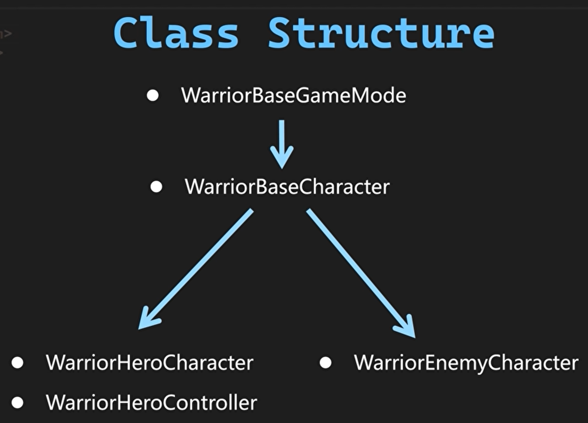

# Lesson1基础类的构建

## 1.基础类的构建




**WarriorBaseCharacter.cpp**

```c++
   AWarriorBaseCharacter::AWarriorBaseCharacter()
{
    //这是Tick功能的总开关，决定Actor是否允许注册或执行Tick函数
    PrimaryActorTick.bCanEverTick = flase;
    //控制Actor生成后Tick函数是否默认启用，但需在bCanEverTick=true的前提下生效
    PrimaryActorTick.bStartWithTickEnabled = false;

    // 设置Mesh不接收贴花
    GetMesh()->bReceivesDecals = false;
}
```

之后创建蓝图类。

## 2.Debug工具类

**WarriorDebugHelper.h**

```c++
#pragma once

namespace Debug
{
static void Print(const FString& Msg, const FColor& Color = FColor::MakeRandomColor(), int32 InKey = -1)
{
    if (GEngine)
    {
        GEngine->AddOnScreenDebugMessage(InKey, 7.f, Color, Msg);// 屏幕输出
        UE_LOG(LogTemp, Warning, TEXT("%s"), *Msg);              // 日志输出
    }
}
}  // namespace Debug
```

**优点：**

- 静态方法无需实例化
- 默认参数简化调用（`Debug::Print("Hello")`）

### 3.设置英雄相机

**WarriorHeroCharacter.h**

```c++
// Tcohneyn All Rights Reserved

#pragma once

#include "CoreMinimal.h"
#include "Characters/WarriorBaseCharacter.h"
#include "WarriorHeroCharacter.generated.h"

class USpringArmComponent;
class UCameraComponent;

UCLASS()
class MYWARRIOR_API AWarriorHeroCharacter : public AWarriorBaseCharacter
{
    GENERATED_BODY()
public:
    AWarriorHeroCharacter();

protected:
    virtual void BeginPlay() override;

private:
#pragma region Components

    UPROPERTY(VisibleAnywhere, BlueprintReadOnly, Category = "Camera", meta = (ALLowPrivateAccess = "true"))
    TObjectPtr<USpringArmComponent> CameraBoom; //弹簧臂组件

    UPROPERTY(VisibleAnywhere, BlueprintReadOnly, Category = "Camera", meta = (ALLowPrivateAccess = "true"))
    TObjectPtr<UCameraComponent> FollowCamera;  //相机组件
#pragma endregion


};

```

**WarriorHeroCharacter.cpp**

```c++
// Tcohneyn All Rights Reserved

#include "Characters/WarriorHeroCharacter.h"
#include "WarriorDebugHelper.h"
#include "Components/CapsuleComponent.h"
#include "GameFramework/SpringArmComponent.h"
#include "Camera/CameraComponent.h"
#include "GameFramework/CharacterMovementComponent.h"

AWarriorHeroCharacter::AWarriorHeroCharacter()
{
     // 初始化胶囊碰撞组件的大小，半径为42.f，高度为96.f
    GetCapsuleComponent()->InitCapsuleSize(42.f, 96.f);

     // 设置不使用控制器的俯仰旋转
    bUseControllerRotationPitch = false;
    // 设置不使用控制器的偏航旋转
    bUseControllerRotationYaw = false;
    // 设置不使用控制器的滚转旋转
    bUseControllerRotationRoll = false;
    // 创建默认的弹簧臂组件，并命名为"CameraBoom"
    CameraBoom = CreateDefaultSubobject<USpringArmComponent>(TEXT("CameraBoom"));
    // 将弹簧臂组件附加到根组件
    CameraBoom->SetupAttachment(GetRootComponent());
    // 设置弹簧臂的目标长度为200.f
    CameraBoom->TargetArmLength = 200.f;
    // 设置弹簧臂的socket偏移量为(0.f, 55.f, 65.f)
    CameraBoom->SocketOffset = FVector(0.f, 55.f, 65.f);
     // 设置弹簧臂使用角色控制旋转
    CameraBoom->bUsePawnControlRotation = true;
    //// 创建默认的相机组件，并命名为"FollowCamera"
    FollowCamera = CreateDefaultSubobject<UCameraComponent>(TEXT("FollowCamera"));
    // 将相机组件附加到弹簧臂组件的Socket
    FollowCamera->SetupAttachment(CameraBoom, USpringArmComponent::SocketName);
    // 设置相机组件不使用角色控制旋转
    FollowCamera->bUsePawnControlRotation = false;
    
    // 获取角色移动组件，并设置其旋转方向与移动方向一致
    GetCharacterMovement()->bOrientRotationToMovement = true;
    // 设置角色移动组件的旋转速度，偏航速度为500.f
    GetCharacterMovement()->RotationRate = FRotator(0.f, 500.f, 0.f);
    // 设置角色移动组件的最大行走速度为400.f
    GetCharacterMovement()->MaxWalkSpeed = 400.f;
    // 设置角色移动组件的行走制动减速度为2000.f
    GetCharacterMovement()->BrakingDecelerationWalking = 2000.f;
}


void AWarriorHeroCharacter::BeginPlay()
{
    Super::BeginPlay();
}


```

