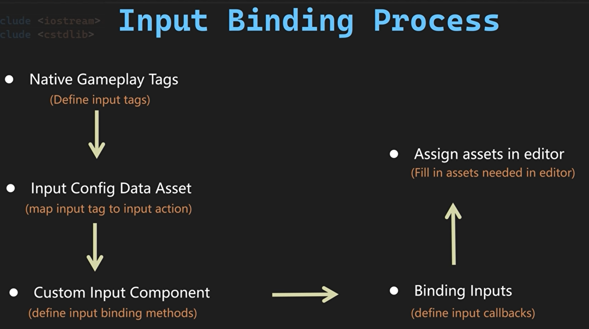
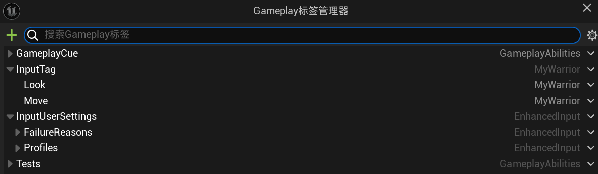
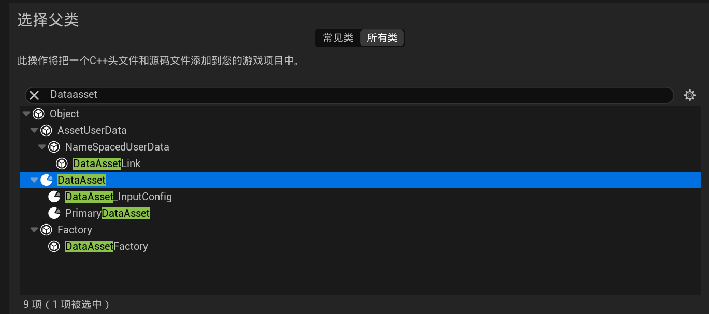
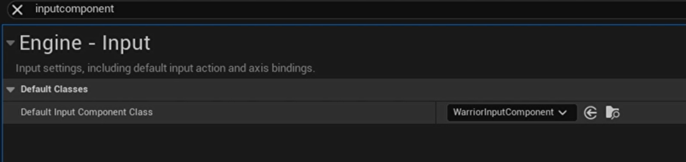

# Lesson2输入绑定过程

## 流程示意图




## 1.本地Gamplay Tags

**定义输入标签**



可以通过管理器或C++的方式添加标签，用C++添加我们可以用C++直接添加访问标签，防止我们在代码中请求游戏标签出现拼写错误。

创建一个空的C++类命名为WarriorGameplayTags。

**WarriorGameplayTags.h**

```c++
// Tcohneyn All Rights Reserved

#ifndef GAMEPLAYTAGS_H
// 防止头文件被多次包含，使用宏定义进行保护
#define GAMEPLAYTAGS_H

#include "NativeGameplayTags.h"
// 包含原生游戏标签的头文件，以便使用UE4中的游戏标签功能

namespace WarriorGameplayTags
{
// 定义一个命名空间WarriorGameplayTags，用于存放与战士游戏相关的标签

/** Input Tag **/
// 注释说明以下定义的是输入相关的标签

MYWARRIOR_API UE_DECLARE_GAMEPLAY_TAG_EXTERN(InputTag_Move) 
// 使用MYWARRIOR_API宏定义一个外部声明的游戏标签InputTag_Move，用于标识移动输入
// UE_DECLARE_GAMEPLAY_TAG_EXTERN宏用于声明一个可以在其他地方定义的游戏标签

MYWARRIOR_API UE_DECLARE_GAMEPLAY_TAG_EXTERN(InputTag_Look)
// 使用MYWARRIOR_API宏定义一个外部声明的游戏标签InputTag_Look，用于标识视角查看输入

}  // namespace WarriorGameplayTags
// 结束命名空间WarriorGameplayTags

#endif  // !GAMEPLAYTAGS_H
// 结束头文件保护宏定义

```

**WarriorGameplayTags.cpp**

```c++
// Tcohneyn All Rights Reserved
// 版权声明，表示代码的版权归属

#include "WarriorGameplayTags.h"
// 包含头文件 "WarriorGameplayTags.h"，该头文件可能定义了与战士游戏玩法标签相关的内容

namespace WarriorGameplayTags
{
// 定义一个命名空间 WarriorGameplayTags，用于封装与战士游戏玩法标签相关的代码，避免命名冲突

/** Input Tag **/
// 注释，表示以下定义的是输入相关的标签

UE_DEFINE_GAMEPLAY_TAG(InputTag_Move, "InputTag.Move")
// 使用宏 UE_DEFINE_GAMEPLAY_TAG 定义一个游戏玩法标签 InputTag_Move，其标签名称为 "InputTag.Move"
// 这个标签可能用于标识与角色移动相关的输入操作

UE_DEFINE_GAMEPLAY_TAG(InputTag_Look, "InputTag.Look")
// 使用宏 UE_DEFINE_GAMEPLAY_TAG 定义一个游戏玩法标签 InputTag_Look，其标签名称为 "InputTag.Look"
// 这个标签可能用于标识与角色视角查看相关的输入操作
}  // namespace WarriorGameplayTags
// 结束命名空间 WarriorGameplayTags

```


之后在UBT中添加**GameplayTags**模块才能运行

## 2.输入配置数据资产

**将输入标签映射到输入操作**



设置**DataAsset_InputConfig**类

**DataAsset_InputConfig.h**

```c++
// Tcohneyn All Rights Reserved
// 版权声明，表示代码的版权归属

#pragma once
// 确保头文件只被包含一次，防止重复定义

#include "CoreMinimal.h"
// 包含Unreal Engine的核心最小头文件，提供基础功能
#include "Engine/DataAsset.h"
// 包含Unreal Engine的数据资产头文件，用于创建数据资产类
#include "GameplayTagContainer.h"
// 包含游戏玩法标签容器的头文件，用于处理游戏中的标签系统
#include "DataAsset_InputConfig.generated.h"
// 包含生成的头文件，用于序列化和反射

class UInputAction;
// 声明UInputAction类，表示输入动作
class UInputMappingContext;
// 声明UInputMappingContext类，表示输入映射上下文

USTRUCT(BlueprintType)
// 定义一个结构体，并使其可以在蓝图编辑器中使用
struct FWarriorInputActionConfig
{
    GENERATED_BODY()
    // 用于生成结构体的反射和序列化代码

public:
    UPROPERTY(EditDefaultsOnly, BlueprintReadOnly, meta = (Categories = "InputTag"))
    // 定义一个属性，只能在默认设置中编辑，蓝图只读，并且可以归类为"InputTag"
    FGameplayTag InputTag;
    // 游戏玩法标签，用于标识输入动作

    UPROPERTY(EditDefaultsOnly, BlueprintReadOnly)
    // 定义一个属性，只能在默认设置中编辑，蓝图只读
    TObjectPtr<UInputAction> InputAction;
    // 输入动作的指针，指向UInputAction对象
};

UCLASS()
// 定义一个类，并使其可以在Unreal Engine中使用
class MYWARRIOR_API UDataAsset_InputConfig : public UDataAsset
{
    GENERATED_BODY()
    // 用于生成类的反射和序列化代码

public:
    UPROPERTY(EditDefaultsOnly, BlueprintReadOnly)
    // 定义一个属性，只能在默认设置中编辑，蓝图只读
    TObjectPtr<UInputMappingContext> DefaultMappingContext;
    // 默认的输入映射上下文，指向UInputMappingContext对象

    UPROPERTY(EditDefaultsOnly, BlueprintReadOnly, meta = (TitleProperty = "InputTag"))
    // 定义一个属性，只能在默认设置中编辑，蓝图只读，并且将InputTag属性作为显示标题
    TArray<FWarriorInputActionConfig> NativeInputActions;
    // 原生输入动作配置数组，包含多个FWarriorInputActionConfig结构体

    UInputAction* FindNativeInputActionByTag(const FGameplayTag& InputTag) const;
    // 声明一个函数，用于通过游戏玩法标签查找原生的输入动作，返回UInputAction指针
};
```


**DataAsset_InputConfig.cpp**

```c++
// Tcohneyn All Rights Reserved
// 版权声明，表示代码的版权归属

#include "DataAssets/Input/DataAsset_InputConfig.h"
// 包含头文件 "DataAssets/Input/DataAsset_InputConfig.h"，用于访问该头文件中定义的类和函数

// UDataAsset_InputConfig::FindNativeInputActionByTag 函数定义
// 该函数用于根据输入标签查找原生的输入动作
UInputAction* UDataAsset_InputConfig::FindNativeInputActionByTag(const FGameplayTag& InputTag) const
{
    // 遍历 NativeInputActions 数组中的每一个 FWarriorInputActionConfig 结构体
    for (const FWarriorInputActionConfig& InputActionConfig : NativeInputActions)
    {
        // 检查当前遍历的 InputActionConfig 的 InputTag 是否与传入的 InputTag 相等
        // 并且 InputActionConfig 的 InputAction 是否不为空
        if (InputActionConfig.InputTag == InputTag && InputActionConfig.InputAction)
        {
            // 如果条件满足，返回当前 InputActionConfig 的 InputAction
            return InputActionConfig.InputAction;
        }
    }
    // 如果遍历完所有元素都没有找到匹配的输入动作，返回 nullptr
    return nullptr;
}
```

## 3.自定义输入组件

定义输入绑定方法

以**EnhancedInputComponent**为父类创建**WarriorEnhancedInputComponent**类

**WarriorEnhancedInputComponent.h**

```c++
// Tcohneyn All Rights Reserved
// 版权声明

#pragma once
// 确保头文件只被包含一次，防止重复定义

#include "CoreMinimal.h"
// 包含UE4核心最小头文件，提供基础类型和宏定义
#include "EnhancedInputComponent.h"
// 包含增强输入组件头文件，用于处理增强的输入逻辑
#include "DataAssets/Input/DataAsset_InputConfig.h"
// 包含输入配置数据资产头文件，用于存储和管理输入配置
#include "WarriorEnhancedInputComponent.generated.h"
// 包含生成的头文件，用于UE4反射系统

/**
 * UWarriorEnhancedInputComponent类定义
 * 继承自UEnhancedInputComponent，用于自定义 warrior 的输入逻辑
 */
UCLASS()
class MYWARRIOR_API UWarriorEnhancedInputComponent : public UEnhancedInputComponent
{
    GENERATED_BODY()
    // 生成必要的宏和代码，用于UE4反射系统

public:
    /**
     * 绑定原生输入动作
     * @param InInputConfig 输入配置数据资产
     * @param InInputTag 输入标签
     * @param TriggerEvent 触发事件类型
     * @param ContextObject 上下文对象
     * @param Func 回调函数
     */
    template <class UserObject, typename CallbackFunc>
    void BindNativeInputAction(const UDataAsset_InputConfig* InInputConfig, const FGameplayTag& InInputTag, ETriggerEvent TriggerEvent,
        UserObject* ContextObject, CallbackFunc Func);
};

/**
 * 绑定原生输入动作的实现
 * @param InInputConfig 输入配置数据资产
 * @param InInputTag 输入标签
 * @param TriggerEvent 触发事件类型
 * @param ContextObject 上下文对象
 * @param Func 回调函数
 */
template <class UserObject, typename CallbackFunc>
inline void UWarriorEnhancedInputComponent::BindNativeInputAction(const UDataAsset_InputConfig* InInputConfig,
    const FGameplayTag& InInputTag, ETriggerEvent TriggerEvent, UserObject* ContextObject, CallbackFunc Func)
{
    checkf(InInputConfig, TEXT("Input config data asset is null, can not proceed with binding"));
    // 检查输入配置数据资产是否为空，如果为空则输出错误信息并停止执行

    if (!InInputConfig) return;
    // 如果输入配置数据资产为空，直接返回

    if (UInputAction* FoundAction = InInputConfig->FindNativeInputActionByTag(InInputTag))
    // 尝试根据输入标签查找对应的输入动作
    {
        BindAction(FoundAction, TriggerEvent, ContextObject, Func);
        // 如果找到对应的输入动作，则绑定该动作到指定的触发事件和回调函数
    }
}
```


最后改成自己的输入组件



## 4.绑定输入

**定义输入回调**

**WarriorHeroCharacter.h**

```c++
// Tcohneyn All Rights Reserved
// 版权声明，表示代码的版权归属

#pragma once
// 确保头文件只被包含一次，防止重复定义

#include "CoreMinimal.h"
// 包含Unreal Engine的核心最小头文件，提供基本的引擎功能
#include "Characters/WarriorBaseCharacter.h"
// 包含基础战士角色类头文件，AWarriorHeroCharacter继承自AWarriorBaseCharacter
#include "WarriorHeroCharacter.generated.h"
// Unreal Engine的宏，用于生成反射代码，便于编辑器识别和管理类

class UDataAsset_InputConfig;
// 声明输入配置数据资产类，用于存储输入映射配置
struct FInputActionValue;
// 声明输入动作值结构体，用于存储输入动作的值

UCLASS()
// Unreal Engine的宏，定义一个UClass，表示这是一个可以被实例化的类
class MYWARRIOR_API AWarriorHeroCharacter : public AWarriorBaseCharacter
// 定义AWarriorHeroCharacter类，继承自AWarriorBaseCharacter，MYWARRIOR_API是模块的导出宏
{
    GENERATED_BODY()
    // Unreal Engine的宏，用于生成类的序列化和反射代码

public:
    // 公共成员函数和变量
    AWarriorHeroCharacter();
    // 构造函数，用于初始化对象

protected:

    virtual void BeginPlay() override;
    // 重写BeginPlay函数，当游戏开始或角色被实例化时调用

    virtual void SetupPlayerInputComponent(class UInputComponent* PlayerInputComponent) override;
    // 重写SetupPlayerInputComponent函数，用于设置玩家输入组件

private:
#pragma region Components
#pragma endregion

#pragma region Inputs
    // 区域标记，用于分组相关代码，便于阅读和维护

    UPROPERTY(EditDefaultsOnly, Category = "CharacterData", meta = (ALLowPrivateAccess = "true"))
    // Unreal Engine的宏，定义一个属性，EditDefaultsOnly表示只能在默认编辑器中编辑，Category用于分类，meta用于元数据
    TObjectPtr<UDataAsset_InputConfig> InputConfigDataAsset;
    // 定义一个指向输入配置数据资产的指针，用于存储输入映射配置

    void Input_Move(const FInputActionValue& InputActionValue);
    // 定义一个输入移动的函数，参数为输入动作值

    void Input_Look(const FInputActionValue& InputActionValue);
    // 定义一个输入视角的函数，参数为输入动作值
#pragma endregion
    // 区域标记结束

};
// 类定义结束
```

**WarriorHeroCharacter.cpp**

```c++
// Tcohneyn All Rights Reserved

#include "Characters/WarriorHeroCharacter.h"
#include "WarriorDebugHelper.h"
#include "EnhancedInputSubsystems.h"
#include "DataAssets/Input/DataAsset_InputConfig.h"
#include "WarriorGameplayTags.h"
#include "Components/Input/WarriorEnhancedInputComponent.h"
// 构造函数：AWarriorHeroCharacter的构造函数
AWarriorHeroCharacter::AWarriorHeroCharacter()
{
}

// AWarriorHeroCharacter类的BeginPlay函数，用于在游戏开始时执行一些初始化操作
void AWarriorHeroCharacter::BeginPlay()
{
    // 调用基类的BeginPlay函数，确保基类的初始化逻辑也被执行
    Super::BeginPlay();
}

// AWarriorHeroCharacter类的SetupPlayerInputComponent函数，用于设置玩家的输入组件
void AWarriorHeroCharacter::SetupPlayerInputComponent(UInputComponent* PlayerInputComponent)
{
    // 检查InputConfigDataAsset是否已分配
    checkf(InputConfigDataAsset, TEXT("Forget to assign a valid data asset as input config"));
    
    // 获取本地玩家
    ULocalPlayer* LocalPlayer = GetController<APlayerController>()->GetLocalPlayer();
    
    // 获取增强输入本地玩家子系统
    auto Subsystem = ULocalPlayer::GetSubsystem<UEnhancedInputLocalPlayerSubsystem>(LocalPlayer);
    
    // 检查子系统是否有效
    check(Subsystem);
    
    // 如果子系统无效，直接返回
    if (!Subsystem) return;
    
    // 添加默认的映射上下文到子系统
    Subsystem->AddMappingContext(InputConfigDataAsset->DefaultMappingContext, 0);
    
    // 将PlayerInputComponent转换为UWarriorEnhancedInputComponent类型
    auto WarriorInputComponent = CastChecked<UWarriorEnhancedInputComponent>(PlayerInputComponent);
    
    // 绑定移动输入动作
    WarriorInputComponent->BindNativeInputAction(
        InputConfigDataAsset, WarriorGameplayTags::InputTag_Move, ETriggerEvent::Triggered, this, &AWarriorHeroCharacter::Input_Move);
    
    // 绑定视角旋转输入动作
    WarriorInputComponent->BindNativeInputAction(
        InputConfigDataAsset, WarriorGameplayTags::InputTag_Look, ETriggerEvent::Triggered, this, &AWarriorHeroCharacter::Input_Look);
}

// AWarriorHeroCharacter类的Input_Move函数，用于处理移动输入
void AWarriorHeroCharacter::Input_Move(const FInputActionValue& InputActionValue)
{
    // 获取输入的二维向量
    const FVector2D MovementVector = InputActionValue.Get<FVector2D>();
    
    // 获取控制器的旋转
    const FRotator MovementRotation(0.f, Controller->GetControlRotation().Yaw, 0.f);
    
    // 如果Y轴输入不为0，则向前移动
    if (MovementVector.Y != 0.f)
    {
        const FVector ForwardDirection = MovementRotation.RotateVector(FVector::ForwardVector);
        AddMovementInput(ForwardDirection, MovementVector.Y);
    }

    // 如果X轴输入不为0，则向右移动
    if (MovementVector.X != 0.f)
    {
        const FVector RightDirection = MovementRotation.RotateVector(FVector::RightVector);
        AddMovementInput(RightDirection, MovementVector.X);
    }
}

// AWarriorHeroCharacter类的Input_Look函数，用于处理视角旋转输入
void AWarriorHeroCharacter::Input_Look(const FInputActionValue& InputActionValue)
{
    // 获取输入的二维向量
    const FVector2D LookAxisVector = InputActionValue.Get<FVector2D>();
    
    // 如果X轴输入不为0，则旋转视角的Yaw
    if (LookAxisVector.X != 0.f)
    {
        AddControllerYawInput(LookAxisVector.X);
    }
    
    // 如果Y轴输入不为0，则旋转视角的Pitch
    if (LookAxisVector.Y != 0.f)
    {
        AddControllerPitchInput(LookAxisVector.Y);
    }
}
```

