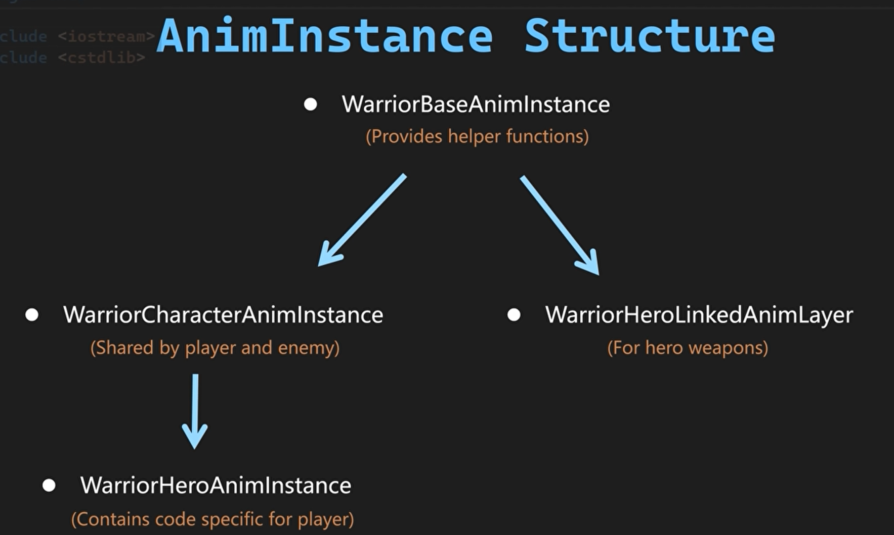
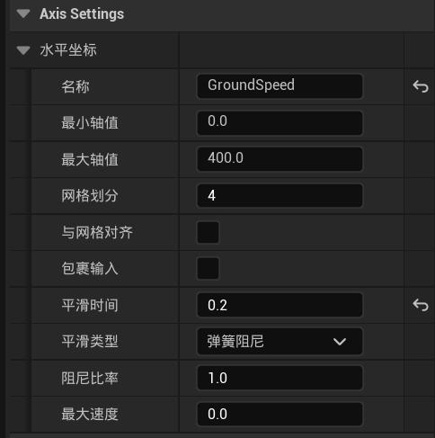
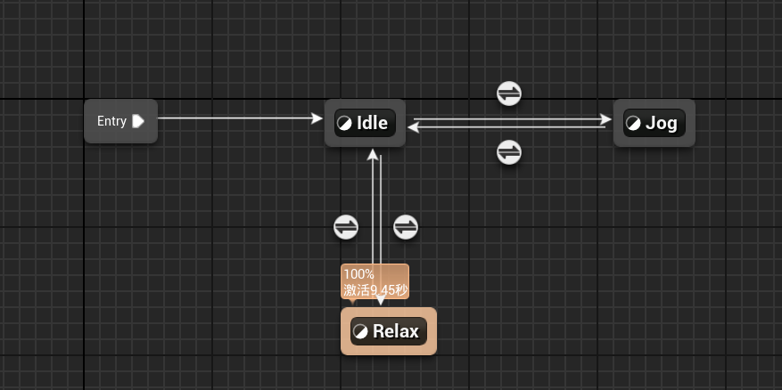
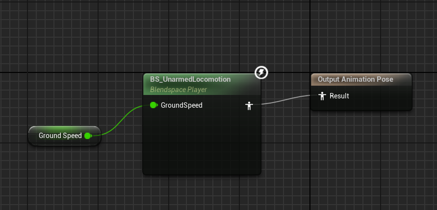
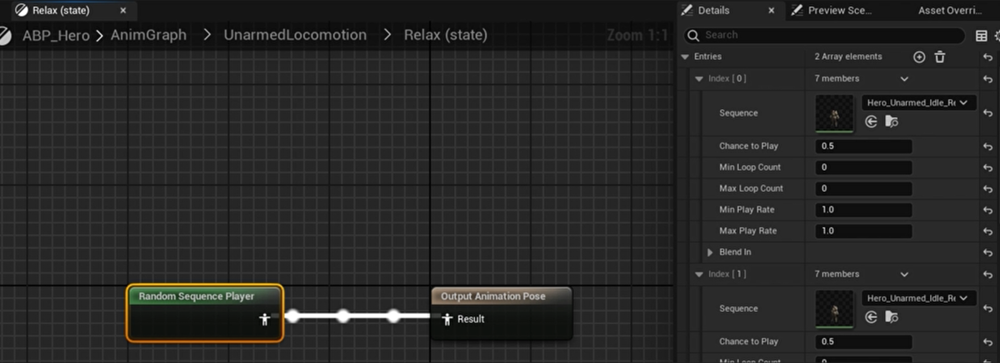

# Lesson3动画实例

## **动画实例结构图**




## 1.Character Anim Instance

**WarriorCharacterAnimInstance.h**

```c++
// Tcohneyn All Rights Reserved
// 版权声明，表示代码的版权归属

#pragma once
// 确保头文件只被包含一次，防止重复定义

#include "CoreMinimal.h"
// 包含Unreal Engine的核心最小头文件，提供基础类型和宏定义
#include "AnimInstances/WarriorBaseAnimInstance.h"
// 包含基础战士动画实例的头文件，继承自该类
#include "WarriorCharacterAnimInstance.generated.h"
// 包含生成的反射代码头文件，用于Unreal Engine的反射系统

class AWarriorBaseCharacter;
// 声明AWarriorBaseCharacter类，表示战士基础角色
class UCharacterMovementComponent;
// 声明UCharacterMovementComponent类，表示角色移动组件

UCLASS()
// UCLASS宏定义，表示这是一个Unreal Engine的类
class MYWARRIOR_API UWarriorCharacterAnimInstance : public UWarriorBaseAnimInstance
// 定义UWarriorCharacterAnimInstance类，继承自UWarriorBaseAnimInstance
{
    GENERATED_BODY()
    // GENERATED_BODY宏，用于生成序列化和反射相关的代码

public:
    // 公共成员函数和变量

    virtual void NativeInitializeAnimation() override;
    // 虚函数，用于初始化动画，override表示重写基类函数

    virtual void NativeThreadSafeUpdateAnimation(float DeltaSeconds) override;
    // 虚函数，用于线程安全地更新动画，override表示重写基类函数

protected:
    // 受保护成员变量

    UPROPERTY()
    // UPROPERTY宏，表示这是一个Unreal Engine的属性
    TObjectPtr<AWarriorBaseCharacter> OwningCharacter;
    // 指向拥有此动画实例的战士基础角色的智能指针

    UPROPERTY()
    TObjectPtr<UCharacterMovementComponent> OwningMovementComponent;
    // 指向拥有此动画实例的角色移动组件的智能指针

    UPROPERTY(VisibleDefaultsOnly, BlueprintReadOnly, Category = "AnimData|LocomotionData")
    // UPROPERTY宏，指定属性在编辑器中的可见性和分类
    float GroundSpeed;
    // 表示角色在地面的速度

    UPROPERTY(VisibleDefaultsOnly, BlueprintReadOnly, Category = "AnimData|LocomotionData")
    bool bHasAcceleration;
    // 表示角色是否有加速度
};
```

**WarriorCharacterAnimInstance.cpp**

```c++
// Tcohneyn All Rights Reserved

#include "AnimInstances/WarriorCharacterAnimInstance.h"
#include "Characters/WarriorBaseCharacter.h"
#include "GameFramework/CharacterMovementComponent.h"

// 初始化动画实例
void UWarriorCharacterAnimInstance::NativeInitializeAnimation()
{
    // 尝试获取当前动画实例所属的角色，并将其转换为AWarriorBaseCharacter类型
    OwningCharacter = Cast<AWarriorBaseCharacter>(TryGetPawnOwner());
    // 如果成功获取到角色
    if (OwningCharacter)
    {
        // 获取角色的移动组件
        OwningMovementComponent = OwningCharacter->GetCharacterMovement();
    }
}

// 更新动画实例，线程安全
void UWarriorCharacterAnimInstance::NativeThreadSafeUpdateAnimation(float DeltaSeconds)
{
    // 如果没有角色或移动组件，直接返回
    if (!OwningCharacter || !OwningMovementComponent)
    {
        return;
    }

    // 获取角色的水平速度（二维速度大小）
    GroundSpeed = OwningCharacter->GetVelocity().Size2D();
    // 判断角色是否有加速度（加速度的平方大于0）
    bHasAcceleration = OwningMovementComponent->GetCurrentAcceleration().SizeSquared2D() > 0.f;
}
```

## 2.Hero AnimBP

创建了动画蓝图ABP_Hero后再创建混合空间BS_UnarmedLocomotion。

**设置参数**



**ABP设置**



Jog状态



## 3.Hero Anim Instance



**设置转换Relax状态逻辑**

**WarriorHeroAnimInstance.h**

```c++
// Tcohneyn All Rights Reserved
// 版权声明，表示代码的版权归属

#pragma once
// 确保头文件只被包含一次，防止重复定义

#include "CoreMinimal.h"
// 包含Unreal Engine的核心最小头文件，提供基础功能
#include "AnimInstances/WarriorCharacterAnimInstance.h"
// 包含自定义的战士角色动画实例头文件
#include "WarriorHeroAnimInstance.generated.h"
// 包含生成的头文件，用于序列化和反射

class AWarriorHeroCharacter;
// 声明AWarriorHeroCharacter类，表示战士英雄角色

UCLASS()
// UCLASS宏定义一个Unreal Engine类
class MYWARRIOR_API UWarriorHeroAnimInstance : public UWarriorCharacterAnimInstance
// 定义UWarriorHeroAnimInstance类，继承自UWarriorCharacterAnimInstance
{
    GENERATED_BODY()
    // GENERATED_BODY宏，用于自动生成序列化和反射相关的代码

public:
    // 公共成员函数和变量

    virtual void NativeInitializeAnimation() override;
    // 虚函数，用于初始化动画，override表示重写基类函数

    virtual void NativeThreadSafeUpdateAnimation(float DeltaSeconds) override;
    // 虚函数，用于线程安全地更新动画，override表示重写基类函数

protected:
    // 受保护成员变量

    UPROPERTY(VisibleDefaultsOnly, BlueprintReadOnly, Category = "AnimData|Refrences")
    // UPROPERTY宏定义一个Unreal Engine属性
    // VisibleDefaultsOnly：在默认视图中可见
    // BlueprintReadOnly：允许在蓝图中被读取
    // Category：指定属性在编辑器中的分类
    TObjectPtr<AWarriorHeroCharacter> OwningHeroCharacter;
    // 指向拥有该动画实例的战士英雄角色的指针

    UPROPERTY(VisibleDefaultsOnly, BlueprintReadOnly, Category = "AnimData|LocomotionData")
    bool bShouldEnterRelaxState;
    // 布尔变量，表示是否应进入放松状态

    UPROPERTY(EditDefaultsOnly, BlueprintReadOnly, Category = "AnimData|LocomotionData")
    // EditDefaultsOnly：只在默认属性编辑器中可见和可编辑
    float EnterRelaxStateThreshold = 5.f;
    // 浮点变量，表示进入放松状态的阈值，默认值为5

    float IdleElpasedTime;
    // 浮点变量，用于记录空闲状态经过的时间
};
```

**WarriorHeroAnimInstance.cpp**

```c++
// Tcohneyn All Rights Reserved

// 包含英雄动画实例的头文件
#include "AnimInstances/Hero/WarriorHeroAnimInstance.h"
// 包含英雄角色的头文件
#include "Characters/WarriorHeroCharacter.h"

// 初始化动画实例的函数
void UWarriorHeroAnimInstance::NativeInitializeAnimation()
{
    // 调用基类的初始化动画函数
    Super::NativeInitializeAnimation();
    // 检查当前拥有该动画实例的角色是否存在
    if (OwningCharacter)
    {
        // 将拥有该动画实例的角色转换为AWarriorHeroCharacter类型
        OwningCharacter = Cast<AWarriorHeroCharacter>(OwningCharacter);
    }
}

// 更新动画的线程安全函数
void UWarriorHeroAnimInstance::NativeThreadSafeUpdateAnimation(float DeltaSeconds)
{
    // 调用基类的线程安全更新动画函数
    Super::NativeThreadSafeUpdateAnimation(DeltaSeconds);
    // 检查是否有加速度
    if (bHasAcceleration)
    {
        // 如果有加速度，重置空闲时间
        IdleElpasedTime = 0.f;
        // 设置不进入放松状态
        bShouldEnterRelaxState = false;
    }
    else
    {
        // 如果没有加速度，累加空闲时间
        IdleElpasedTime += DeltaSeconds;
        // 判断是否应该进入放松状态
        bShouldEnterRelaxState = (IdleElpasedTime >= EnterRelaxStateThreshold);
    }
}
```

