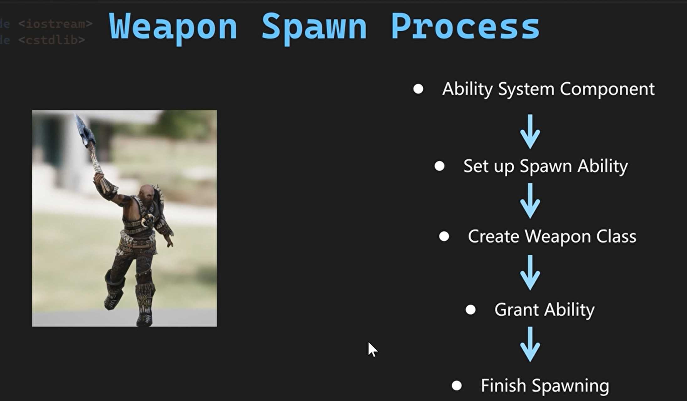
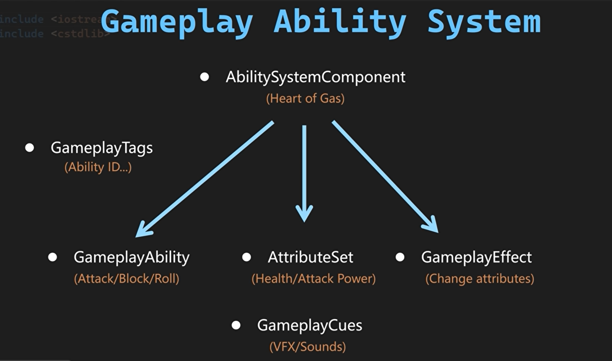
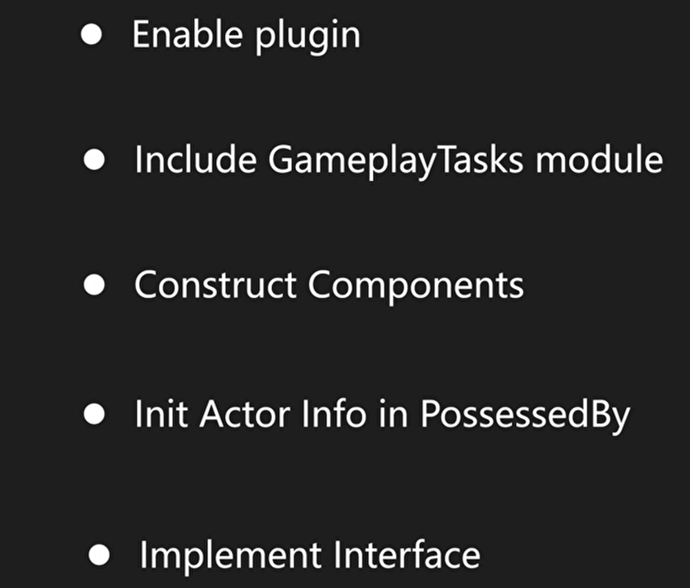

# Lesson4GAS

## 武器生成流程示意



1. 能力系统组件(Ability System Component)
2. 配置生成能力(Set up Spawn Ability)
3. 创建武器类
4. 赋予能力
5. 完成生成

## GAS系统的优点

在虚幻引擎（UE）中使用**Gameplay Ability System（GAS）**系统，能够为游戏开发带来多层次的效率提升和功能扩展。以下是其核心优势及具体应用场景的详细解析：

------

### 一、模块化与灵活性

1. **解耦的组件化设计**
    GAS通过将技能逻辑拆分为独立的 ​**​Gameplay Ability​**​（技能）、​**​Gameplay Effect​**​（效果）和 ​**​Attribute​**​（属性），实现了逻辑与表现的高度解耦。例如，一个火球术技能可分解为：
   - **Ability**：释放条件与流程控制（如冷却时间、法力消耗）
   - **Effect**：伤害计算、状态附加（如燃烧效果）
   - **Attribute**：攻击力、法力值等动态属性
      这种模块化设计使得开发者无需修改底层代码即可快速调整技能机制。
2. **Tag驱动的动态交互**
    通过 ​**​Gameplay Tag​**​ 系统，角色状态（如眩晕、无敌）与技能条件（如“仅对燃烧目标生效”）可动态绑定。例如，当角色被赋予 `State.Stun` 标签时，所有依赖 `Require.State.Stun` 标签的技能将自动失效，实现复杂状态机的轻量化管理。

------

### 二、高效开发与协作

1. **数据驱动的技能配置**
    GAS支持通过蓝图或数据资产（Data Asset）配置技能逻辑，策划人员可直接在编辑器中调整技能参数（如伤害系数、施法时间），而无需程序员介入。
2. **内置网络同步与容错机制**
    GAS默认处理了技能的网络同步（如客户端预测与服务器校验），开发者只需关注业务逻辑。例如，技能释放时客户端预表现弹道，服务器验证后广播结算结果，避免作弊并提升流畅性。

------

### 三、可扩展性与性能优化

1. **动态加载与资源管理**
    通过 ​**​Ability System Component​**​（ASC）动态挂载技能，支持运行时按需加载资源。例如，角色升级后解锁新技能时，仅需动态添加对应 `UGameplayAbility` 实例，避免内存冗余。
2. **性能优化策略**
   - **批处理效果叠加**：多个 `Gameplay Effect` 可合并计算（如同时生效的增伤与减伤效果）
   - **异步任务处理**：通过 `Ability Task` 实现非阻塞操作（如播放动画时并行计算伤害）
      网页4提到GAS未来还将整合AI驱动的性能分析工具，进一步优化资源占用。

------

### 四、跨领域适用性

1. **复杂状态系统的统一管理**
    不仅适用于战斗技能，还可扩展至交互系统（如开门、驾驶）、经济系统（如属性衰减、BUFF叠加）等场景。
2. **多平台与云原生支持**
    GAS架构天然适配分布式计算。

## GAS构造



## 1.能力系统组件(Ability System Component)流程



以**AbilitySystemComponent**和**AttributeSet**为父类创建**WarriorAbilitySystemComponent**和**WarriorAttributeSet**类。

**UBT**中添加**GameplayTasks**。

**WarriorBaseCharacter.h**

```c++
// Tcohneyn All Rights Reserved
// 版权声明，表示代码的版权归属

#pragma once
// 确保头文件只被包含一次，防止重复定义

#include "CoreMinimal.h"
// 包含Unreal Engine的核心最小头文件，提供基础类型和宏定义
#include "GameFramework/Character.h"
// 包含Character类，用于定义游戏中的角色
#include "AbilitySystemInterface.h"
// 包含能力系统接口头文件，用于实现角色能力系统
#include "WarriorBaseCharacter.generated.h"
// 包含生成的头文件，用于序列化和反射

class UWarriorAbilitySystemComponent;
// 声明UWarriorAbilitySystemComponent类，用于前向声明
class UWarriorAttributeSet;
// 声明UWarriorAttributeSet类，用于前向声明

UCLASS()
// UCLASS宏定义，表示这是一个UObject类
class MYWARRIOR_API AWarriorBaseCharacter : public ACharacter,public IAbilitySystemInterface
// 定义AWarriorBaseCharacter类，继承自ACharacter和IAbilitySystemInterface
{
    GENERATED_BODY()
    // GENERATED_BODY宏，用于生成序列化和反射所需的代码

public:
    // 公共接口部分

    // 构造函数，设置角色的默认属性
    AWarriorBaseCharacter();

    //~ Begin IAbilitySystemInterface Interface
    // 开始IAbilitySystemInterface接口的实现部分

    // 获取能力系统组件的虚函数重写
    virtual UAbilitySystemComponent* GetAbilitySystemComponent() const override;

    //~ End IAbilitySystemInterface Interface
    // 结束IAbilitySystemInterface接口的实现部分

protected:
    // 受保护成员变量和函数部分

    //~ Begin APawn Interface
    // 开始APawn接口的实现部分

    // 当角色被控制器拥有时的虚函数重写
    virtual void PossessedBy(AController* NewController) override;

    //~ End APawn Interface
    // 结束APawn接口的实现部分

    // 能力系统组件，可见于编辑器，可蓝图读取，分类为"AbilitySystem"
    UPROPERTY(VisibleAnywhere, BlueprintReadOnly, Category = "AbilitySystem")
    TObjectPtr<UWarriorAbilitySystemComponent> WarriorAbilitySystemComponent;

    // 角色属性集，可见于编辑器，可蓝图读取，分类为"AbilitySystem"
    UPROPERTY(VisibleAnywhere, BlueprintReadOnly, Category = "AbilitySystem")
    TObjectPtr<UWarriorAttributeSet> WarriorAttributeSet;

public:
    // 公共接口部分

    // 获取战士能力系统组件的强制内联函数
    FORCEINLINE UWarriorAbilitySystemComponent* GetWarriorAbilitySystemComponent() const { return WarriorAbilitySystemComponent; }

    // 获取战士属性集的强制内联函数
    FORCEINLINE UWarriorAttributeSet* GetWarriorAttributeSet() const { return WarriorAttributeSet; }
};
```


**WarriorBaseCharacter.cpp**

```C++
// Tcohneyn All Rights Reserved

#include "Characters/WarriorBaseCharacter.h"
#include "AbilitySystem/WarriorAbilitySystemComponent.h"
#include "AbilitySystem/WarriorAttributeSet.h"

// 构造函数，设置默认值
AWarriorBaseCharacter::AWarriorBaseCharacter()
{
    // 创建并初始化WarriorAbilitySystemComponent子对象
    WarriorAbilitySystemComponent = CreateDefaultSubobject<UWarriorAbilitySystemComponent>(TEXT("WarriorAbilitySystemComponent"));

    // 创建并初始化WarriorAttributeSet子对象
    WarriorAttributeSet = CreateDefaultSubobject<UWarriorAttributeSet>(TEXT("WarriorAttributeSet"));
}

// 获取能力系统组件
UAbilitySystemComponent* AWarriorBaseCharacter::GetAbilitySystemComponent() const
{
    // 返回WarriorAbilitySystemComponent
    return GetWarriorAbilitySystemComponent();
}

// 当角色被控制时调用
void AWarriorBaseCharacter::PossessedBy(AController* NewController)
{
    // 调用基类的PossessedBy函数
    Super::PossessedBy(NewController);
    // 如果WarriorAbilitySystemComponent存在
    if (WarriorAbilitySystemComponent)
    {
        // 初始化能力系统组件的信息，将当前角色和控制器传递进去
        WarriorAbilitySystemComponent->InitAbilityActorInfo(this, this);
    }
}
```

然后再WarriorHeroCharacter类中重写PossessedBy函数。

**WarriorHeroCharacter.h**

```c++
// Tcohneyn All Rights Reserved
// 版权声明，表示代码的版权归属

#pragma once
// 确保头文件只被包含一次，防止重复定义

#include "CoreMinimal.h"
// 包含Unreal Engine的核心最小头文件，提供基本的引擎功能
#include "Characters/WarriorBaseCharacter.h"
// 包含基础战士角色类头文件，AWarriorHeroCharacter继承自AWarriorBaseCharacter
#include "WarriorHeroCharacter.generated.h"
// Unreal Engine的宏，用于生成反射代码，便于编辑器识别和管理类

UCLASS()
// Unreal Engine的宏，定义一个UClass，表示这是一个可以被实例化的类
class MYWARRIOR_API AWarriorHeroCharacter : public AWarriorBaseCharacter
// 定义AWarriorHeroCharacter类，继承自AWarriorBaseCharacter，MYWARRIOR_API是模块的导出宏
{
    GENERATED_BODY()
    // Unreal Engine的宏，用于生成类的序列化和反射代码

public:
    // 公共成员函数和变量
    AWarriorHeroCharacter();
    // 构造函数，用于初始化对象

protected:
    // 受保护成员函数和变量，只能在类内部和派生类中访问
    //~ Begin APawn Interface
    // 标记以下函数是实现APawn接口的
    virtual void PossessedBy(AController* NewController) override;
    // 重写APawn接口的PossessedBy函数，当角色被控制器拥有时调用
    //~ End APawn Interface
    // 标记以上函数是实现APawn接口的结束

};

```

**WarriorHeroCharacter.cpp**

```c++
// Tcohneyn All Rights Reserved

#include "Characters/WarriorHeroCharacter.h"
#include "WarriorDebugHelper.h"
#include "WarriorGameplayTags.h"
#include "AbilitySystem/WarriorAbilitySystemComponent.h"
// 构造函数：AWarriorHeroCharacter的构造函数
AWarriorHeroCharacter::AWarriorHeroCharacter()
{
}

// AWarriorHeroCharacter类的PossessedBy函数，用于在角色被控制器拥有时执行一些初始化操作
void AWarriorHeroCharacter::PossessedBy(AController* NewController)
{
    // 调用基类的PossessedBy函数，确保基类的初始化逻辑也被执行
    Super::PossessedBy(NewController);
    
    // 检查WarriorAbilitySystemComponent和WarriorAttributeSet是否有效
    if (WarriorAbilitySystemComponent && WarriorAttributeSet)
    {
        // 构造一个字符串，包含Owner Actor和AvatarActor的标签
        const FString ASCText =
            FString::Printf(TEXT("Owner Actor: %s ,AvatarActor: %s "), *WarriorAbilitySystemComponent->GetOwnerActor()->GetActorLabel(),
                *WarriorAbilitySystemComponent->GetAvatarActor()->GetActorLabel());
        
        // 打印调试信息，表示AbilitySystemComponent有效，并显示Owner Actor和AvatarActor的标签
        Debug::Print(TEXT("Ability system component valid.") + ASCText, FColor::Green);
        
        // 打印调试信息，表示AttributeSet有效
        Debug::Print(TEXT("AttributeSet valid."), FColor::Green);
    }
}

```

## 2.配置生成能力(Set up Spawn Ability)
