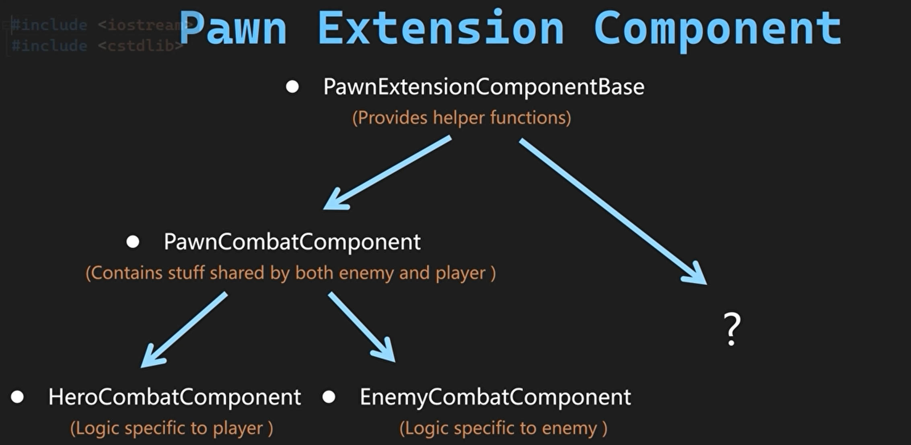
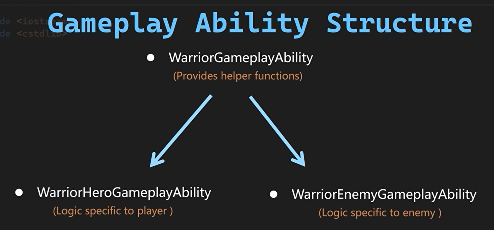
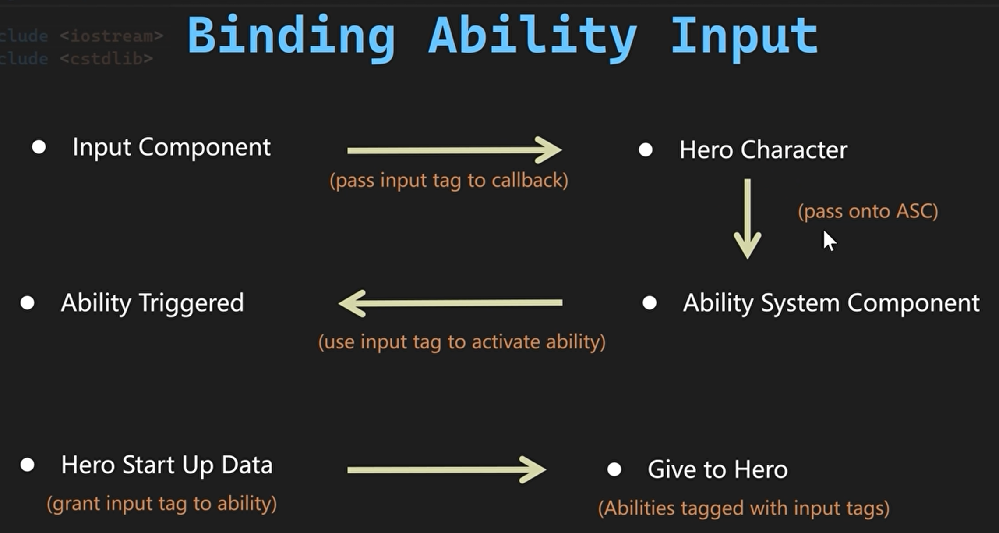
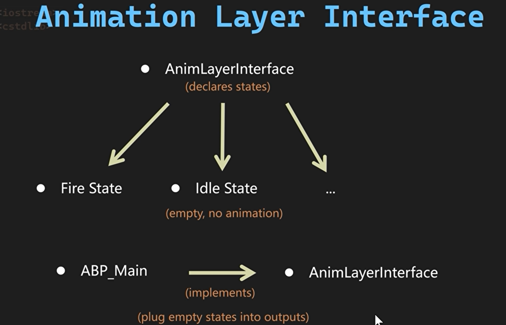
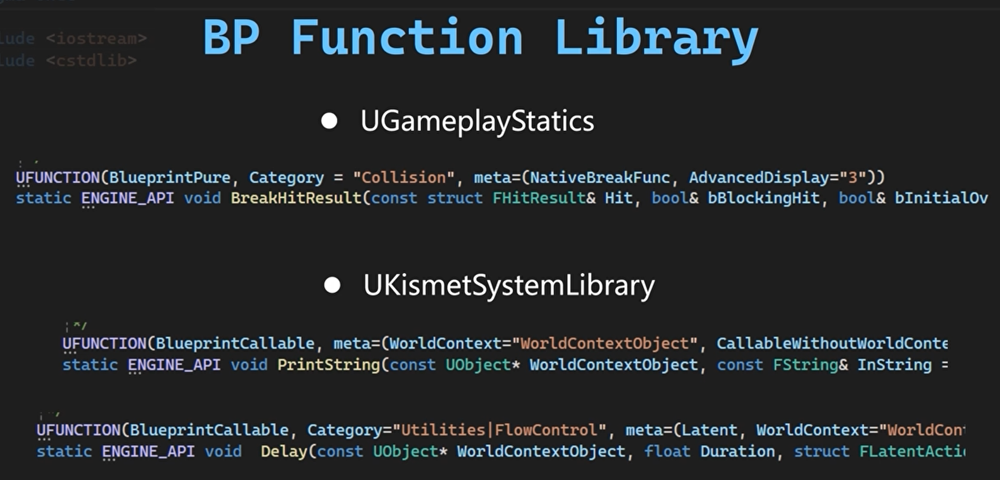
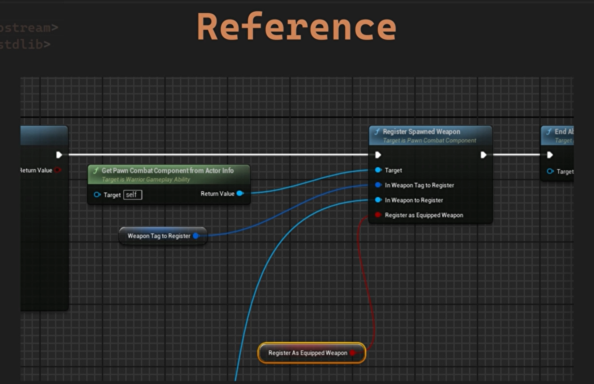

# Lesson5近战连招系统

## 一.近战连击系统部分概述

从创建Pawn Extension组件开始本节然后创建一个继承自该组件的PawnCombat组件用于注册武器。



在这之后继续添加HeroGameplayAbility并创建能力输入操作。需要使用目前拥有的系统来绑定能力输入






然后创建装备武器所需的蒙太奇，并利用动画图层接口用于创建强大的动画系统，以链接正确的动画图层，当我们装备好武器时。



接下来把武器能力填入武器数据结构，并创建武器技能，比如当我们装备了斧头并看时解除武器装备，在卸下斧头后我们如何才能移除该能力。

准备好后创建Combo系统为我们的英雄角色提供攻击和重击能力。

我们将通过蓝图函数库（Blueprint Function Library）实现轻攻击执行期间直接跳转至终结技的机制



准备好动作后会添加音效和慢动作。

## 二.面临的挑战

接下来要实现武器装备(Weapon Equiping)和攻击连段(Attack Combo)

### 1.武器装备

* 检索生成的武器
* 一个新的Gamplay Ability(用于装备和卸下武器)
* 绑定能力输入动作
* 武装机动系统
* 解除装备

### 2.连段系统

* 新的动作可以轻松的添加删除
* 系统能独立于动画
* 有轻/重攻击
* 攻击之间能够互相连携
* 伤害能跟连击数有关联

## 三.Pawn扩展组件

首先解决检索生成的武器的问题。

我们将用能力生成的武器注册到我们的PawnCombatComponent中，这个组件除了处理武器方面的外还能处理战斗方面的。


PawnExtensionComponentBase.h

```C++
// Tcohneyn All Rights Reserved
// 版权声明，表示代码的版权归属

#pragma once
// 确保头文件只被包含一次，防止重复定义

#include "CoreMinimal.h"
// 包含Unreal Engine的核心最小头文件，提供基础的定义和功能
#include "Components/ActorComponent.h"
// 包含ActorComponent头文件，用于创建和管理Actor组件
#include "PawnExtensionComponentBase.generated.h"
// 包含生成的头文件，用于UE4的反射系统

UCLASS( ClassGroup=(Custom), meta=(BlueprintSpawnableComponent) )
// UCLASS宏定义一个UE4类
// ClassGroup=(Custom) 将类分组为自定义，便于在编辑器中分类
// meta=(BlueprintSpawnableComponent) 表示这个组件可以在蓝图中被创建和实例化
class MYWARRIOR_API UPawnExtensionComponentBase : public UActorComponent
// 定义一个名为UPawnExtensionComponentBase的类，继承自UActorComponent
{
	GENERATED_BODY()
	// GENERATED_BODY宏用于UE4的反射系统，自动生成序列化和反射相关的代码

	protected:
    // 保护成员，只能在类内部或派生类中访问

    template <class T>
    // 模板函数，允许传入任意类型T
    T* GetOwningPawn() const
    // 返回一个指向拥有该组件的Pawn的指针，const表示不会修改成员变量
    {
        static_assert(TPointerIsConvertibleFromTo<T, APawn>::Value, "'T' Template Parameter to GetPawn must be derived from APawn");
        // static_assert用于编译时断言，确保T类型可以从APawn转换，即T必须是APawn的派生类
        return CastChecked<T>(GetOwner());
        // 使用CastChecked将GetOwner()转换为T类型，GetOwner()返回组件的拥有者
    }

    APawn* GetOwningPawn() const { return GetOwningPawn<APawn>(); }
    // 重载GetOwningPawn函数，返回APawn类型的指针，调用模板函数获取拥有者

    template <class T>
    // 模板函数，允许传入任意类型T
    T* GetOwningController() const
    // 返回一个指向拥有该组件的Pawn的Controller的指针，const表示不会修改成员变量
    {
        static_assert(
            TPointerIsConvertibleFromTo<T, AController>::Value, "'T' Template Parameter to GetController must be derived from AController");
        // static_assert用于编译时断言，确保T类型可以从AController转换，即T必须是AController的派生类
        return GetOwningPawn<APawn>()->GetController<T>();
        // 调用GetOwningPawn获取Pawn，然后调用GetController<T>()获取其Controller
    }
};

```

随后创建PawnCombatComponent和HeroCombatComponent，并在HeroCharacter中初始化HeroCombatComponent和创建GetHeroCombatComponent()函数。

**WarriorHeroCharacter.h**

```c++
// Tcohneyn All Rights Reserved
// 版权声明，表示代码的版权归属

#pragma once
// 确保头文件只被包含一次，防止重复定义

#include "CoreMinimal.h"
// 包含Unreal Engine的核心最小头文件，提供基本的引擎功能
#include "Characters/WarriorBaseCharacter.h"
// 包含基础战士角色类头文件，AWarriorHeroCharacter继承自AWarriorBaseCharacter
#include "WarriorHeroCharacter.generated.h"
// Unreal Engine的宏，用于生成反射代码，便于编辑器识别和管理类

class UHeroCombatComponent;

UCLASS()
// Unreal Engine的宏，定义一个UClass，表示这是一个可以被实例化的类
class MYWARRIOR_API AWarriorHeroCharacter : public AWarriorBaseCharacter
// 定义AWarriorHeroCharacter类，继承自AWarriorBaseCharacter，MYWARRIOR_API是模块的导出宏
{
    GENERATED_BODY()
    // Unreal Engine的宏，用于生成类的序列化和反射代码

public:
    // 公共成员函数和变量
    AWarriorHeroCharacter();
    // 构造函数，用于初始化对象

private:
    // 私有成员函数和变量，只能在类内部访问
#pragma region Components
    // 区域标记，用于分组相关代码，便于阅读和维护
    UPROPERTY(VisibleAnywhere, BlueprintReadOnly, Category = "Combat", meta = (AllowPrivateAccess = "true"))
    TObjectPtr<UHeroCombatComponent> HeroCombatComponent;
#pragma endregion
    // 区域标记结束


public:
    FORCEINLINE UHeroCombatComponent* GetHeroCombatComponent() const { return HeroCombatComponent; }
};

```

**WarriorHeroCharacter.cpp**

```c++
#include "Characters/WarriorHeroCharacter.h"
#include "Components/Combat/HeroCombatComponent.h"
// 构造函数：AWarriorHeroCharacter的构造函数
AWarriorHeroCharacter::AWarriorHeroCharacter()
{
    HeroCombatComponent = CreateDefaultSubobject<UHeroCombatComponent>(TEXT("HeroCombatComponent"));
}
```

## 四.生成武器注册

**PawnCombatComponent.h**

```c++
// Tcohneyn All Rights Reserved
// 版权声明，表示代码的版权归属

#pragma once
// 确保头文件只被包含一次，防止重复定义

#include "CoreMinimal.h"
// 包含Unreal Engine核心最小化头文件，提供基础类型和宏定义
#include "Components/PawnExtensionComponentBase.h"
// 包含Pawn扩展组件基类头文件，用于扩展Pawn的功能
#include "GameplayTagContainer.h"
// 包含游戏玩法标签容器头文件，用于管理游戏中的标签
#include "PawnCombatComponent.generated.h"
// 包含生成的头文件，用于UE4的反射系统

class AWarriorWeaponBase;
// 声明AWarriorWeaponBase类，表示战士武器基类

UCLASS()
// UCLASS宏定义，表示这是一个UE4的类
class MYWARRIOR_API UPawnCombatComponent : public UPawnExtensionComponentBase
// 定义UPawnCombatComponent类，继承自UPawnExtensionComponentBase
{
    GENERATED_BODY()
    // GENERATED_BODY宏，用于UE4的反射系统，生成序列化和反射所需的代码

public:
    // 公共接口部分

    UFUNCTION(BlueprintCallable, Category = "Warrior|Combat")
    // UFUNCTION宏，表示这是一个UE4的函数，可以在蓝图中被调用
    // BlueprintCallable属性，表示这个函数可以在蓝图中被调用
    // Category属性，用于在蓝图中分类显示
    void RegisterSpawnedWeapon(
        FGameplayTag InWeaponTagToRegister, AWarriorWeaponBase* InWeaponToRegister, bool bRegisterAsEquippedWeapon = false);
    // 注册生成的武器
    // 参数：InWeaponTagToRegister - 要注册的武器标签
    //       InWeaponToRegister - 要注册的武器对象
    //       bRegisterAsEquippedWeapon - 是否将武器注册为当前装备的武器，默认为false

    UFUNCTION(BlueprintCallable, Category = "Warrior|Combat")
    AWarriorWeaponBase* GetCharacterCarriedWeaponByTag(FGameplayTag InWeaponTagToGet) const;
    // 根据标签获取角色携带的武器
    // 参数：InWeaponTagToGet - 要获取的武器标签
    // 返回：指向武器的指针

    UPROPERTY(BlueprintReadWrite, Category = "Warrior|Combat")
    // UPROPERTY宏，表示这是一个UE4的属性，可以在蓝图中读写
    // BlueprintReadWrite属性，表示这个属性可以在蓝图中读写
    // Category属性，用于在蓝图中分类显示
    FGameplayTag CurrentEquippedWeaponTag;
    // 当前装备的武器标签

    UFUNCTION(BlueprintCallable, Category = "Warrior|Combat")
    AWarriorWeaponBase* GetCharacterCurrentEquippedWeapon() const;
    // 获取角色当前装备的武器
    // 返回：指向当前装备的武器的指针

private:
    // 私有成员变量部分

    TMap<FGameplayTag, AWarriorWeaponBase*> CharacterCarriedWeaponMap;
    // 角色携带的武器映射，键为武器标签，值为武器对象指针
};

```

**PawnCombatComponent.cpp**

```c++
// Tcohneyn All Rights Reserved
// 版权声明，保留所有权利

#include "Components/Combat/PawnCombatComponent.h"
#include "Items/Weapons/WarriorWeaponBase.h"
#include "WarriorDebugHelper.h"

// 注册生成的武器
void UPawnCombatComponent::RegisterSpawnedWeapon(
    FGameplayTag InWeaponTagToRegister, AWarriorWeaponBase* InWeaponToRegister, bool bRegisterAsEquippedWeapon)
{
    // 检查是否已经存在相同标签的武器
    checkf(!CharacterCarriedWeaponMap.Contains(InWeaponTagToRegister), TEXT("A named named %s has already been added as carried weapon"),
        *InWeaponTagToRegister.ToString());
    // 检查传入的武器对象是否有效
    check(InWeaponToRegister);

    // 将武器添加到角色携带的武器映射中
    CharacterCarriedWeaponMap.Emplace(InWeaponTagToRegister, InWeaponToRegister);

    // 如果需要将武器注册为当前装备的武器
    if (bRegisterAsEquippedWeapon)
    {
        CurrentEquippedWeaponTag = InWeaponTagToRegister;
    }
    // 打印调试信息，显示已注册的武器
    const FString WeaponString = FString::Printf(TEXT("A Weapon named: %s has been registered using the tag %s"),
        *InWeaponToRegister->GetName(), *InWeaponTagToRegister.ToString());
    Debug::Print(WeaponString);
}

// 根据标签获取角色携带的武器
AWarriorWeaponBase* UPawnCombatComponent::GetCharacterCarriedWeaponByTag(FGameplayTag InWeaponTagToGet) const
{
    // 检查映射中是否包含指定标签的武器
    if (CharacterCarriedWeaponMap.Contains(InWeaponTagToGet))
    {
        // 如果找到，返回该武器
        if (AWarriorWeaponBase* const* FoundWeapon = CharacterCarriedWeaponMap.Find(InWeaponTagToGet))
        {
            return *FoundWeapon;
        }
    }

    // 如果未找到，返回空指针
    return nullptr;
}

// 获取角色当前装备的武器
AWarriorWeaponBase* UPawnCombatComponent::GetCharacterCurrentEquippedWeapon() const
{
    // 检查当前装备的武器标签是否有效
    if (!CurrentEquippedWeaponTag.IsValid())
    {
        return nullptr;
    }

    // 返回当前装备的武器
    return GetCharacterCarriedWeaponByTag(CurrentEquippedWeaponTag);
}

```

[TMap 容器中 Contains 方法的深度解析与整合复述](./Tips/TMap容器中Contains方法的深度解析与整合复述.md)


接下来在WarriorGameplayTags类中创建武器标签。

**WarriorGameplayTags.h**

```c++
// Tcohneyn All Rights Reserved

#ifndef GAMEPLAYTAGS_H
// 防止头文件被多次包含，使用宏定义进行保护
#define GAMEPLAYTAGS_H

#include "NativeGameplayTags.h"


namespace WarriorGameplayTags
{
/** Player Tag **/
MYWARRIOR_API UE_DECLARE_GAMEPLAY_TAG_EXTERN(Player_Weapon_Axe);
}  // namespace WarriorGameplayTags


#endif  // !GAMEPLAYTAGS_H
// 结束头文件保护宏定义

```

**WarriorGameplayTags.cpp**

```c++
// Tcohneyn All Rights Reserved
// 版权声明，表示代码的版权归属

#include "WarriorGameplayTags.h"

namespace WarriorGameplayTags
{
/** Player Tag **/
UE_DEFINE_GAMEPLAY_TAG(Player_Weapon_Axe, "Player.Weapon.Axe")
}  // namespace WarriorGameplayTags
// 结束命名空间 WarriorGameplayTags

```


接下来解决如何如何在GameplayAbility蓝图中获取 `PawnCombat` 组件。为此，我将在 `WarriorGameplayAbility` 类中创建一个辅助函数，并在其受保护（Protected）区域下方实现该功能。

**WarriorGameplayAbility.h**

```c++
// Tcohneyn All Rights Reserved
// 版权声明，表示代码的版权归属

#pragma once
// 确保头文件只被包含一次，防止重复定义

#include "CoreMinimal.h"
// 包含Unreal Engine的核心最小头文件，提供基础类型和宏定义
#include "Abilities/GameplayAbility.h"
// 包含游戏玩法能力相关的头文件，UGameplayAbility类的定义在此
#include "WarriorGameplayAbility.generated.h"
// 包含生成的头文件，用于UE4的反射系统

class UPawnCombatComponent;
// 声明UPawnCombatComponent类，用于后续使用

UCLASS()
// 定义一个UE4类
class MYWARRIOR_API UWarriorGameplayAbility : public UGameplayAbility
// UWarriorGameplayAbility类继承自UGameplayAbility
{
    GENERATED_BODY()
    // 用于UE4的反射系统，自动生成必要的代码

protected:
    UFUNCTION(BlueprintPure, Category = "Warrior|Ability")
    // UFUNCTION宏定义一个函数，BlueprintPure表示该函数没有副作用，可以在蓝图中使用，Category用于分类
    UPawnCombatComponent* GetPawnCombatComponentFromActorInfo() const;

};

```

**WarriorGameplayAbility.cpp**

```c++
// Tcohneyn All Rights Reserved

#include "AbilitySystem/Abilities/WarriorGameplayAbility.h"
#include "AbilitySystem/WarriorAbilitySystemComponent.h"
#include "Components/Combat/PawnCombatComponent.h"

// 从ActorInfo中获取PawnCombatComponent组件
UPawnCombatComponent* UWarriorGameplayAbility::GetPawnCombatComponentFromActorInfo() const
{
    // 从ActorInfo中获取AvatarActor（通常是角色的实例），然后查找并返回PawnCombatComponent组件
    return GetAvatarActorFromActorInfo()->FindComponentByClass<UPawnCombatComponent>();
}

```

然后在GameplayAbility蓝图中添加逻辑，这里我是用SharedSpawnWeapon类进行代替。



**SharedSpawnWeapon.h**

```c++
// Tcohneyn All Rights Reserved
// 版权声明，表示代码的版权归属

#pragma once
// 确保头文件只被包含一次，防止重复定义

#include "CoreMinimal.h"
// 包含UE4的核心最小头文件，提供基础类型和宏定义
#include "AbilitySystem/Abilities/WarriorGameplayAbility.h"
// 包含战士游戏能力相关的头文件，USharedSpawnWeapon类继承自UWarriorGameplayAbility
#include "Items/Weapons/WarriorWeaponBase.h"
// 包含战士武器基类的头文件，用于定义可生成的武器类
#include "SharedSpawnWeapon.generated.h"
// 包含生成的宏，用于UE4的反射系统，使类可以在编辑器中识别和编辑

class AWarriorWeaponBase;
// 声明AWarriorWeaponBase类，表示这是一个战士武器的基础类

UCLASS()
// UCLASS宏定义，表示这是一个UE4的类，可以被UE4的反射系统识别
class MYWARRIOR_API USharedSpawnWeapon : public UWarriorGameplayAbility
// 定义USharedSpawnWeapon类，继承自UWarriorGameplayAbility，MYWARRIOR_API是模块的导出宏
{
    GENERATED_BODY()
    // GENERATED_BODY宏，用于UE4的反射系统，自动生成序列化和反射相关的代码

public:
    // 公共成员变量和方法

    UPROPERTY(EditDefaultsOnly, BlueprintReadWrite)
    // UPROPERTY宏，表示这是一个UE4的属性，EditDefaultsOnly表示只在默认编辑器中可编辑，BlueprintReadWrite表示可以在蓝图读写
    TSubclassOf<AWarriorWeaponBase> WeaponClassToSpawn;
    // 定义一个TSubclassOf类型的属性，用于指定要生成的武器类

    UPROPERTY(EditDefaultsOnly, BlueprintReadWrite)
    FName SocketNameToAttachTo;
    // 定义一个FName类型的属性，用于指定武器要附加到的骨骼名称

    UPROPERTY(EditDefaultsOnly, BlueprintReadWrite)
    FGameplayTag WeaponTagToRegister;
    // 定义一个FGameplayTag类型的属性，用于指定要注册的武器标签

    UPROPERTY(EditDefaultsOnly, BlueprintReadWrite)
    bool RegisterasEquippedWeapon;
    // 定义一个bool类型的属性，用于指定是否将生成的武器注册为已装备的武器

protected:
    // 受保护成员方法和变量

    virtual void ActivateAbility(const FGameplayAbilitySpecHandle Handle, const FGameplayAbilityActorInfo* ActorInfo,
        const FGameplayAbilityActivationInfo ActivationInfo, const FGameplayEventData* TriggerEventData) override;
    // 虚函数，重写基类的ActivateAbility方法，用于激活能力
    // 参数Handle是能力的规格句柄，ActorInfo是能力执行者的信息，ActivationInfo是能力激活的信息，TriggerEventData是触发事件的数据
};

```

**SharedSpawnWeapon.cpp**

```c++
// Tcohneyn All Rights Reserved

#include "AbilitySystem/Abilities/SharedSpawnWeapon.h"
#include "Components/Combat/PawnCombatComponent.h"

// 激活技能函数，用于生成武器
void USharedSpawnWeapon::ActivateAbility(const FGameplayAbilitySpecHandle Handle, const FGameplayAbilityActorInfo* ActorInfo,
    const FGameplayAbilityActivationInfo ActivationInfo, const FGameplayEventData* TriggerEventData)
{
    // 创建生成参数结构体
    FActorSpawnParameters SpawnParams;
    // 设置生成武器的所有者为当前角色的Avatar
    SpawnParams.Owner = GetAvatarActorFromActorInfo();  
    // 设置生成武器的Instigator为当前角色的Avatar，并转换为APawn类型
    SpawnParams.Instigator = Cast<APawn>(GetAvatarActorFromActorInfo());
    // 设置碰撞处理方式，尽可能调整位置但总是生成
    SpawnParams.SpawnCollisionHandlingOverride = ESpawnActorCollisionHandlingMethod::AdjustIfPossibleButAlwaysSpawn;

    // 设置生成武器的初始变换（位置、旋转和缩放）
    FTransform SpawnTransform = FTransform(FRotator::ZeroRotator, FVector(0, 0, 0));
    // 在世界中生成武器Actor
    AActor* NewActor = GetWorld()->SpawnActor<AActor>(WeaponClassToSpawn, SpawnTransform, SpawnParams);

    // 检查生成的武器Actor是否有效
    if (IsValid(NewActor))
    {
        // 设置附件变换规则
        FAttachmentTransformRules NewRules(EAttachmentRule::SnapToTarget,  // 位置：立即匹配目标
            EAttachmentRule::KeepRelative, // 旋转：保持相对
            EAttachmentRule::KeepWorld,    // 缩放：保持世界
            true                           // 自动更新子组件位置
        );
        // 将生成的武器Actor附加到当前角色的组件上，并指定Socket名称
        NewActor->AttachToComponent(GetOwningComponentFromActorInfo(), NewRules, SocketNameToAttachTo);

        // 在角色的战斗组件中注册生成的武器
        GetPawnCombatComponentFromActorInfo()->RegisterSpawnedWeapon(
            WeaponTagToRegister, Cast<AWarriorWeaponBase>(NewActor), RegisterasEquippedWeapon);

        // 结束技能，成功生成武器
        EndAbility(Handle, ActorInfo, ActivationInfo, true, false);
    }
    else
    {
        // 结束技能，生成武器失败
        EndAbility(Handle, ActorInfo, ActivationInfo, true, true);
    }
}

```

