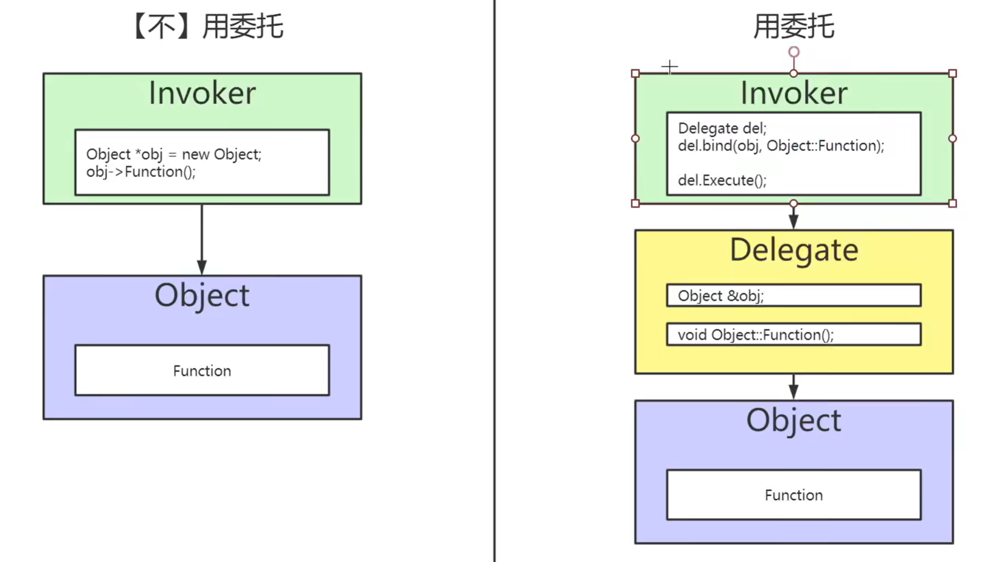

# 委托

**委托** 是一种泛型但类型安全的方式，可在C++对象上调用成员函数。可使用委托**<u>动态绑定</u>**到任意对象的成员函数，之后在该对象上**<u>调用函数</u>**，即使调用程序不知对象类型也可进行操作。复制委托对象很安全。你也可以利用值传递委托，但这样操作需要在堆上分配内存，因此通常并不推荐。请尽量通过引用传递委托。虚幻引擎共支持三种类型的委托：

- 单点委托
- 组播委托
- 动态

**使用委托和不使用委托调用的图示**



使用委托绑定的步骤可以不在Invoker里面这样就就完全不知道调用的对象是谁。

## 单点委托

接下来按照图示结构创建三个类DelegateInvoker,DelegateMaker,DelegateObject.

### 声明委托

如需声明委托，请使用下文所述的宏。请根据与委托相绑定的函数（或多个函数）的函数签名来选择宏。每个宏都为新的委托类型名称、函数返回类型（如果不是 `void` 函数）及其参数提供了参数。当前，支持以下使用任意组合的委托签名：

- 返回一个值的函数。
- 声明为 `常` 函数。
- 最多4个"载荷"变量。
- 最多8个函数参数。

使用此表格查找要用于声明委托的生命宏。

| 函数签名                                     | 声明宏                                                       |
| -------------------------------------------- | ------------------------------------------------------------ |
| `void Function()`                            | `DECLARE_DELEGATE(DelegateName)`                             |
| `void Function(Param1)`                      | `DECLARE_DELEGATE_OneParam(DelegateName, Param1Type)`        |
| `void Function(Param1, Param2)`              | `DECLARE_DELEGATE_TwoParams(DelegateName, Param1Type, Param2Type)` |
| `void Function(Param1, Param2, ...)`         | `DECLARE_DELEGATE_<Num>Params(DelegateName, Param1Type, Param2Type, ...)` |
| `<RetValType> Function()`                    | `DECLARE_DELEGATE_RetVal(RetValType, DelegateName)`          |
| `<RetValType> Function(Param1)`              | `DECLARE_DELEGATE_RetVal_OneParam(RetValType, DelegateName, Param1Type)` |
| `<RetValType> Function(Param1, Param2)`      | `DECLARE_DELEGATE_RetVal_TwoParams(RetValType, DelegateName, Param1Type, Param2Type)` |
| `<RetValType> Function(Param1, Param2, ...)` | `DECLARE_DELEGATE_RetVal_<Num>Params(RetValType, DelegateName, Param1Type, Param2Type, ...)` |

上面是文档定义，我们现在在**DelegateMaker.h**中定义了声明委托。

```c++
DECLARE_DELEGATE(FTestDelegate); //没有返回值也没有参数的委托，必须绑定同类型函数
DECLARE_DELEGATE_RetVal(bool, FTestDelegate_Ret);//这种可以带返回值
DECLARE_DELEGATE_OneParam(FTestDelegate_Bool, bool);//这种可以带一个参数
```

下面是制造委托的函数(用于绑定委托)和委托的变量

```c++
UENUM(BlueprintType)
enum class EDelegateType : uint8
{
	Object,
	Lambda,
	Raw,
	SP,
	Static,
	WeakLambda,
	UFunction,
};

/**
 * 
 */
UCLASS()
class DELEGATE_API UDelegateMaker : public UObject
{
	GENERATED_BODY()
public:
	FTestDelegate& MakeDelegate(EDelegateType Type);

	FTestDelegate_Ret& MakeDelegate_Ret();

	FTestDelegate_Bool& MakeDelegate_Bool();

	FTestDelegate Delegate;
	FTestDelegate_Ret Delegate_Ret;
	FTestDelegate_Bool Delegate_Bool;

};
```

**DelegateMaker.cpp**

```c++
FTestDelegate& UDelegateMaker::MakeDelegate(EDelegateType Type)
{
	if (Delegate.IsBound())
	{
		Delegate.Unbind();
	}
	switch (Type) {
	case EDelegateType::Object:
		if (UEObject == nullptr)
		{
			UEObject = NewObject<UDelegateObject>();
		}
		Delegate.BindUObject(UEObject, &UDelegateObject::TestDelegate);
		break;

	case	EDelegateType::Lambda:
		Delegate.BindLambda(
			[](void)
			{
				UE_LOG(LogTemp, Warning, TEXT(__FUNCTION__));
			}
		);
		break;

	case EDelegateType::Raw:
		if (!RawObjectPtr.IsValid()) {
			RawObjectPtr = MakeShareable(new RawObject);
		}
		Delegate.BindRaw(RawObjectPtr.Get(), &RawObject::DelegateTest);
		break;

	case EDelegateType::SP:
		if (!RawObjectPtr.IsValid()) {
			RawObjectPtr = MakeShareable(new RawObject);
		}
		Delegate.BindSP(RawObjectPtr.ToSharedRef(), &RawObject::DelegateTest);
		break;

	case EDelegateType::Static:
		Delegate.BindStatic(&RawObject::DelegateStatic);
		break;

	case EDelegateType::UFunction:
		if (UEObject == nullptr)
		{
			UEObject = NewObject<UDelegateObject>();
		}
		Delegate.BindUFunction(UEObject, "TestDelegateUFunction");
		break;

	case EDelegateType::WeakLambda:
		if (UEObject == nullptr)
		{
			UEObject = NewObject<UDelegateObject>();
		}
		Delegate.BindWeakLambda(UEObject, [](void)
			{
				UE_LOG(LogTemp, Warning, TEXT(__FUNCTION__));
			}
		);
		break;

	default:
		break;
	}
	return Delegate;
}
```

**DelegateInvoker.h**

```c++
UCLASS()
class DELEGATE_API ADelegateInvoker : public AActor
{
	GENERATED_BODY()
	
public:	
    UDelegateMaker* Maker;

	UFUNCTION(BlueprintCallable)
	void InvokeDelegate(EDelegateType Type);
};
```

**DelegateInvoker.cpp**

```c++
void ADelegateInvoker::InvokeDelegate(EDelegateType Type)
{
	const UEnum* EnumPtr = FindObject<UEnum>(ANY_PACKAGE, TEXT("EDelegateType"), true);

	if (Maker == nullptr)
	{
		Maker = NewObject<UDelegateMaker>();
	}
	UE_LOG(LogTemp, Warning, TEXT("%s"), *EnumPtr->GetNameStringByValue((int64)Type));
	Maker->MakeDelegate(Type).ExecuteIfBound();

	if (Type == EDelegateType::Object)
	{
		{
			FTestDelegate_Ret& Delegate = Maker->MakeDelegate_Ret();
			if (Delegate.IsBound())
			{
				bool bRet = Delegate.Execute();
				UE_LOG(LogTemp, Warning, TEXT("return %u"), bRet);
			}
		}
		{
			FTestDelegate_Bool& Delegate = Maker->MakeDelegate_Bool();
			Delegate.ExecuteIfBound(true);
		}
		{
			FTestDelegate& Delegate = Maker->MakeDelegate_Payload(100);
			Delegate.ExecuteIfBound();
		}
	}
}
```

